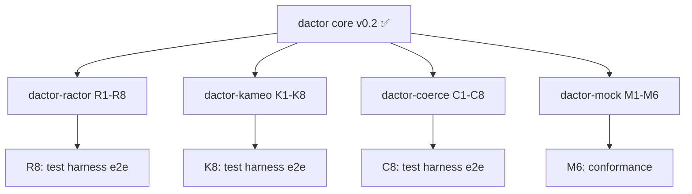

# dactor v0.2 — Adapter & Mock Implementation Plan

> Plan for implementing provider adapters (ractor, kameo, coerce) and
> the mock runtime for unit testing. Each adapter bridges dactor's v0.2 API
> to the provider's native API.

---

## Overview

```
┌─────────────────────────────────────────────────────┐
│                  dactor (core)                       │
│  Actor, Handler, TypedActorRef, tell/ask/stream/feed │
│  Interceptors, Headers, Lifecycle, Cancellation      │
└──────────┬──────────┬──────────┬──────────┬─────────┘
           │          │          │          │
    ┌──────┴───┐ ┌────┴────┐ ┌──┴───┐ ┌───┴────┐
    │ dactor-  │ │ dactor- │ │dactor│ │ dactor-│
    │ ractor   │ │ kameo   │ │-coerce│ │ mock   │
    └──────────┘ └─────────┘ └──────┘ └────────┘
```

### What each adapter must implement:
1. **Runtime** — implements spawn, timers, groups, cluster events
2. **ActorRef** — implements TypedActorRef with tell/ask/stream/feed/stop
3. **Handler dispatch** — type-erased enum dispatch (ractor) or direct mapping (kameo/coerce)
4. **Interceptor integration** — run inbound/outbound pipelines
5. **Lifecycle** — on_start/on_stop/on_error → ErrorAction
6. **Mailbox** — bounded/unbounded via provider or wrapper
7. **Watch** — map to provider's supervision/linking
8. **Cancellation** — CancellationToken via select!/ctx.cancelled()

### What dactor-mock must implement:
1. **MockRuntime** — in-process multi-node simulation
2. **MockNetwork** — simulated transport with fault injection
3. **MockActorRef** — cross-node messaging with serialization
4. All core API features (tell/ask/stream/feed/interceptors/lifecycle)

---

## Phase 1: dactor-ractor Adapter (~8 PRs)

### PR R1: Ractor runtime scaffold + spawn

**Goal:** Replace v0.1 ractor adapter with v0.2 API. Spawn actors using new Actor trait.

**Changes:**
- New `RactorRuntime` implementing v0.2 spawn
- Type-erased message enum for Handler<M> dispatch
- `RactorActorRef<A>` implementing `TypedActorRef<A>`
- Actor task wraps ractor::Actor with dactor lifecycle

**Key challenge:** ractor uses single `type Msg` enum; adapter synthesizes
type-erased `DactorMsg(Box<dyn Any>)` + TypeId-keyed dispatch table.

**Tests:**
- Conformance suite passes (6 tests)
- Spawn Counter, tell Increment, ask GetCount

### PR R2: Tell + Ask with interceptors

**Goal:** Wire tell/ask through interceptor pipelines.

**Changes:**
- Inbound interceptors run on ractor actor task
- Outbound interceptors run on caller task in tell/ask
- Disposition handling (Continue, Delay, Drop, Reject, Retry)
- RuntimeHeaders stamped per message

**Tests:**
- Interceptor on_receive called
- Reject on ask returns Err(Rejected)
- Headers flow from outbound to inbound

### PR R3: Lifecycle + ErrorAction

**Goal:** Wire on_start/on_stop/on_error to ractor's pre_start/post_stop.

**Changes:**
- `on_start()` → ractor `pre_start()`
- `on_stop()` → ractor `post_stop()`
- `on_error()` → catch panics, obey ErrorAction (Resume/Stop)
- `stop()` → graceful shutdown

**Tests:**
- on_start called before messages
- on_error Resume continues processing
- stop triggers on_stop

### PR R4: Stream + Feed

**Goal:** Implement stream/feed via mpsc channel shims.

**Changes:**
- `stream()` → create mpsc, pass StreamSender to handler
- `feed()` → create mpsc, spawn drain task
- Backpressure via bounded channels

**Tests:**
- Stream returns items in order
- Feed sums items correctly
- Consumer drop → StreamSendError

### PR R5: Cancellation

**Goal:** CancellationToken on ask/stream/feed.

**Changes:**
- Token propagated through dispatch
- select! racing handler vs cancellation
- ctx.cancelled() support

**Tests:**
- Cancel ask returns Err(Cancelled)
- Cancel feed stops drain task

### PR R6: Mailbox + Watch

**Goal:** Bounded mailbox via wrapper channel; DeathWatch via ractor supervision.

**Changes:**
- MailboxConfig::Bounded → wrapper mpsc in front of ractor mailbox
- watch/unwatch → ractor's supervisor notification system
- ChildTerminated delivery

**Tests:**
- Bounded mailbox RejectWithError
- Watch receives ChildTerminated

### PR R7: Metrics + Dead Letters

**Goal:** MetricsInterceptor and dead letter integration.

**Tests:**
- MetricsStore records per-actor counts
- Dead letter handler called on send to stopped actor

### PR R8: Test harness integration

**Goal:** Test node binary for ractor, e2e tests via gRPC harness.

**Changes:**
- `tests/harness/test-node-ractor/main.rs` binary
- E2e tests: spawn via control protocol, tell/ask, fault injection

**Tests:**
- Launch 2 ractor nodes, ping via gRPC
- Cross-node tell (future, when ractor_cluster wired)
- Fault injection (kill actor, verify ChildTerminated)

---

## Phase 2: dactor-kameo Adapter (~8 PRs)

Same structure as ractor, but simpler mapping:

### PR K1: Kameo runtime scaffold + spawn
- kameo's `impl Message<M> for Actor` maps nearly 1:1 to Handler<M>
- `KameoActorRef<A>` wraps `kameo::actor::ActorRef`
- Conformance suite passes

### PR K2: Tell + Ask with interceptors
- `tell()` → `kameo::tell().try_send()`
- `ask()` → `kameo::ask()`

### PR K3: Lifecycle + ErrorAction
- `on_start` → kameo `on_start`
- `on_stop` → kameo `on_stop`
- `on_panic` → kameo `on_panic` → ErrorAction

### PR K4: Stream + Feed
- mpsc channel shims (same as ractor)

### PR K5: Cancellation

### PR K6: Mailbox + Watch
- Bounded → `kameo::spawn_bounded()`
- Watch → kameo actor linking

### PR K7: Metrics + Dead Letters

### PR K8: Test harness integration
- `test-node-kameo` binary

---

## Phase 3: dactor-coerce Adapter (~8 PRs)

### PR C1: Coerce runtime scaffold + spawn
- coerce's `impl Handler<M> for Actor` is nearly identical to dactor
- `CoerceActorRef<A>` wraps `coerce::actor::LocalActorRef`
- Conformance suite passes

### PR C2: Tell + Ask with interceptors
- `tell()` → `coerce::notify()`
- `ask()` → `coerce::send()`

### PR C3: Lifecycle + ErrorAction
- coerce has lifecycle events → map directly

### PR C4: Stream + Feed

### PR C5: Cancellation

### PR C6: Mailbox + Persistence
- coerce has native persistence → map EventSourced/DurableState
- Unbounded-only mailbox (no bounded in coerce)

### PR C7: Metrics + Dead Letters

### PR C8: Test harness integration + cluster
- coerce has native clustering → wire ClusterState, ClusterDiscovery
- `test-node-coerce` binary
- E2e: real multi-node cluster tests

---

## Phase 4: dactor-mock (~6 PRs)

### PR M1: MockRuntime scaffold

**Goal:** In-process multi-node simulation with per-node actor spawning.

**Changes:**
- `MockCluster` — creates N `MockNode` instances
- `MockNode` — owns a `MockRuntime` + actor registry
- `MockRuntime` — implements same API as V2TestRuntime but with node identity
- `MockActorRef<A>` — knows which node it belongs to

**Tests:**
- Create 3-node cluster
- Spawn actor on specific node
- tell/ask within same node

### PR M2: MockNetwork + cross-node messaging

**Goal:** Simulated network transport between mock nodes.

**Changes:**
- `MockNetwork` — routes messages between nodes
- Cross-node tell/ask — serialize via MessageSerializer, route through network
- Local vs remote detection via ActorId.node

**Tests:**
- Cross-node tell delivers message
- Cross-node ask returns reply
- Message serialized/deserialized on cross-node sends

### PR M3: Network fault injection

**Goal:** Simulate network failures for testing resilience.

**Changes:**
- `LinkConfig` — latency, jitter, drop rate, corruption
- `network.partition(node_a, node_b)` — block messages between nodes
- `network.heal(node_a, node_b)` — restore connectivity
- `network.set_latency(node_a, node_b, duration)` — add delay
- `network.set_drop_rate(node_a, node_b, rate)` — probabilistic drops

**Tests:**
- Partition blocks cross-node ask
- Heal restores messaging
- Latency injection delays messages
- Drop rate causes some messages to fail

### PR M4: Node fault injection

**Goal:** Simulate node failures.

**Changes:**
- `cluster.crash_node(node_id)` — immediately stop all actors on node
- `cluster.restart_node(node_id)` — restart node with fresh actors
- `cluster.freeze_node(node_id)` — pause processing (GC simulation)
- `cluster.unfreeze_node(node_id)` — resume

**Tests:**
- crash_node triggers ChildTerminated for watchers on other nodes
- restart_node creates fresh actors
- freeze_node stops message processing, unfreeze resumes

### PR M5: Inspection API

**Goal:** Query cluster state for test assertions.

**Changes:**
- `network.in_flight_count()` — messages currently in transit
- `network.dropped_count()` — total dropped messages
- `network.delivered_count()` — total delivered
- `node.actor_count()` — actors on a node
- `cluster.state()` — ClusterState snapshot

**Tests:**
- Counters increment correctly
- Actor count reflects spawns and stops

### PR M6: Integration with conformance suite

**Goal:** Run conformance tests against MockRuntime.

**Changes:**
- MockRuntime passes all conformance tests
- Cross-node conformance (tell/ask across nodes)
- Fault tolerance conformance (partition, heal, verify recovery)

**Tests:**
- All 6 conformance tests pass per node
- Cross-node tell/ask conformance
- Partition → timeout → heal → success

---

## Test Strategy

### Per-Adapter Test Layers

```
┌─────────────────────────────────┐
│     E2E (test harness)          │  Real processes, gRPC control
│     ~10 tests per adapter       │
├─────────────────────────────────┤
│     Conformance suite           │  6 standardized tests
│     Must pass for all adapters  │
├─────────────────────────────────┤
│     Adapter-specific tests      │  Provider quirks, edge cases
│     ~20-30 per adapter          │
├─────────────────────────────────┤
│     Core unit tests             │  Already done (155 tests)
└─────────────────────────────────┘
```

### Estimated Test Counts

| Component | Tests |
|---|---|
| dactor core | 155 (done) |
| dactor-ractor | ~40 (adapter + conformance + e2e) |
| dactor-kameo | ~40 |
| dactor-coerce | ~40 |
| dactor-mock | ~50 (mock + fault injection + conformance) |
| **Total** | **~325** |

---

## PR Summary

| Phase | Crate | PRs | Scope |
|---|---|---|---|
| 1 | dactor-ractor | R1–R8 | Ractor adapter (full v0.2 API) |
| 2 | dactor-kameo | K1–K8 | Kameo adapter (full v0.2 API) |
| 3 | dactor-coerce | C1–C8 | Coerce adapter (full v0.2 API + persistence) |
| 4 | dactor-mock | M1–M6 | Mock runtime (multi-node simulation) |
| **Total** | | **~30 PRs** | |

---

## Dependency Order



Phases can be worked in parallel — each adapter is independent.

---

## Recommended Order

1. **dactor-ractor** first — existing v0.1 code provides reference
2. **dactor-kameo** second — closest API match to dactor
3. **dactor-mock** third — enables cluster testing without real providers
4. **dactor-coerce** last — most complex (persistence + clustering)
