# dactor v0.2 — Design Document

> An abstract framework for distributed actors in Rust, providing a unified
> API across ractor, kameo, and coerce backends.

## 1. Introduction

**dactor** is a framework-agnostic actor abstraction for Rust. It defines
core traits for actor spawning, message delivery, supervision, streaming,
and cluster membership — without coupling to any specific actor framework.
Concrete backends (ractor, kameo, coerce) are plugged in via adapter crates.

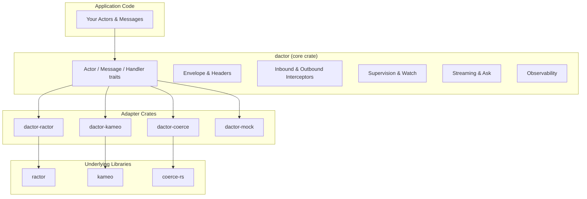

**Goal:** Refactor dactor from a minimal trait extraction into a professional,
production-grade abstract actor framework, informed by Erlang/OTP, Akka,
ractor, kameo, Actix, and Coerce.

---

## 2. Design Principles

### 2.1 Inclusion Rule

**dactor abstracts the superset of capabilities supported by 2 or more actor
frameworks.** If a behavior is common to at least two of the surveyed
frameworks, dactor models it as a first-class trait or type. Individual adapters
that don't natively support a capability have two options:

1. **Adapter-layer implementation** — the adapter implements the capability
   using custom logic (e.g., ractor doesn't have bounded mailboxes, but the
   adapter can wrap a bounded channel).
2. **`NotSupported` error** — the adapter returns `Err(NotSupported)` at
   runtime, signaling the caller that this capability is unavailable with the
   chosen backend.

This ensures the **core API is rich and forward-looking** while each adapter
remains honest about what it can deliver.

### 2.2 Capability Inclusion Matrix

The table below counts how many of the 6 surveyed frameworks support each
capability. **≥ 2** means it qualifies for inclusion in dactor.

| Capability | Erlang | Akka | Ractor | Kameo | Actix | Coerce | Count | Include? |
|---|:---:|:---:|:---:|:---:|:---:|:---:|:---:|:---:|
| Tell (fire-and-forget) | ✓ | ✓ | ✓ | ✓ | ✓ | ✓ | **6** | ✅ |
| Ask (request-reply) | ✓ | ✓ | ✓ | ✓ | ✓ | ✓ | **6** | ✅ |
| Typed messages | — | ✓ | ✓ | ✓ | ✓ | ✓ | **5** | ✅ |
| Actor identity (ID) | ✓ | ✓ | ✓ | ✓ | ✓ | ✓ | **6** | ✅ |
| Lifecycle hooks | ✓ | ✓ | ✓ | ✓ | ✓ | ✓ | **6** | ✅ |
| Supervision | ✓ | ✓ | ✓ | ✓ | ✓ | ✓ | **6** | ✅ |
| DeathWatch / monitoring | ✓ | ✓ | ✓ | ✓ | — | — | **4** | ✅ |
| Timers (send_after/interval) | ✓ | ✓ | ✓ | ✓ | ✓ | ✓ | **6** | ✅ |
| Processing groups | ✓ | ✓ | ✓ | — | — | ✓ | **4** | ✅ |
| Actor registry (named lookup) | ✓ | ✓ | ✓ | — | ✓ | ✓ | **5** | ✅ (v0.4) |
| Mailbox configuration | — | ✓ | — | ✓ | ✓ | — | **3** | ✅ |
| Interceptors / middleware | — | ✓ | — | — | ✓ | ✓ | **3** | ✅ |
| Message envelope / metadata | ✓ | ✓ | — | — | — | — | **2** | ✅ |
| Cluster events | ✓ | ✓ | ✓ | ✓ | — | ✓ | **5** | ✅ |
| Distribution (remote actors) | ✓ | ✓ | ✓ | ✓ | — | ✓ | **5** | ✅ (future) |
| Clock abstraction | ✓ | ✓ | — | — | — | — | **2** | ✅ |
| Streaming responses | ✓ | ✓ | — | — | — | — | **2** | ✅ |
| Priority mailbox | ~ | ✓ | — | ✓ | — | — | **2+** | ✅ |
| Actor pool / worker factory | ✓ | ✓ | ✓ | ✓ | ~ | ~ | **4+** | ✅ |
| Hot code upgrade | ✓ | — | — | — | — | — | **1** | ❌ |

### 2.3 NotSupported Error

All trait methods that might not be supported by every adapter return a
`Result` type. A new error variant is introduced:

```rust
/// Error indicating that the adapter does not support this operation.
#[derive(Debug, Clone)]
pub struct NotSupportedError {
    /// Name of the operation that is not supported.
    pub operation: &'static str,
    /// Name of the adapter/runtime that doesn't support it.
    pub adapter: &'static str,
    /// Optional detail message.
    pub detail: Option<String>,
}

impl fmt::Display for NotSupportedError {
    fn fmt(&self, f: &mut fmt::Formatter<'_>) -> fmt::Result {
        write!(f, "{} is not supported by {}", self.operation, self.adapter)?;
        if let Some(ref detail) = self.detail {
            write!(f, ": {detail}")?;
        }
        Ok(())
    }
}

impl std::error::Error for NotSupportedError {}
```

A unified error enum encompasses all runtime errors:

> **`RuntimeError`** is defined in full in §7.1, which includes the `Actor(ActorError)` variant added after the error model is introduced. The variants include: `Send(ActorSendError)`, `Group(GroupError)`, `Cluster(ClusterError)`, `NotSupported(NotSupportedError)`, `Rejected { interceptor, reason }`, and `Actor(ActorError)`.

### 2.4 Capability Introspection

> **Design only — not yet implemented.**

Callers can pre-flight requirements at startup via `ActorRuntime::is_supported()`:

```rust
/// Individual capabilities that an adapter may or may not support.
#[derive(Debug, Clone, Copy, PartialEq, Eq, Hash)]
#[non_exhaustive]
pub enum RuntimeCapability {
    Ask,
    Stream,
    Feed,
    Watch,
    Pool,
    Timers,
    Cluster,
    BoundedMailbox,
    PriorityMailbox,
    InboundInterceptors,
    OutboundInterceptors,
    RemoteSpawn,
}
```

```rust
pub trait ActorRuntime: Send + Sync + 'static {
    /// Check whether a specific capability is supported by this adapter.
    fn is_supported(&self, capability: RuntimeCapability) -> bool;

    // ... other methods ...
}
```

**Fail-fast on unsupported capabilities:**

When application code calls a function the current adapter does not support,
the call **must fail immediately** with `Err(RuntimeError::NotSupported)`.
The application should treat this as a fatal configuration error — the
adapter cannot fulfill the application's requirements.

**Recommended startup pattern:**

```rust
use dactor::RuntimeCapability::*;

fn validate_runtime(runtime: &impl ActorRuntime) -> Result<(), String> {
    let required = [Ask, InboundInterceptors, Watch];

    for cap in &required {
        if !runtime.is_supported(*cap) {
            return Err(format!("this application requires {:?} support", cap));
        }
    }

    Ok(())
}

fn main() {
    let runtime = dactor_ractor::RactorRuntime::new();

    // Validate at startup — fail before any actors are spawned
    validate_runtime(&runtime).expect("runtime does not meet requirements");

    // Safe to proceed — all required capabilities are available
    runtime.add_inbound_interceptor(Box::new(AuthInterceptor)).unwrap();
    // ...
}
```

**What happens if you skip validation and call unsupported functions:**

| Call | Adapter doesn't support it | Result |
|---|---|---|
| `actor.ask(msg, None)` | `!is_supported(Ask)` | `Err(RuntimeError::NotSupported { operation: "ask", ... })` |
| `runtime.add_inbound_interceptor(...)` | `!is_supported(InboundInterceptors)` | `Err(RuntimeError::NotSupported { operation: "add_inbound_interceptor", ... })` |
| `spawn_with_config(... Bounded ...)` | `!is_supported(BoundedMailbox)` | `Err(RuntimeError::NotSupported { operation: "spawn_with_config", ... })` |
| `runtime.watch(watcher, target)` | `!is_supported(Watch)` | `Err(RuntimeError::NotSupported { operation: "watch", ... })` |

All `NotSupported` errors include the `operation` name and `adapter` name
(see §2.3) so the developer immediately knows which capability is missing
and which adapter to switch to.

**Design choice — `Err` not `panic`:** Unsupported operations return `Result`
errors, not panics. This allows applications to:
1. Gracefully degrade (skip optional features)
2. Display actionable error messages
3. Run capability checks in test harnesses

If the application considers a missing capability **fatal**, it can
`.expect()` or `.unwrap()` the result to turn it into a panic at the
call site — the choice is the application's, not the framework's.

---

## 3. Research Summary: Common Behaviors Across Actor Frameworks

| Concept | Erlang/OTP | Akka (JVM) | Ractor (Rust) | Kameo (Rust) | Actix (Rust) | Coerce (Rust) |
|---|---|---|---|---|---|---|
| **Message passing** | `Pid ! Msg` (async) | tell `!` / ask `?` | `cast()` / `call()` | `tell()` / `ask()` | `do_send()` / `send()` | `notify()` / `send()` |
| **Typed messages** | Dynamic (any term) | Typed behaviors | `ActorRef<M>` | `Message<M>` trait | `Handler<M>` trait | `Handler<M>` trait |
| **Lifecycle hooks** | `init`, `terminate`, `handle_info` | `preStart`, `postStop`, `preRestart` | `pre_start`, `post_start`, `post_stop` | `on_start`, `on_stop`, `on_panic` | `started()`, `stopped()` | Lifecycle events |
| **Supervision** | Supervisor trees with strategies | Resume/Restart/Stop/Escalate | Parent-child supervision | `on_link_died` linking | Built-in supervision | Supervision + clustering |
| **DeathWatch** | `monitor/2` | `context.watch()` → `Terminated` | Supervisor notifications | Actor linking | — | — |
| **Interceptors** | — | `Behaviors.intercept` | — | — | Middleware (web) | Metrics/tracing |
| **Message envelope** | Built-in (pid, ref, msg) | Envelope with metadata | Plain typed msg | Plain typed msg | Plain typed msg | Plain typed msg |
| **Timers** | `send_after`, `send_interval` | Scheduler | tokio tasks | tokio tasks | `run_interval` | tokio tasks |
| **Processing groups** | `pg` module | Cluster-aware routing | Named groups | — | — | Pub/sub, sharding |
| **Actor registry** | `register/2` (named) | Receptionist | Named registry | — | Registry | Actor system |
| **Mailbox config** | Per-process (unbounded) | Bounded/custom | Unbounded | Bounded (default) | Bounded | Unbounded |
| **Distribution** | Native (Erlang nodes) | Akka Cluster/Remoting | `ractor_cluster` | libp2p / Kademlia | — | Cluster, remote actors |
| **Clock/time** | `erlang:monotonic_time` | Scheduler | — | — | — | — |
| **Streaming responses** | Multi-part `gen_server` reply | Akka Streams `Source` | — | — | — | — |
| **Priority mailbox** | Selective receive (mimic) | `PriorityMailbox` (native) | — | Custom mailbox pluggable | — | — |
| **Actor pool / workers** | `poolboy`, supervisor pools | `Routers.pool()` with routing strategies | `Factory` + `Worker` trait | `ActorPool` built-in | `SyncArbiter` (N instances) | Sharding primitives |

### 3.1 Key Takeaways

1. **Every framework** has tell (fire-and-forget) — this is the fundamental operation.
2. **Most frameworks** also support ask (request-reply) — we should abstract it.
3. **All production frameworks** have lifecycle hooks — we need `on_start`/`on_stop`.
4. **Supervision** is universal in Erlang, Akka, ractor, kameo — we should model it.
5. **Message envelopes** with headers exist in Erlang and Akka (2 frameworks) — qualifies for inclusion under the superset rule.
6. **Interceptors/middleware** exist in Akka, Actix, and Coerce (3 frameworks) — qualifies for inclusion.
7. **Test support behind feature flags** is standard practice in Rust crates.
8. **Superset rule applied:** every capability above is supported by ≥ 2 frameworks (see §2). Adapters return `NotSupported` for features they can't provide.
9. **Streaming responses** exist in Erlang (multi-part `gen_server` replies) and Akka (Akka Streams `Source`) — qualifies under the superset rule. Combined with the ubiquity of gRPC server-streaming and Rust's async `Stream` trait, this is a high-value addition.

---

---

## 4. Actor & Runtime

dactor adopts the **Kameo/Coerce pattern** as its primary consumer interface:
`ActorRef<A>` is typed to the actor struct (not the message), each message
type gets its own `Handler<M>` impl, and reply types are checked at compile
time.

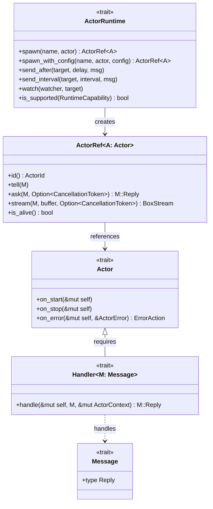

### 4.1 Actor Trait & Lifecycle

**Rationale:** Erlang has `init/terminate`, Akka has `preStart/postStop`,
ractor has `pre_start/post_stop`, kameo has `on_start/on_stop`.

Lifecycle hooks are **methods on the `Actor` trait itself** (not a separate
trait). Since the API decision adopts the Kameo/Coerce pattern where
the actor struct implements `Actor`, lifecycle hooks live naturally alongside
the actor's state. All hooks have default no-op implementations, so simple
actors can ignore them entirely.

```rust
/// The core actor trait. Implemented by the user's actor struct.
/// State lives in `self`. Lifecycle hooks have default no-ops.
pub trait Actor: Send + 'static {
    /// Serializable construction arguments — the parameters needed to
    /// create this actor. For remote spawn, these are serialized and
    /// sent over the wire. For simple local-only actors, this defaults
    /// to `Self` (the actor struct is its own args).
    type Args: Send + 'static = Self;

    /// Local dependencies — non-serializable components resolved at the
    /// node where the actor runs. Examples: references to other actors,
    /// shared services, connection pools, runtime handles.
    ///
    /// For remote spawn, `Deps` are resolved on the target node via
    /// a `DepsFactory` registered in the `TypeRegistry` — they never
    /// cross the wire.
    ///
    /// Defaults to `()` for actors with no local dependencies.
    type Deps: Send + 'static = ();

    /// Construct the actor from its arguments and local dependencies.
    /// Called by the runtime after receiving args (locally or deserialized
    /// from remote) and resolving deps (always local to the target node).
    fn create(args: Self::Args, deps: Self::Deps) -> Self where Self: Sized;

    /// Called after the actor is spawned, before it processes any messages.
    /// Use for async initialization, resource acquisition, subscriptions, etc.
    async fn on_start(&mut self, ctx: &mut ActorContext) {}

    /// Called when the actor is stopping (graceful shutdown or supervision).
    /// Use for cleanup, resource release, flushing buffers, etc.
    async fn on_stop(&mut self) {}

    /// Called when a handler panics or returns an `ActorError`.
    /// Return an `ErrorAction` to control what happens next.
    /// The default is `Stop` — the actor terminates on error.
    fn on_error(&mut self, _error: &ActorError) -> ErrorAction {
        ErrorAction::Stop
    }
}

pub enum ErrorAction {
    /// Resume processing the next message (Erlang: continue).
    Resume,
    /// Restart the actor (Erlang: restart, Akka: Restart).
    /// The runtime keeps the original `Args` and resolves `Deps` again,
    /// then calls `Actor::create(args, deps)` → `on_start()`.
    Restart,
    /// Stop the actor (Erlang: shutdown).
    Stop,
    /// Escalate to the supervisor (Akka: Escalate).
    Escalate,
}
```

**Why separate Args, Deps, and State?**

Actor construction involves three distinct categories of data:

| | `Args` | `Deps` | Actor struct (State) |
|---|---|---|---|
| **What** | Config values, IDs, URLs | Other actor refs, shared services, pools | Args + Deps + runtime resources |
| **Serializable** | ✅ Required for remote spawn | ❌ Local to target node | ❌ Not required |
| **Provided by** | Caller (at spawn site) | Target node's runtime / registry | `Actor::create(args, deps)` |
| **Survives restart** | ✅ Kept by runtime | ✅ Re-resolved by runtime | ❌ Rebuilt from Args + Deps |
| **Crosses network** | ✅ For remote spawn | ❌ Never | ❌ Never |

This matches established patterns:

| Framework | Args (serializable) | Deps (local) | State |
|---|---|---|---|
| Erlang | `Args` in `start_link` | Resolved in `init/1` via name registry | `{ok, State}` from `init` |
| Akka | `Props(args)` | Injected via `ActorContext` or DI | Actor instance fields |
| Ractor | `type Arguments` | Available in `pre_start` via `myself` ref | `type State` |
| Spring/Guice | Constructor params | `@Inject` dependencies | Bean instance |

**Three usage tiers:**

```rust
// ── Tier 1: Simple actor — Args = Self, Deps = () ───────────
// No separation needed. The actor struct IS the args.

struct Counter { count: u64 }

impl Actor for Counter {
    // type Args = Self;   ← default, can omit
    // type Deps = ();     ← default, can omit
    fn create(args: Self, _deps: ()) -> Self { args }
}

let counter = runtime.spawn("counter", Counter { count: 0 });
```

```rust
// ── Tier 2: Async init — Args ≠ State, Deps = () ────────────
// Args are serializable config. State has non-serializable resources.
// No local dependencies.

#[derive(Clone, Serialize, Deserialize)]
struct DatabaseWorkerArgs {
    connection_string: String,
    pool_size: usize,
}

struct DatabaseWorker {
    args: DatabaseWorkerArgs,
    conn: Option<DbPool>,     // non-serializable, created in on_start()
}

impl Actor for DatabaseWorker {
    type Args = DatabaseWorkerArgs;

    fn create(args: DatabaseWorkerArgs, _deps: ()) -> Self {
        DatabaseWorker { args, conn: None }
    }

    async fn on_start(&mut self, _ctx: &mut ActorContext) {
        self.conn = Some(
            DbPool::connect(&self.args.connection_string)
                .max_connections(self.args.pool_size)
                .await
                .expect("failed to connect")
        );
    }
}

let worker = runtime.spawn("db-worker", DatabaseWorkerArgs {
    connection_string: "postgres://localhost/mydb".into(),
    pool_size: 10,
});
```

```rust
// ── Tier 3: Local dependencies — Args + Deps ────────────────
// The actor depends on other actors or shared local services
// that cannot be serialized.

#[derive(Clone, Serialize, Deserialize)]
struct OrderProcessorArgs {
    region: String,
    max_retries: u32,
}

/// Local dependencies — resolved at the target node, never serialized.
struct OrderProcessorDeps {
    payment_service: ActorRef<PaymentService>,
    inventory: ActorRef<InventoryManager>,
    metrics: Arc<MetricsCollector>,
}

struct OrderProcessor {
    args: OrderProcessorArgs,
    deps: OrderProcessorDeps,
    pending_orders: Vec<Order>,
}

impl Actor for OrderProcessor {
    type Args = OrderProcessorArgs;
    type Deps = OrderProcessorDeps;

    fn create(args: OrderProcessorArgs, deps: OrderProcessorDeps) -> Self {
        OrderProcessor {
            args,
            deps,
            pending_orders: Vec::new(),
        }
    }
}

#[async_trait]
impl Handler<PlaceOrder> for OrderProcessor {
    async fn handle(&mut self, msg: PlaceOrder, _ctx: &mut ActorContext)
        -> Result<OrderId, ActorError>
    {
        // Use local dependencies — these are ActorRefs, not serializable
        let payment = self.deps.payment_service
            .ask(ChargeCard { amount: msg.total })
            .await?;

        self.deps.inventory
            .tell(ReserveItems { items: msg.items.clone() })
            .unwrap();

        self.deps.metrics.record_order(&self.args.region);

        Ok(payment.order_id)
    }
}

// ── Local spawn with deps ───────────────────────────────────
let payment = runtime.spawn("payment", PaymentServiceArgs { ... });
let inventory = runtime.spawn("inventory", InventoryArgs { ... });
let metrics = Arc::new(MetricsCollector::new());

let processor = runtime.spawn_with_deps(
    "order-processor",
    OrderProcessorArgs { region: "us-east".into(), max_retries: 3 },
    OrderProcessorDeps { payment_service: payment, inventory, metrics },
);
```

**The `spawn()` signatures become:**

```rust
impl ActorRuntime {
    /// Spawn an actor with no local dependencies (Deps = ()).
    fn spawn<A: Actor<Deps = ()>>(&self, name: &str, args: A::Args) -> ActorRef<A>;

    /// Spawn an actor with local dependencies.
    fn spawn_with_deps<A: Actor>(
        &self, name: &str, args: A::Args, deps: A::Deps,
    ) -> ActorRef<A>;

    /// Spawn with full configuration (mailbox, interceptors, target node).
    fn spawn_with_config<A: Actor>(
        &self, name: &str, args: A::Args, deps: A::Deps, config: SpawnConfig,
    ) -> Result<ActorRef<A>, RuntimeError>;
}
```

**Remote spawn with Deps:**

When spawning remotely, `Args` is serialized and sent over the wire, but
`Deps` must be resolved **on the target node**. This is done via a
`DepsFactory` registered in the remote node's `TypeRegistry`:

```rust
/// Factory that resolves local dependencies on the target node.
/// Registered per actor type in the TypeRegistry.
pub trait DepsFactory<A: Actor>: Send + Sync + 'static {
    /// Resolve dependencies using the local runtime.
    /// Called on the target node after receiving a remote spawn request.
    fn resolve(&self, runtime: &dyn ActorRuntime) -> Result<A::Deps, ActorError>;
}

// Registration on the remote node at startup:
runtime.register_remote_actor::<OrderProcessor>(
    OrderProcessorDepsFactory { /* config for how to find local services */ }
);
```

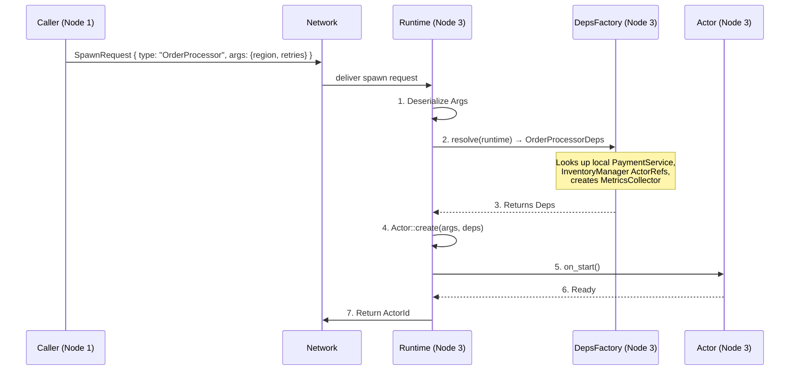

**Restart with Deps:** On restart, the runtime keeps the original `Args` and
calls `DepsFactory::resolve()` again to get fresh `Deps`. This ensures the
restarted actor gets current references to local services (which may have
themselves restarted with new ActorIds since the original spawn).

**Actor lifecycle ordering guarantee:**

Messages are **never** delivered before `on_start()` completes. The runtime
guarantees this strict ordering:

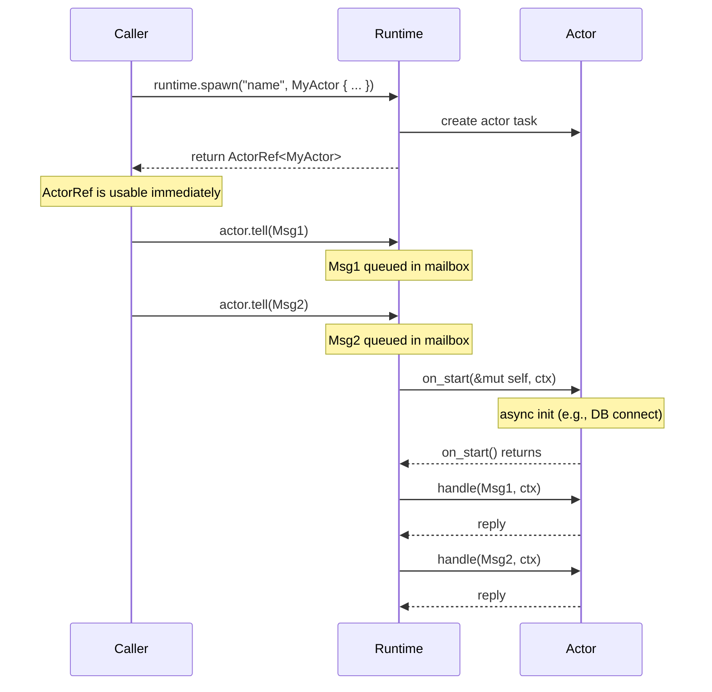

The rules are:

1. **`on_start()` runs first** — before any handler. Messages sent to the
   actor between `spawn()` and `on_start()` completion are buffered in the
   mailbox and delivered in order after `on_start()` returns.

2. **`on_start()` failure** — if `on_start()` panics or returns an error,
   the actor enters the error path (`on_error()` is called). Buffered
   messages are either delivered after recovery (if `Resume`/`Restart`)
   or forwarded to the dead letter handler (if `Stop`).

3. **Handlers run sequentially** — one at a time, after `on_start()`. No
   concurrent handler execution on the same actor (fundamental actor model
   guarantee).

4. **`on_stop()` runs last** — after all handlers complete and the actor is
   shutting down. No messages are delivered after `on_stop()` begins.

5. **Restart cycle** — on restart: `on_stop()` → re-create actor →
   `on_start()` → resume processing queued messages.

The complete lifecycle is:

```
spawn() → on_start() → [handle messages]* → on_stop() → dropped
                ↑                    |
                |   on_error() → Restart
                +--------------------+
```

### 4.2 Message Trait

```rust
/// Defines a message type and its reply. Implemented on the MESSAGE,
/// not on the actor. This decouples message definition from handling
/// (Coerce style) and allows the same message to be handled by
/// different actors.
pub trait Message: Send + 'static {
    /// The reply type for this message. Use `()` for fire-and-forget.
    type Reply: Send + 'static;
}
```

### 4.3 Handler Trait

```rust
/// Implemented by an actor for each message type it can handle.
/// One impl per (Actor, Message) pair.
#[async_trait::async_trait]
pub trait Handler<M: Message>: Actor {
    /// Handle the message and return a reply.
    async fn handle(&mut self, msg: M, ctx: &mut ActorContext) -> M::Reply;
}
```

**Sequential execution guarantee (`&mut self`):**

The handler takes `&mut self` — exclusive mutable access to the actor's
state. This is not a Rust convention choice; it reflects the **fundamental
actor model invariant**: an actor processes exactly one message at a time.
No two handlers ever run concurrently on the same actor instance.

All three backend libraries guarantee this:

| Library | Mechanism | Guarantee |
|---|---|---|
| **Erlang/OTP** | Each process has its own mailbox; the BEAM scheduler runs one reduction at a time per process | ✅ Sequential per process |
| **Akka** | Actor mailbox delivers one message at a time; dispatcher ensures single-threaded execution | ✅ Sequential per actor |
| **ractor** | Actor runs as a single tokio task; mailbox delivers one message at a time to `handle()` | ✅ Sequential per actor |
| **kameo** | Actor runs as a single tokio task; bounded/unbounded mailbox serializes delivery | ✅ Sequential per actor |
| **Actix** | Actor runs on an Arbiter (single-threaded event loop); messages processed one at a time. `SyncArbiter` runs N worker *instances* for parallelism, but each instance is still sequential | ✅ Sequential per actor instance |
| **coerce** | Actor runs as a single tokio task; message queue serializes delivery | ✅ Sequential per actor |

This is a **universal guarantee across all 6 surveyed frameworks** — it is the
fundamental invariant of the actor model.

**What this means for users:**

- **No locks needed** inside handler code — `&mut self` is exclusive
- **No `Arc<Mutex<_>>`** for actor state — the framework guarantees no races
- **Async handlers** may `.await` internally (e.g., database queries), and
  the actor will not process the next message until the current handler returns
- **Cross-actor concurrency** is achieved by having many actors, each
  processing their own messages independently

```rust
// SAFE: no locking needed — only one handler runs at a time
#[async_trait]
impl Handler<Deposit> for BankAccount {
    async fn handle(&mut self, msg: Deposit, _ctx: &mut ActorContext) {
        self.balance += msg.amount;  // no Mutex, no race
        self.transaction_log.push(format!("+{}", msg.amount));
        self.save_to_db().await;     // while awaiting, no other handler runs
    }
}
```

### 4.4 ActorRef & ActorId

**Rationale:** Every framework gives actors identity. Without an ID, you can't
implement supervision, death watch, logging, or debugging. In a distributed
system, IDs must be **globally unique** across all nodes without requiring
a central coordinator.

```rust
/// Unique identifier for a node in the cluster.
///
/// `NodeId` wraps a `String` that is the **provider's native node identity**
/// converted to a string by the adapter. This avoids inventing a separate
/// ID scheme — the provider already guarantees unique, consistent identity.
///
/// Examples:
///   ractor: "node1@host:4697"
///   kameo:  "12D3KooWRF..." (PeerId as base58)
///   coerce: "node-east-1"
#[derive(Debug, Clone, PartialEq, Eq, Hash, PartialOrd, Ord, Serialize, Deserialize)]
pub struct NodeId(pub String);

impl fmt::Display for NodeId {
    fn fmt(&self, f: &mut fmt::Formatter<'_>) -> fmt::Result {
        write!(f, "{}", self.0)
    }
}

/// Globally unique identifier for an actor across all nodes in a cluster.
#[derive(Debug, Clone, PartialEq, Eq, Hash, Serialize, Deserialize)]
pub struct ActorId {
    /// The node that spawned this actor.
    pub node: NodeId,
    /// Node-local monotonically increasing sequence number.
    pub local: u64,
}

impl fmt::Display for ActorId {
    fn fmt(&self, f: &mut fmt::Formatter<'_>) -> fmt::Result {
        write!(f, "Actor({}/{})", self.node.0, self.local)
    }
}
```

**How `NodeId` works — no negotiation needed:**

`NodeId` wraps the provider's native identity as a string. The adapter
converts between `NodeId` and the provider's native type:

```rust
/// Adapter implements this to convert between NodeId and native identity.
pub trait NodeIdConverter {
    /// Convert provider's native node identity to NodeId.
    fn to_node_id(&self, native: &Self::NativeId) -> NodeId;

    /// Convert NodeId back to provider's native identity.
    fn from_node_id(&self, node_id: &NodeId) -> Self::NativeId;

    /// The native identity type for this provider.
    type NativeId;
}

// Example: ractor adapter
impl NodeIdConverter for RactorAdapter {
    type NativeId = String;  // ractor node name
    fn to_node_id(&self, name: &String) -> NodeId {
        NodeId(name.clone())  // direct wrap
    }
    fn from_node_id(&self, node_id: &NodeId) -> String {
        node_id.0.clone()
    }
}

// Example: kameo adapter
impl NodeIdConverter for KameoAdapter {
    type NativeId = libp2p::PeerId;
    fn to_node_id(&self, peer_id: &PeerId) -> NodeId {
        NodeId(peer_id.to_base58())  // convert to string
    }
    fn from_node_id(&self, node_id: &NodeId) -> PeerId {
        PeerId::from_str(&node_id.0).unwrap()
    }
}
```

**Why String, not u64:**

| Approach | Pros | Cons |
|---|---|---|
| `NodeId(u64)` | Compact, `Copy` | Needs negotiation protocol, collision risk, no natural mapping to provider IDs |
| `NodeId(String)` | Direct wrap of provider identity, no negotiation, no collision, consistent by definition | Slightly larger, requires `Clone` not `Copy` |

Since the provider already guarantees unique, consistent identity across the
cluster, wrapping it as a string eliminates the entire negotiation problem.
The `ActorId` is slightly larger but the trade-off is worth the simplicity.

```rust
/// A reference to a running actor of type `A`.
///
/// `ActorRef<A>` is typed to the ACTOR, not the message. You can send
/// any message type `M` for which `A: Handler<M>`.
pub struct ActorRef<A: Actor> { /* internal handle */ }

impl<A: Actor> ActorRef<A> {
    /// The actor's unique identity.
    pub fn id(&self) -> ActorId { ... }

    /// Fire-and-forget: deliver a message.
    pub fn tell<M>(&self, msg: M) -> Result<(), ActorSendError>
    where A: Handler<M>, M: Message<Reply = ()> { ... }

    /// Request-reply: send a message and await the reply.
    pub async fn ask<M>(
        &self, msg: M, cancel: Option<CancellationToken>,
    ) -> Result<M::Reply, RuntimeError>
    where A: Handler<M>, M: Message { ... }

    /// Request-stream: send a request and receive a stream of responses.
    pub fn stream<M>(
        &self, msg: M, buffer: usize, cancel: Option<CancellationToken>,
    ) -> Result<BoxStream<M::Reply>, RuntimeError>
    where A: Handler<M>, M: Message { ... }

    /// Check if the actor is still alive.
    pub fn is_alive(&self) -> Result<bool, NotSupportedError> { ... }
}

impl<A: Actor> Clone for ActorRef<A> { ... }
impl<A: Actor> Send for ActorRef<A> {}
impl<A: Actor> Sync for ActorRef<A> {}
```

### 4.5 ActorRuntime Trait

> **Design only — not yet implemented.**

```rust
pub trait ActorRuntime: Send + Sync + 'static {
    type Events: ClusterEvents;
    type Timer: TimerHandle;

    // ── Spawning ────────────────────────────────────────
    /// Spawn an actor with no local dependencies (Deps = ()).
    fn spawn<A: Actor<Deps = ()>>(&self, name: &str, args: A::Args) -> ActorRef<A>;

    /// Spawn an actor with local dependencies.
    fn spawn_with_deps<A: Actor>(
        &self, name: &str, args: A::Args, deps: A::Deps,
    ) -> ActorRef<A>;

    /// Spawn with full configuration (mailbox, interceptors, target node).
    fn spawn_with_config<A: Actor>(
        &self, name: &str, args: A::Args, deps: A::Deps, config: SpawnConfig,
    ) -> Result<ActorRef<A>, RuntimeError>;

    /// Spawn a pool of N identical worker actors.
    fn spawn_pool<A: Actor>(
        &self, name: &str, pool_config: PoolConfig,
        args: A::Args, deps_factory: impl Fn(usize) -> A::Deps + Send + 'static,
    ) -> Result<PoolRef<A>, RuntimeError>
    where A::Args: Clone;

    // ── Timers ──────────────────────────────────────────
    fn send_interval<A, M>(
        &self, target: &ActorRef<A>, interval: Duration, msg: M,
    ) -> Self::Timer
    where A: Handler<M>, M: Message<Reply = ()> + Clone;

    fn send_after<A, M>(
        &self, target: &ActorRef<A>, delay: Duration, msg: M,
    ) -> Self::Timer
    where A: Handler<M>, M: Message<Reply = ()>;

    // ── Supervision / DeathWatch ────────────────────────
    fn watch<A: Actor>(
        &self, watcher: &ActorRef<A>, target: ActorId,
    ) -> Result<(), RuntimeError>;

    fn unwatch<A: Actor>(
        &self, watcher: &ActorRef<A>, target: ActorId,
    ) -> Result<(), RuntimeError>;

    // ── Cluster ─────────────────────────────────────────
    fn cluster_events(&self) -> &Self::Events;
    fn cluster_state(&self) -> ClusterState;

    // ── Interceptors ────────────────────────────────────
    fn add_inbound_interceptor(&self, interceptor: Box<dyn InboundInterceptor>) -> Result<(), RuntimeError>;
    fn add_outbound_interceptor(&self, interceptor: Box<dyn OutboundInterceptor>) -> Result<(), RuntimeError>;

    // ── Registries ──────────────────────────────────────
    fn register_remote_actor<A: Actor>(&self) where A::Args: Serialize + DeserializeOwned;
    fn register_error_codec(&self, codec: Box<dyn ErrorCodec>);
    fn set_message_serializer(&self, serializer: Box<dyn MessageSerializer>);
    fn set_dead_letter_handler(&self, handler: Box<dyn DeadLetterHandler>);

    // ── Capability Introspection ────────────────────────
    fn is_supported(&self, capability: RuntimeCapability) -> bool;

    // ── Metrics ─────────────────────────────────────────
    fn runtime_metrics(&self) -> RuntimeMetrics;
}

/// Subscription to cluster membership events.
pub trait ClusterEvents: Send + Sync + 'static {
    /// Subscribe to cluster membership changes.
    fn subscribe(
        &self,
        on_event: Box<dyn Fn(ClusterEvent) + Send + Sync>,
    ) -> Result<SubscriptionId, ClusterError>;

    /// Remove a previously registered subscription.
    fn unsubscribe(&self, id: SubscriptionId) -> Result<(), ClusterError>;
}

/// Events emitted by the cluster membership system.
#[derive(Debug, Clone, PartialEq, Eq)]
pub enum ClusterEvent {
    NodeJoined(NodeId),
    NodeLeft(NodeId),
}

/// Opaque handle returned by `ClusterEvents::subscribe()`.
/// Pass to `unsubscribe()` to remove the subscription.
#[derive(Debug, Clone, Copy, PartialEq, Eq, Hash)]
pub struct SubscriptionId(pub u64);

/// A handle to a scheduled timer that can be cancelled.
pub trait TimerHandle: Send + 'static {
    /// Cancel the timer. Idempotent.
    fn cancel(self);
}
```

### 4.6 ActorContext

```rust
/// Context passed to handlers, providing access to the actor's identity,
/// message metadata, and runtime operations.
pub struct ActorContext {
    /// The headers from the incoming message envelope.
    pub headers: Headers,
    /// The actor's own unique identity.
    pub actor_id: ActorId,
    /// The name the actor was spawned with.
    pub actor_name: String,
    /// How the message was sent (Tell, Ask, Stream, Feed).
    pub send_mode: SendMode,
}

impl ActorContext {
    /// Spawn a child actor (delegates to the runtime).
    pub fn spawn<A: Actor<Deps = ()>>(&self, name: &str, args: A::Args) -> ActorRef<A> { ... }

    /// Schedule a one-shot message to an actor.
    pub fn send_after<A, M>(&self, target: &ActorRef<A>, delay: Duration, msg: M)
    where A: Handler<M>, M: Message<Reply = ()> { ... }

    /// Schedule a recurring message to an actor.
    pub fn send_interval<A, M>(&self, target: &ActorRef<A>, interval: Duration, msg: M)
    where A: Handler<M>, M: Message<Reply = ()> + Clone { ... }
}
```

### 4.7 SpawnConfig

Collect all per-actor settings into a config struct:

```rust
pub struct SpawnConfig {
    pub mailbox: MailboxConfig,
    pub inbound_interceptors: Vec<Box<dyn InboundInterceptor>>,
    /// Message comparer for priority mailboxes (§5.6).
    /// `None` = `StrictPriorityComparer` (default).
    pub comparer: Option<Box<dyn MessageComparer>>,
    /// Target node for the actor. `None` = spawn locally (default).
    /// `Some(node_id)` = spawn on the specified remote node.
    pub target_node: Option<NodeId>,
}

impl Default for SpawnConfig {
    fn default() -> Self {
        Self {
            mailbox: MailboxConfig::default(),
            inbound_interceptors: Vec::new(),
            comparer: None,
            target_node: None,
        }
    }
}
```

### 4.8 Complete Example

```rust
use dactor::prelude::*;

// ── Define the actor ────────────────────────────────────────
struct Counter { count: u64 }

impl Actor for Counter {
    async fn on_start(&mut self, _ctx: &mut ActorContext) {
        println!("Counter started at {}", self.count);
    }
}

// ── Define messages ─────────────────────────────────────────
struct Increment(u64);
impl Message for Increment { type Reply = (); }

struct GetCount;
impl Message for GetCount { type Reply = u64; }

struct Reset;
impl Message for Reset { type Reply = u64; }  // returns old count

// ── Implement handlers ─────────────────────────────────────
#[async_trait]
impl Handler<Increment> for Counter {
    async fn handle(&mut self, msg: Increment, _ctx: &mut ActorContext) {
        self.count += msg.0;
    }
}

#[async_trait]
impl Handler<GetCount> for Counter {
    async fn handle(&mut self, _msg: GetCount, _ctx: &mut ActorContext) -> u64 {
        self.count
    }
}

#[async_trait]
impl Handler<Reset> for Counter {
    async fn handle(&mut self, _msg: Reset, _ctx: &mut ActorContext) -> u64 {
        let old = self.count;
        self.count = 0;
        old
    }
}

// ── Usage ───────────────────────────────────────────────────
#[tokio::main]
async fn main() {
    let runtime = dactor_ractor::RactorRuntime::new();
    let counter: ActorRef<Counter> = runtime.spawn("counter", Counter { count: 0 });

    counter.tell(Increment(5)).unwrap();          // fire-and-forget
    counter.tell(Increment(3)).unwrap();

    let count = counter.ask(GetCount).await.unwrap();  // returns u64
    assert_eq!(count, 8);

    let old = counter.ask(Reset).await.unwrap();       // returns u64
    assert_eq!(old, 8);
}
```

---

dactor supports four communication patterns, all as methods on `ActorRef<A>`:

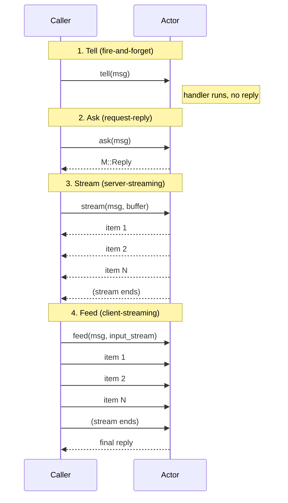

### 4.9 Tell (Fire-and-Forget)

The most fundamental communication pattern in the actor model. The sender
delivers a message and does not wait for a reply. All 6 surveyed frameworks
support this as the primary operation.

```rust
impl<A: Actor> ActorRef<A> {
    /// Fire-and-forget: deliver a message to the actor's mailbox.
    /// Only available for messages with `Reply = ()`.
    /// Outbound interceptors run automatically before delivery,
    /// stamping headers (trace context, correlation IDs, etc.).
    pub fn tell<M>(&self, msg: M) -> Result<(), ActorSendError>
    where
        A: Handler<M>,
        M: Message<Reply = ()>;
}
```

**Key properties:**

- Returns immediately — does not wait for the handler to execute
- Returns `Ok(())` on successful mailbox delivery, `Err` if the actor is stopped
- No reply channel — the sender has no way to know if the handler succeeded
- Outbound interceptors enrich headers automatically — no need for manual
  envelope construction
- If an inbound interceptor returns `Reject`, it behaves the same as `Drop`
  (no error path for fire-and-forget — the rejection goes to the dead letter handler)

**Example:**

```rust
struct LogEvent { level: String, message: String }
impl Message for LogEvent { type Reply = (); }

// Fire-and-forget — outbound interceptors auto-inject trace context,
// correlation ID, etc. No manual envelope needed.
logger.tell(LogEvent {
    level: "INFO".into(),
    message: "user logged in".into(),
}).unwrap();

// Priority is set via an outbound interceptor, not a separate method:
// e.g., PriorityInterceptor checks message type and sets Priority header
logger.tell(LogEvent {
    level: "ERROR".into(),
    message: "disk full".into(),
}).unwrap();
```

### 4.10 Ask (Request-Reply)

**Rationale:** ractor, kameo, Akka, and Actix all support ask. Not having it
forces users to implement reply channels manually.

Ask is a method directly on `ActorRef<A>` (not a separate trait). The reply
type is determined at compile time by `M::Reply`. Cancellation uses
`tokio_util::sync::CancellationToken` — the standard Rust async cancellation
primitive — instead of dedicated `_timeout` methods.

```rust
use tokio_util::sync::CancellationToken;

impl<A: Actor> ActorRef<A> {
    /// Request-reply: send a message and await the reply.
    /// Pass `None` for no cancellation, or `Some(token)` for
    /// timeout / explicit cancel / hierarchical scope cancellation.
    pub async fn ask<M>(
        &self, msg: M, cancel: Option<CancellationToken>,
    ) -> Result<M::Reply, RuntimeError>
    where
        A: Handler<M>,
        M: Message;
}
```

**Cancellation via `CancellationToken`:**

A `CancellationToken` (from `tokio_util::sync`) is the standard Rust async
cancellation primitive. It subsumes timeouts, explicit cancels, and
hierarchical scope cancellation — all with one parameter:

```rust
use tokio_util::sync::CancellationToken;

// ── Simple ask (no cancellation) ────────────────────────────
let balance = account.ask(GetBalance, None).await?;

// ── Ask with timeout ────────────────────────────────────────
// dactor provides a helper to create a token that auto-cancels after a duration:
let balance = account.ask(GetBalance, Some(cancel_after(Duration::from_secs(5)))).await?;

// ── Explicit cancellation (e.g., user pressed "Cancel") ─────
let token = CancellationToken::new();
let token_for_ui = token.clone();
// UI thread: token_for_ui.cancel() when user clicks Cancel
let balance = account.ask(GetBalance, Some(token)).await?;

// ── Hierarchical: cancel all child operations ───────────────
let parent_token = CancellationToken::new();
let (r1, r2) = tokio::join!(
    actor1.ask(Query1, Some(parent_token.child_token())),
    actor2.ask(Query2, Some(parent_token.child_token())),
);
// Cancel everything if the parent scope ends:
parent_token.cancel();  // both child tokens are also cancelled
```

**Helper:**

```rust
/// Create a CancellationToken that auto-cancels after the given duration.
pub fn cancel_after(duration: Duration) -> CancellationToken {
    let token = CancellationToken::new();
    let t = token.clone();
    tokio::spawn(async move {
        tokio::time::sleep(duration).await;
        t.cancel();
    });
    token
}
```

**What happens on cancellation:** See §4.13 for the complete cancellation
design (applies identically to ask and stream).

### 4.11 Streaming (Request-Stream)

**Rationale:** Erlang supports multi-part `gen_server` replies where a server
sends chunked results back to the caller over time. Akka has first-class
support via Akka Streams `Source`, tightly integrated with actors. gRPC server
streaming is the dominant RPC pattern for streaming data. In Rust, the async
`Stream` trait (`futures_core::Stream`) is the standard abstraction, and
`tokio::sync::mpsc` channels convert naturally into streams via
`tokio_stream::wrappers::ReceiverStream`.

dactor should provide a `stream()` method on actor references that sends a
request to an actor and returns an async stream of response items. This enables
use cases like:

- Paginated data retrieval
- Real-time event feeds / subscriptions
- Long-running computation with progressive results
- Fan-out aggregation with incremental delivery

**Core types:**

```rust
use std::pin::Pin;
use futures_core::Stream;

/// A pinned, boxed, Send-safe async stream of items.
/// This is the return type from `StreamRef::stream()` — the caller
/// consumes it with `while let Some(item) = stream.next().await`.
pub type BoxStream<T> = Pin<Box<dyn Stream<Item = T> + Send>>;

/// A sender handle given to the actor's stream handler.
/// The actor pushes items into this sender; the caller receives them
/// as an async stream on the other end.
///
/// Backed by a bounded `mpsc` channel for backpressure.
pub struct StreamSender<T: Send + 'static> {
    inner: tokio::sync::mpsc::Sender<T>,
}

impl<T: Send + 'static> StreamSender<T> {
    /// Send an item to the stream consumer.
    /// Returns `Err` if the consumer has dropped the stream.
    #[must_use = "check if the consumer dropped the stream to stop producing"]
    pub async fn send(&self, item: T) -> Result<(), StreamSendError> {
        self.inner.send(item).await
            .map_err(|_| StreamSendError::ConsumerDropped)
    }

    /// Try to send without blocking. Returns `Err` if the channel is
    /// full or the consumer has dropped.
    pub fn try_send(&self, item: T) -> Result<(), StreamSendError> {
        self.inner.try_send(item)
            .map_err(|e| match e {
                tokio::sync::mpsc::error::TrySendError::Full(_) =>
                    StreamSendError::Full,
                tokio::sync::mpsc::error::TrySendError::Closed(_) =>
                    StreamSendError::ConsumerDropped,
            })
    }

    /// Check if the consumer is still listening.
    pub fn is_closed(&self) -> bool {
        self.inner.is_closed()
    }
}

#[derive(Debug)]
pub enum StreamSendError {
    /// The consumer dropped the stream (no longer reading).
    ConsumerDropped,
    /// The channel buffer is full (backpressure).
    Full,
}
```

**Extension trait on `ActorRef`:**

Streaming is a method on `ActorRef<A>`. The actor's handler receives a
`StreamSender<R>` to push items into:

```rust
impl<A: Actor> ActorRef<A> {
    /// Send a request and receive a stream of responses.
    ///
    /// `buffer` controls the channel capacity (backpressure). A typical
    /// default is 16 or 32.
    ///
    /// Pass `None` for no cancellation, or `Some(token)` to cancel the
    /// stream externally. When the token is cancelled, the stream closes
    /// and the actor's `StreamSender::send()` returns `ConsumerDropped`.
    ///
    /// Returns `Err(RuntimeError::NotSupported)` if the adapter doesn't
    /// support streaming.
    pub fn stream<M>(
        &self,
        msg: M,
        buffer: usize,
        cancel: Option<CancellationToken>,
    ) -> Result<BoxStream<M::Reply>, RuntimeError>
    where
        A: StreamHandler<M>,
        M: Message;
}
```

**`StreamHandler` trait:**

Actors that produce a stream of responses implement `StreamHandler<M>` instead
of `Handler<M>`. The handler receives a `StreamSender` to push items into;
the caller receives them as a `BoxStream` on the other end:

```rust
/// Implemented by actors that respond to a request with a stream of items.
/// The handler receives a `StreamSender<M::Reply>` to push items into.
/// When the handler returns (or drops the sender), the stream closes.
#[async_trait]
pub trait StreamHandler<M: Message>: Actor {
    async fn handle_stream(
        &mut self,
        msg: M,
        sender: StreamSender<M::Reply>,
        ctx: &mut ActorContext,
    );
}
```

**How it works (adapter implementation pattern):**

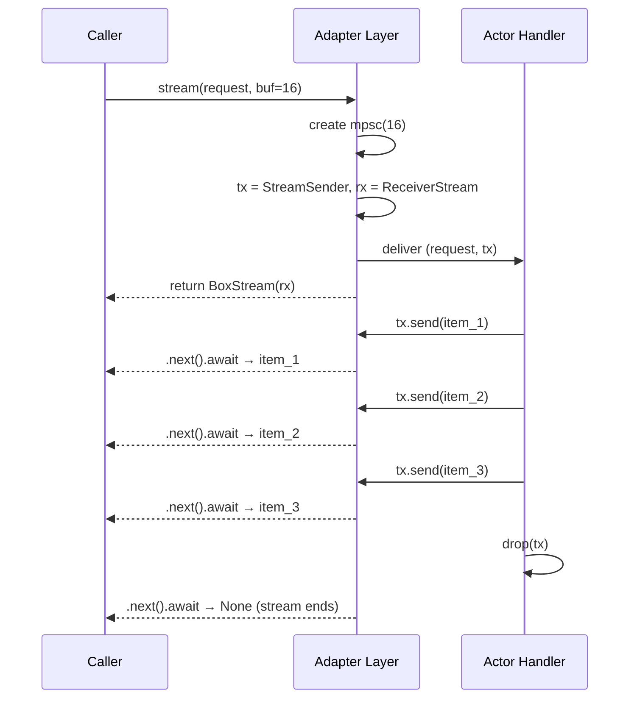

**Backpressure:** The bounded channel naturally provides backpressure. If the
caller is slow to consume, the actor's `tx.send().await` will suspend until
the caller reads an item, preventing unbounded memory growth.

**Cancellation:** When the caller drops the `BoxStream`, the `Receiver` is
dropped, closing the channel. The actor's next `tx.send()` returns
`StreamSendError::ConsumerDropped`, signaling it to stop producing.

**Example usage (caller side):**

```rust
use tokio_stream::StreamExt;

async fn get_logs(log_actor: &ActorRef<LogServer>) {
    let mut stream = log_actor.stream(GetLogs { since: yesterday() }, 32, None).unwrap();

    while let Some(entry) = stream.next().await {
        println!("{}: {}", entry.timestamp, entry.message);
    }
}
```

**Example usage (actor handler side):**

```rust
// The actor receives a tuple of (request, StreamSender)
// when dispatched via stream(). The adapter wraps the handler.
async fn handle_get_logs(request: GetLogs, tx: StreamSender<LogEntry>) {
    for entry in database.query_logs(request.since).await {
        if tx.send(entry).await.is_err() {
            break; // consumer dropped the stream
        }
    }
    // dropping tx closes the stream on the caller side
}
```

**Relationship to Tell and Ask:** The four communication patterns form a
complete matrix (mirroring gRPC's four RPC types):

| Pattern | Input | Output | gRPC Equivalent |
|---|---|---|---|
| `tell()` | single message | no reply | — |
| `ask()` | single message | single reply | Unary |
| `stream()` | single message | stream of replies | Server streaming |
| `feed()` | stream of items | optional single reply | Client streaming |

All four are methods on `ActorRef<A>`, providing a unified API. The `feed()`
pattern is detailed in §4.12; batching for both `stream()` and `feed()` is
covered in §4.11.1.

**Dependencies:** The core crate adds `futures-core` (for the `Stream` trait)
and `tokio-stream` (for `ReceiverStream`) as dependencies, both lightweight
and standard in the async Rust ecosystem.

#### 4.11.1 Stream & Feed Batching

**Problem:** In both `stream()` and `feed()`, each item is an independent
message through the channel (and over the wire for remote actors). For
high-throughput streams with small items (e.g., sensor readings, log lines,
pixel rows), per-item overhead dominates: serialization framing, channel
wake-ups, network round-trips. Batching amortizes this overhead.

**Design:** The runtime provides optional **transparent batching** controlled
by a `BatchConfig`. Batching is applied at the transport layer — the
application-level API remains item-by-item (`send(item)` / `recv()`), so
actor code doesn't change.

```rust
/// Controls automatic batching for stream and feed channels.
/// Batching is transparent — the sender/receiver API remains per-item.
///
/// A batch is flushed when ANY of these two conditions is met (whichever first):
/// - `max_items` items have accumulated
/// - `max_delay` has elapsed since the first item in the current batch
#[derive(Debug, Clone)]
pub struct BatchConfig {
    /// Maximum number of items to batch together.
    /// When this many items are buffered, the batch is flushed immediately.
    pub max_items: usize,

    /// Maximum time to wait for more items before flushing.
    /// If fewer than `max_items` are buffered but this duration elapses
    /// since the first item in the batch, the batch is flushed.
    pub max_delay: Duration,
}

impl Default for BatchConfig {
    fn default() -> Self {
        Self {
            max_items: 64,
            max_delay: Duration::from_millis(5),
        }
    }
}
```

**API integration:**

```rust
impl<A: Actor> ActorRef<A> {
    /// Send a request and receive a stream of responses, with optional batching.
    pub fn stream<M>(
        &self,
        msg: M,
        buffer: usize,
        batch_config: Option<BatchConfig>,
        cancel: Option<CancellationToken>,
    ) -> Result<BoxStream<M::Reply>, ActorSendError>
    where
        A: Handler<M>,
        M: Message;

    /// Feed an async stream into the actor, with optional batching.
    pub fn feed<Item, Reply>(
        &self,
        input: BoxStream<Item>,
        buffer: usize,
        batch_config: Option<BatchConfig>,
        cancel: Option<CancellationToken>,
    ) -> Result<AskReply<Reply>, ActorSendError>
    where
        A: FeedHandler<Item, Reply>,
        Item: Send + 'static,
        Reply: Send + 'static;
}
```

**How batching works (local actors):**

For local actors, batching has minimal benefit since channel operations are
cheap. The runtime may skip batching entirely for local sends (adapter
decides).

**How batching works (remote actors):**

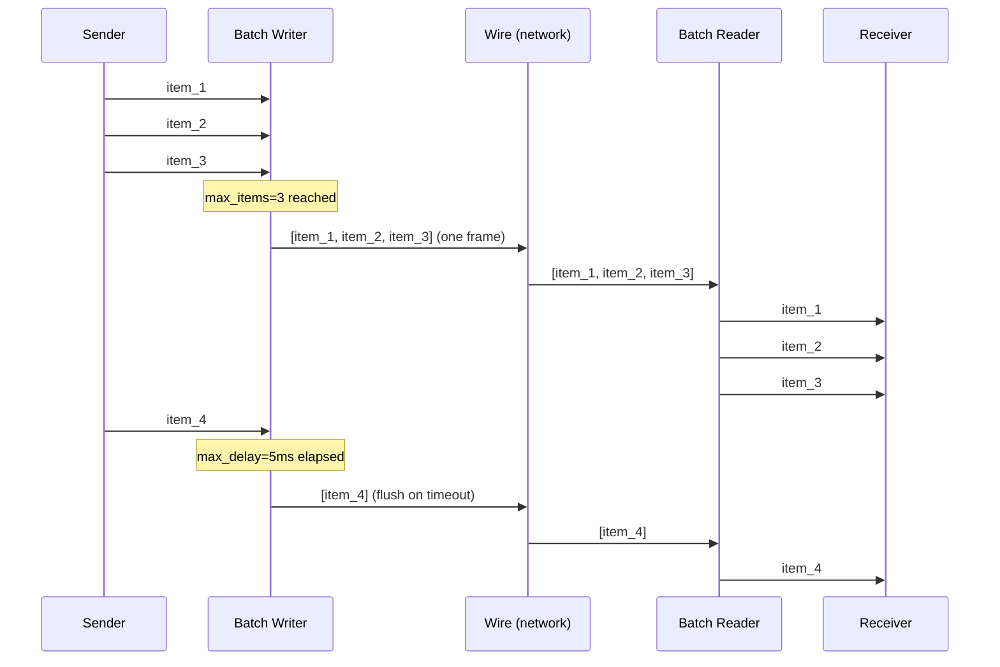

The batch writer accumulates items and flushes when either `max_items` is
reached or `max_delay` elapses. A flushed batch (Vec<T>) will be wrapped
into a single WireEnvelope by the transport layer, sharing the same
MessageId and headers. Byte-level concerns (frame size limits, throttling)
are handled by the transport layer, not the batch writer. On the receiving
end, the batch reader unpacks items and delivers them individually to the
`StreamReceiver` or `StreamSender`. The application code sees single items
as usual.

**Trade-offs:**

| Setting | Throughput | Latency |
|---|---|---|
| `max_items=1, max_delay=0` | No batching (baseline) | Lowest per-item latency |
| `max_items=64, max_delay=5ms` | Good (default) | ≤5ms added latency |
| `max_items=256, max_delay=50ms` | Best for bulk transfer | Higher latency acceptable |

> **Note:** Pass `batch_config: None` to `stream()` and `feed()` for
> per-item delivery with no batching. Batching is opt-in.

### 4.12 Feed (Client-Streaming / Stream-to-Actor)

**Rationale:** The `stream()` pattern (§4.11) covers *server-streaming* — one
request yields many response items. The inverse pattern is equally important:
the caller has an async stream of items to feed into an actor, which digests
them and optionally returns a final result. Use cases include:

- **Bulk data ingestion** — streaming CSV rows, log entries, or sensor readings
- **Aggregation** — sum/count/average over a stream of values
- **Upload pipelines** — chunked file upload with a final checksum
- **ETL processing** — transform and load a stream of records
- **Training data** — feeding batches to an ML model actor

This is analogous to gRPC client streaming, where the client sends a stream
and the server responds once after consuming it.

**Core types:**

```rust
/// Handle given to the actor to receive items from the incoming stream.
/// The actor pulls items from this receiver in its handler.
///
/// Backed by a bounded `mpsc` channel for backpressure — if the actor
/// is slow to consume, the caller's stream is naturally throttled.
pub struct StreamReceiver<T: Send + 'static> {
    inner: tokio::sync::mpsc::Receiver<T>,
}

impl<T: Send + 'static> StreamReceiver<T> {
    /// Receive the next item from the stream.
    /// Returns `None` when the stream is exhausted (caller finished or dropped).
    pub async fn recv(&mut self) -> Option<T> {
        self.inner.recv().await
    }

    /// Try to receive without blocking. Returns `None` if empty or closed.
    pub fn try_recv(&mut self) -> Option<T> {
        self.inner.try_recv().ok()
    }

    /// Convert into an async `Stream` for use with `StreamExt` combinators.
    pub fn into_stream(self) -> BoxStream<T> {
        Box::pin(tokio_stream::wrappers::ReceiverStream::new(self.inner))
    }
}
```

**Feed handler trait:**

```rust
/// Implemented by actors that can receive a stream of items.
/// The handler receives a `StreamReceiver` to pull items from.
/// It returns a final reply after processing.
#[async_trait]
pub trait FeedHandler<Item: Send + 'static, Reply: Send + 'static>: Actor {
    async fn handle_feed(
        &mut self,
        receiver: StreamReceiver<Item>,
        ctx: &mut ActorContext,
    ) -> Reply;
}
```

**Extension method on `ActorRef`:**

```rust
impl<A: Actor> ActorRef<A> {
    /// Feed an async stream of items into the actor and await a final reply.
    ///
    /// `input` is an async stream the caller provides. The runtime drains
    /// items from it and delivers them to the actor's `FeedHandler`.
    ///
    /// `buffer` controls the internal channel capacity (backpressure).
    ///
    /// `batch_config` optionally enables batching for the feed stream.
    ///
    /// `cancel` optionally cancels the feed. When cancelled, the receiver
    /// yields `None` and the actor can finalize early.
    ///
    /// Returns the actor's final reply after the stream is fully consumed
    /// (or cancelled).
    pub fn feed<Item, Reply>(
        &self,
        input: BoxStream<Item>,
        buffer: usize,
        batch_config: Option<BatchConfig>,
        cancel: Option<CancellationToken>,
    ) -> Result<AskReply<Reply>, ActorSendError>
    where
        A: FeedHandler<Item, Reply>,
        Item: Send + 'static,
        Reply: Send + 'static;
}
```

**How it works (adapter implementation pattern):**

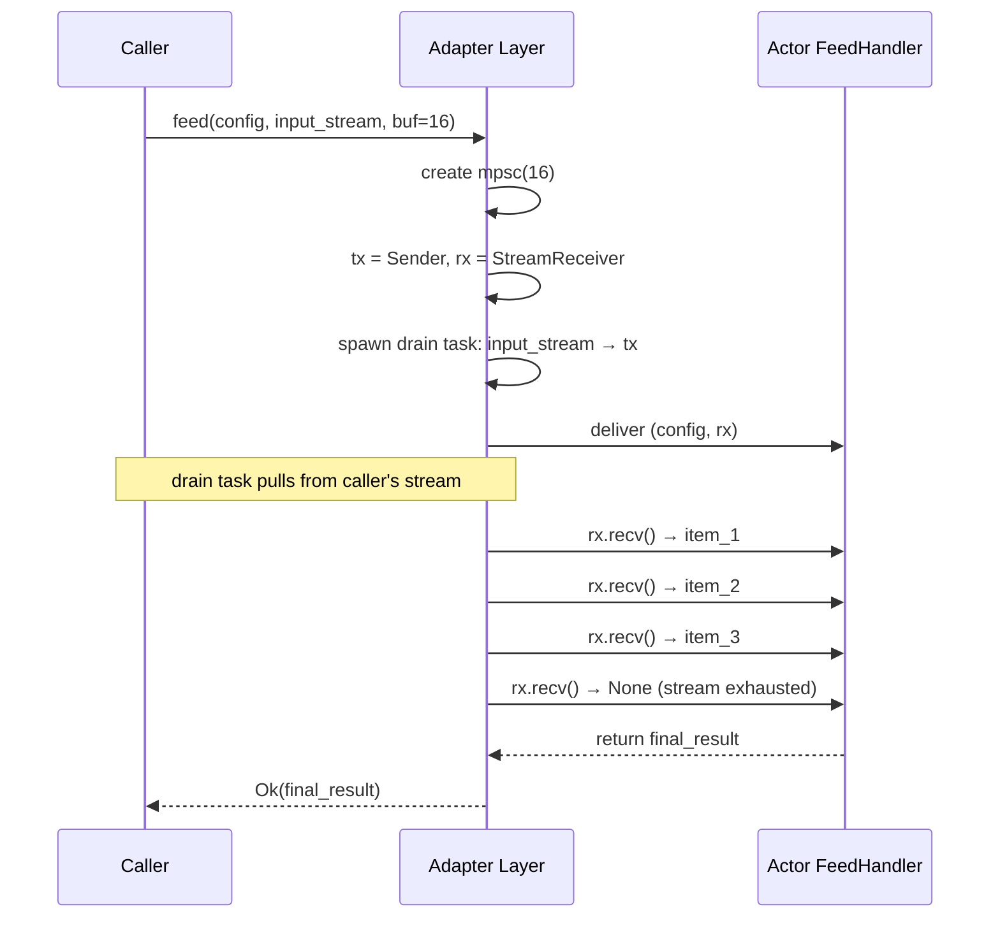

**Backpressure:** The bounded channel between the drain task and the actor
provides natural backpressure. If the actor is slow to consume items, the
drain task suspends on `tx.send().await`, which in turn stops pulling from
the caller's input stream. No unbounded buffering occurs.

**Cancellation:** When the cancellation token fires:
1. The drain task stops pulling from the input stream and drops `tx`
2. The actor's `receiver.recv()` returns `None`, signaling end-of-stream
3. The actor can finalize (compute aggregate, flush buffer, etc.)
4. The final reply is returned to the caller

**Example — Aggregation actor:**

```rust
// Actor receives a stream of i64 values and returns their sum
struct Aggregator;

#[async_trait]
impl FeedHandler<i64, i64> for Aggregator {
    async fn handle_feed(
        &mut self,
        mut receiver: StreamReceiver<i64>,
        _ctx: &mut ActorContext,
    ) -> i64 {
        let mut sum: i64 = 0;
        while let Some(value) = receiver.recv().await {
            sum += value;
        }
        sum
    }
}
```

**Caller side:**

```rust
use tokio_stream::StreamExt;

async fn compute_sum(aggregator: &ActorRef<Aggregator>) -> i64 {
    // Create an async stream of values
    let values = tokio_stream::iter(vec![10, 20, 30, 40, 50]);
    let input: BoxStream<i64> = Box::pin(values);

    let total = aggregator
        .feed::<i64, i64>(input, 16, None, None)
        .await
        .unwrap();

    println!("Total: {total}");  // Total: 150
    total
}
```

**Example — Chunked file upload:**

```rust
#[async_trait]
impl FeedHandler<Bytes, UploadResult> for StorageActor {
    async fn handle_feed(
        &mut self,
        mut receiver: StreamReceiver<Bytes>,
        ctx: &mut ActorContext,
    ) -> UploadResult {
        let mut total_bytes = 0u64;

        while let Some(chunk) = receiver.recv().await {
            total_bytes += chunk.len() as u64;
        }

        UploadResult { bytes_written: total_bytes }
    }
}
```

**Remote support:** For remote actors, the adapter serializes each stream
item and sends it over the wire using the same `MessageSerializer`. The
drain task runs on the caller's node; items flow to the remote actor via
the provider's transport. Stream items are sent as a sequence of serialized
payloads on the same logical channel.

**Interceptor visibility:** The **real interception** happens per-Item
via `on_stream_item()`:

- **Outbound `on_stream_item()`:** called on the caller side for each Item
  *before* it is sent to the actor. This is where throttling interceptors
  can observe per-item data and make rate-limiting decisions.
- **Inbound `on_stream_item()`:** called on the actor side as each Item
  is delivered from the `StreamReceiver`.

The final reply is visible to `OutboundInterceptor::on_reply`.

> **Note:** Bidirectional streaming (stream in + stream out) can be composed
> from `feed()` + actor-internal `stream()`, or by having the `FeedHandler`
> return a `BoxStream` as its reply type. This is left as an application-level
> composition rather than a first-class primitive, to keep the core API simple.

### 4.13 Cancellation

Cancellation applies to `ask()`, `stream()`, and `feed()` — the design is
identical. `tell()` is fire-and-forget and does not support cancellation.

**The problem:** Actors process messages sequentially on a single task
(§4.3). How does a handler receive a cancellation signal while it's running,
without violating the single-threaded execution guarantee?

**Answer:** The handler is `async` — it `.await`s at yield points (database
queries, network calls, channel sends). Cancellation is checked at those
yield points via `tokio::select!` against a `CancellationToken` provided
through `ActorContext`. The handler is never *interrupted* mid-computation
— it cooperatively checks for cancellation.

#### 4.13.1 Local Cancellation

For local `ask()` / `stream()`, the caller's `CancellationToken` is passed
directly to the runtime, which makes it available via `ctx.cancelled()`:

```rust
// Caller:
let result = actor.ask(ExpensiveQuery { ... }, Some(cancel_after(Duration::from_secs(5)))).await?;

// Handler:
#[async_trait]
impl Handler<ExpensiveQuery> for Worker {
    async fn handle(&mut self, msg: ExpensiveQuery, ctx: &mut ActorContext)
        -> Result<Vec<Row>, ActorError>
    {
        let mut results = Vec::new();
        for batch in msg.batches() {
            tokio::select! {
                _ = ctx.cancelled() => {
                    return Err(ActorError::new(ErrorCode::Cancelled, "cancelled by caller"));
                }
                rows = self.db.query(&batch) => {
                    results.extend(rows?);
                }
            }
        }
        Ok(results)
    }
}
```

#### 4.13.2 Remote Cancellation

`CancellationToken` is an in-process primitive — it **cannot be serialized**.
For remote calls, the runtime's local `CancelManager` system actor sends a
`CancelRequest` to the remote node's `CancelManager` system actor (see §8.2).
This uses the adapter's existing remote messaging — no separate transport.

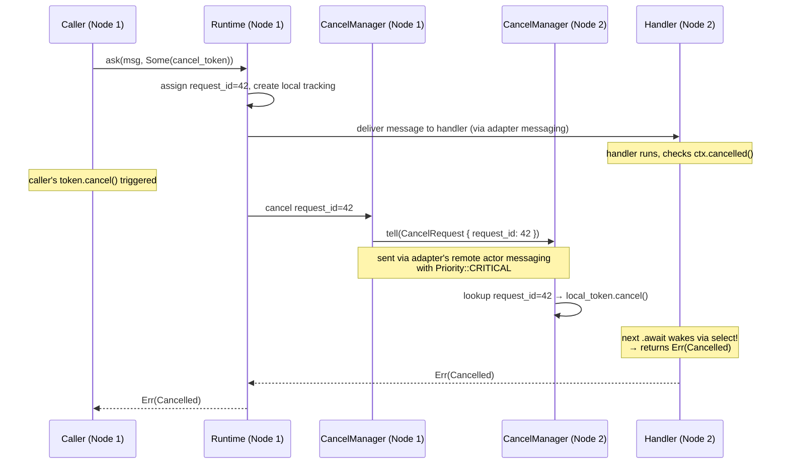

**`CancelRequest` is sent as a `Priority::CRITICAL` message to the remote
`CancelManager` system actor.** Since `CancelManager` has its own mailbox
(separate from the target actor's mailbox), the cancel is not blocked by
the target actor's message queue.

On the remote node, `CancelManager` maintains a map of `request_id →
local CancellationToken`. When it receives a `CancelRequest`, it calls
`token.cancel()`, which wakes the handler's `select!` at the next `.await`
point.

```rust
/// System actor that handles cancellation requests on this node.
/// One per node, spawned automatically by the runtime.
pub(crate) struct CancelManager {
    active_requests: HashMap<u64, CancellationToken>,
}

impl Actor for CancelManager {
    type Args = ();
    type Deps = ();
    fn create(_args: (), _deps: ()) -> Self {
        CancelManager { active_requests: HashMap::new() }
    }
}

#[derive(Serialize, Deserialize)]
pub(crate) struct CancelRequest {
    pub request_id: u64,
}

impl Message for CancelRequest { type Reply = (); }

#[async_trait]
impl Handler<CancelRequest> for CancelManager {
    async fn handle(&mut self, msg: CancelRequest, _ctx: &mut ActorContext) {
        if let Some(token) = self.active_requests.remove(&msg.request_id) {
            token.cancel();
        }
    }
}
```

#### 4.13.3 How the Runtime Delivers Cancellation

The cancellation signal does **not** enter the actor's mailbox. Instead,
the runtime manages it out-of-band:

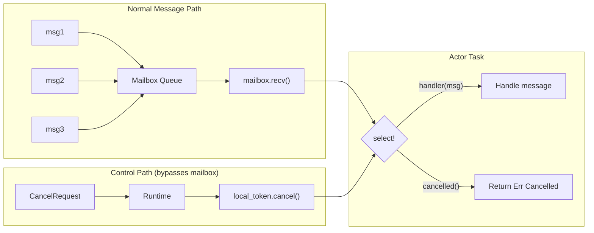

The runtime wraps each handler invocation in a `select!` that races the
handler against `local_token.cancelled()`. This means:

- **Handlers that opt in** (using `ctx.cancelled()` inside their own
  `select!`) get fine-grained cancellation at their chosen yield points
- **Handlers that don't opt in** still get cancelled at the outer `select!`
  after the handler returns — the reply is discarded if the token has fired

#### 4.13.4 Thread Safety Guarantees

1. **No thread interruption** — the actor's single task is never interrupted.
   Cancellation is cooperative: it triggers at `.await` points via `select!`.

2. **`ctx.cancelled()` is a future, not a signal** — it only resolves when
   polled at an `.await` point. Between `.await` points, the handler runs
   uninterrupted.

3. **No data races** — `CancellationToken` uses atomic operations internally.
   The handler polling `ctx.cancelled()` and the runtime calling
   `local_token.cancel()` happen on different tokio tasks, coordinated
   safely by the tokio scheduler.

4. **Cancellation granularity depends on the handler:**

   | Handler type | Cancellation speed |
   |---|---|
   | Many `.await` points (batch processing) | Fast — cancels between batches |
   | One long `.await` (single DB query) | Slow — cancels when query completes |
   | CPU-bound, no `.await` | Cannot cancel until handler returns |
   | Stream handler (sends many items) | Fast — `tx.send().await` checks each item |

#### 4.13.5 Cancellation Outcomes

| Scenario | `ask()` result | `stream()` result | `feed()` result |
|---|---|---|---|
| Token cancelled before handler starts | `Err(Cancelled)` | `Err(Cancelled)` — stream never opens | `Err(Cancelled)` — input stream not drained |
| Token cancelled during handler | `Err(Cancelled)` | Stream closes, `StreamSender` returns `ConsumerDropped` | Drain task stops, `StreamReceiver` yields `None`, handler can finalize early |
| Handler finishes before cancel arrives | `Ok(reply)` — cancel is a no-op | Stream items delivered, then ends normally | `Ok(reply)` — cancel is a no-op |
| No cancellation token (`None`) | Runs to completion | Runs to completion | Runs to completion |
| Handler cooperatively checks `ctx.cancelled()` | Returns `Err(Cancelled)` with partial results | Stops sending items, drops `StreamSender` | Stops consuming, returns partial result or `Err(Cancelled)` |

#### 4.13.6 `ErrorCode::Cancelled`

```rust
#[non_exhaustive]
pub enum ErrorCode {
    // ... existing codes ...

    /// The operation was cancelled by the caller (via CancellationToken).
    /// Analogous to gRPC `CANCELLED`.
    Cancelled,
}
```

#### 4.13.7 `ActorContext.cancelled()`

```rust
impl ActorContext {
    /// Returns a future that completes when the current operation is
    /// cancelled (by the caller or by timeout). Use with `tokio::select!`.
    ///
    /// For calls without a CancellationToken (`None`), this future
    /// never completes — the operation runs to completion.
    pub async fn cancelled(&self);
}
```

#### 4.13.8 Helper: `cancel_after()`

```rust
/// Create a CancellationToken that auto-cancels after the given duration.
/// Convenience for timeout-based cancellation.
pub fn cancel_after(duration: Duration) -> CancellationToken {
    let token = CancellationToken::new();
    let t = token.clone();
    tokio::spawn(async move {
        tokio::time::sleep(duration).await;
        t.cancel();
    });
    token
}
```

---

### 4.14 Actor Pool / Worker Factory

**Rationale:** A single actor processes messages sequentially — this is safe
but limits throughput. When work is stateless or partitionable, a **pool of
worker actors** can process messages in parallel. This is supported by 4+ of
the 6 surveyed frameworks, qualifying under the superset rule.

| Framework | Mechanism | Routing Strategies |
|---|---|---|
| **Erlang/OTP** | `poolboy` library, supervisor-managed worker pools | Checkout/checkin, FIFO |
| **Akka** | `Routers.pool(N)` with configurable routing | RoundRobin, Random, SmallestMailbox, Broadcast, ConsistentHashing |
| **Ractor** | `Factory` module with `Worker` trait | RoundRobin, KeyPersistent (sticky), StickyQueuer, Custom |
| **Kameo** | `ActorPool` built-in abstraction | Round-robin, least-connections |
| **Actix** | `SyncArbiter::start(N, \|\| MyActor)` for N instances | Round-robin (implicit) |
| **Coerce** | Sharding primitives, custom routing | Shard-key-based distribution |

**dactor API:**

```rust
/// Routing strategy for distributing messages across pool workers.
#[derive(Debug, Clone)]
#[non_exhaustive]
pub enum PoolRouting {
    /// Distribute messages evenly across workers in order.
    RoundRobin,
    /// Route to the worker with the fewest queued messages.
    LeastLoaded,
    /// Route randomly.
    Random,
    /// Route by a key — all messages with the same key go to the same
    /// worker, preserving per-key ordering (sticky sessions).
    KeyBased,
}

/// Configuration for an actor pool.
pub struct PoolConfig {
    /// Number of worker instances.
    pub pool_size: usize,
    /// How to distribute messages across workers.
    pub routing: PoolRouting,
    /// Per-worker spawn configuration (mailbox, interceptors).
    pub worker_config: SpawnConfig,
}

impl Default for PoolConfig {
    fn default() -> Self {
        Self {
            pool_size: num_cpus::get(),
            routing: PoolRouting::RoundRobin,
            worker_config: SpawnConfig::default(),
        }
    }
}
```

**Spawning a pool:**

```rust
/// A handle to a pool of actors. Sending a message to the pool
/// routes it to one worker according to the routing strategy.
/// Implements the same ActorRef<A> interface as a single actor.
pub struct PoolRef<A: Actor> { /* ... */ }

impl<A: Actor> PoolRef<A> {
    /// Fire-and-forget: route a message to a pool worker.
    pub fn tell<M>(&self, msg: M) -> Result<(), ActorSendError>
    where A: Handler<M>, M: Message<Reply = ()> { ... }

    /// Fire-and-forget a keyed message, routing by `Keyed::routing_key`.
    /// All messages with the same key are routed to the same worker.
    pub fn tell_keyed<M>(&self, msg: M) -> Result<(), ActorSendError>
    where A: Handler<M>, M: Message<Reply = ()> + Keyed { ... }

    /// Request-reply: route a message to a pool worker and await the reply.
    pub fn ask<M>(
        &self, msg: M, cancel: Option<CancellationToken>,
    ) -> Result<AskReply<M::Reply>, ActorSendError>
    where A: Handler<M>, M: Message { ... }

    /// Request-reply with a keyed message, routing by `Keyed::routing_key`.
    pub fn ask_keyed<M>(
        &self, msg: M, cancel: Option<CancellationToken>,
    ) -> Result<AskReply<M::Reply>, ActorSendError>
    where A: Handler<M>, M: Message + Keyed { ... }

    /// Request-stream: route a message to a pool worker and receive a stream.
    pub fn stream<M>(
        &self, msg: M, buffer: usize, cancel: Option<CancellationToken>,
    ) -> Result<BoxStream<M::Reply>, RuntimeError>
    where A: Handler<M>, M: Message { ... }
}

impl ActorRuntime {
    /// Spawn a pool of N identical worker actors.
    ///
    /// All workers share the same `Args` (cloned for each). Each worker
    /// gets its own `Deps` via the `deps_factory` — called N times to
    /// produce per-worker dependencies (separate DB connections, unique
    /// actor refs, etc.).
    ///
    /// On worker restart, the runtime calls `deps_factory` again to get
    /// fresh deps, then `Actor::create(args.clone(), new_deps)`.
    fn spawn_pool<A: Actor>(
        &self,
        name: &str,
        pool_config: PoolConfig,
        args: A::Args,
        deps_factory: impl Fn(usize) -> A::Deps + Send + 'static,
    ) -> Result<PoolRef<A>, RuntimeError>
    where
        A::Args: Clone;
}
```

**How Args and Deps work in a pool:**

| | `Args` | `Deps` |
|---|---|---|
| **Shared or per-worker?** | Shared — cloned for each worker | Per-worker — `deps_factory(worker_index)` called N times |
| **On restart** | Same `Args` (cloned again) | Fresh `Deps` (factory called again) |
| **Remote spawn** | `Args` serialized once, cloned on remote | `DepsFactory` resolved on remote node |

```rust
// deps_factory receives the worker index (0..pool_size)
// so each worker can get unique resources
deps_factory: impl Fn(usize) -> A::Deps
```

**Usage examples:**

```rust
// ── Tier 1: No deps (Deps = ()) ─────────────────────────────

struct ImageResizer { quality: u32 }

impl Actor for ImageResizer {
    type Args = Self;       // Args = Self, simple
    type Deps = ();         // no local deps
    fn create(args: Self, _deps: ()) -> Self { args }
}

let pool = runtime.spawn_pool(
    "image-resizer",
    PoolConfig { pool_size: 8, routing: PoolRouting::RoundRobin, ..Default::default() },
    ImageResizer { quality: 85 },   // Args — cloned 8 times
    |_worker_index| (),              // no deps
)?;
```

```rust
// ── Tier 2: Per-worker deps (each gets own DB connection) ───

#[derive(Clone, Serialize, Deserialize)]
struct QueryWorkerArgs {
    db_url: String,
    max_rows: usize,
}

struct QueryWorkerDeps {
    conn: DbConnection,  // non-serializable, per-worker
}

struct QueryWorker {
    args: QueryWorkerArgs,
    deps: QueryWorkerDeps,
}

impl Actor for QueryWorker {
    type Args = QueryWorkerArgs;
    type Deps = QueryWorkerDeps;
    fn create(args: QueryWorkerArgs, deps: QueryWorkerDeps) -> Self {
        QueryWorker { args, deps }
    }
}

let pool = runtime.spawn_pool(
    "query-pool",
    PoolConfig { pool_size: 4, ..Default::default() },
    QueryWorkerArgs { db_url: "postgres://localhost/mydb".into(), max_rows: 1000 },
    |worker_index| {
        // Each worker gets its own DB connection
        let conn = DbConnection::connect(&format!("postgres://localhost/mydb?pool={}", worker_index));
        QueryWorkerDeps { conn }
    },
)?;
```

```rust
// ── Tier 3: Per-worker deps with shared resources ───────────

struct ProcessorDeps {
    metrics: Arc<MetricsCollector>,     // shared across all workers
    output: ActorRef<OutputCollector>,  // shared
    worker_id: usize,                   // unique per worker
}

let metrics = Arc::new(MetricsCollector::new());
let output = runtime.spawn("output", OutputCollectorArgs {}, ())?;

let pool = runtime.spawn_pool(
    "processor-pool",
    PoolConfig { pool_size: 16, routing: PoolRouting::LeastLoaded, ..Default::default() },
    ProcessorArgs { batch_size: 100 },
    {
        let metrics = metrics.clone();
        let output = output.clone();
        move |worker_index| ProcessorDeps {
            metrics: metrics.clone(),   // Arc clone — shared
            output: output.clone(),     // ActorRef clone — shared
            worker_id: worker_index,    // unique per worker
        }
    },
)?;
```

**Key-based (sticky) routing:**

```rust
/// For key-based routing, messages must implement this trait
/// to extract the routing key.
pub trait Keyed {
    type Key: Hash + Eq + Clone + Send;
    fn key(&self) -> Self::Key;
}

// Example: route by user_id — all messages for the same user
// go to the same worker, preserving per-user ordering
struct UserRequest { user_id: u64, action: String }

impl Keyed for UserRequest {
    type Key = u64;
    fn key(&self) -> u64 { self.user_id }
}
```

**Important:** Each worker in the pool is an **independent actor** with its own
state. The sequential execution guarantee (§4.3) applies per worker — no two
handlers run concurrently on the same worker instance. Parallelism comes from
having multiple workers, each processing their own messages.

**Adapter support:**

| Adapter | Strategy | Detail |
|---|:---:|---|
| dactor-ractor | ✅ Library | ractor's `Factory` module with `Worker` trait, multiple routing strategies |
| dactor-kameo | ✅ Library | kameo's `ActorPool` built-in abstraction |
| dactor-coerce | ⚙️ Adapter | coerce has sharding primitives; adapter wraps as pool with routing |
| dactor-mock | ⚙️ Adapter | mock runtime spawns N local actors with routing logic |

---

---

## 5. Messaging & Mailbox

**Scope:** Mailbox configuration is **per-actor**. Each actor has its own
independent mailbox with its own type (FIFO / bounded / priority), capacity,
overflow strategy, and fairness policy. There is no global cross-actor
priority queue — the runtime schedules actors independently, and each actor
processes messages from its own mailbox in its own order.

### 5.1 Envelope & Headers

**Rationale:** Every distributed system eventually needs message metadata — trace
IDs, correlation IDs, deadlines, security context. Baking this into the
framework from day one avoids a breaking change later.

**Design challenge:** Headers must be type-safe locally (no string lookups,
no downcasting) but also serializable for remote calls. `TypeId`-keyed storage
with `dyn Any` solves the local case but cannot cross the wire — `TypeId` is
process-local and `dyn Any` has no serialization. The solution is a **dual-layer
design**: typed access locally, string-keyed bytes on the wire.

```rust
/// A header value that can be stored in the Headers map.
///
/// Locally: stored by `TypeId` for type-safe access (no string lookups).
/// Remotely: serialized to bytes via `to_bytes()` with a string key from
/// `header_name()` for wire transport.
///
/// Headers that are local-only (e.g., `HandlerStartTime(Instant)`) can
/// return `None` from `to_bytes()` — they will be stripped during remote
/// serialization and not sent over the wire.
pub trait HeaderValue: Send + Sync + 'static {
    /// Stable, unique name for this header type (e.g., "dcontext.TraceContext").
    /// Used as the key when serializing headers for remote transport.
    ///
    /// **Must be unique across all header types.** If two header types
    /// return the same name, inserting one will overwrite the other
    /// during remote serialization/deserialization.
    fn header_name(&self) -> &'static str;

    /// Serialize this header to bytes for remote transport.
    /// Returns `None` if this header is local-only and should not cross the wire.
    fn to_bytes(&self) -> Option<Vec<u8>>;

    /// Reconstruct a header from bytes received from a remote node.
    /// This is a static method — called via the HeaderRegistry to deserialize.
    fn from_bytes(bytes: &[u8]) -> Result<Self, ActorError> where Self: Sized;

    /// Downcast support for local typed access.
    fn as_any(&self) -> &dyn std::any::Any;
}

/// A collection of typed headers attached to a message.
///
/// **Local access:** Type-safe via `TypeId` — `insert::<H>()` / `get::<H>()`
/// work without string lookups or downcasting guesswork.
///
/// **Remote serialization:** When headers need to cross the wire, the runtime
/// calls `to_wire()` which converts all serializable headers to a
/// `WireHeaders` map (string key → bytes). Non-serializable (local-only)
/// headers are silently dropped.
#[derive(Default)]
pub struct Headers { /* TypeMap internally */ }

impl Headers {
    pub fn insert<H: HeaderValue>(&mut self, value: H);
    pub fn get<H: HeaderValue>(&self) -> Option<&H>;
    pub fn remove<H: HeaderValue>(&mut self) -> Option<H>;
    pub fn is_empty(&self) -> bool;

    /// Convert all serializable headers to wire format.
    /// Local-only headers (where `to_bytes()` returns `None`) are skipped.
    pub fn to_wire(&self) -> WireHeaders;

    /// Reconstruct typed headers from wire format.
    /// Uses the `HeaderRegistry` to look up deserializers by header name.
    pub fn from_wire(wire: WireHeaders, registry: &HeaderRegistry) -> Self;
}

/// Read-only headers auto-generated by the runtime.
/// Interceptors can read these but cannot modify or remove them.
pub struct RuntimeHeaders {
    /// Unique message ID — auto-assigned by the runtime for every message.
    pub message_id: MessageId,
    /// When the runtime received/created this message.
    pub timestamp: Instant,
}

/// Unique identifier for a message, auto-assigned by the runtime.
#[derive(Debug, Clone, Copy, PartialEq, Eq, Hash, Serialize, Deserialize)]
pub struct MessageId(pub Uuid);
```

**Runtime headers vs user headers — two separate objects:**

Interceptors receive both, but with different mutability:

| Header type| Who sets | Interceptor access | Contents |
|---|---|---|---|
| `RuntimeHeaders` | Runtime (automatic) | **Read-only** `&RuntimeHeaders` | `MessageId`, `timestamp` |
| `Headers` | Interceptors / application | **Mutable** `&mut Headers` in `on_receive`/`on_send` | Trace context, correlation ID, priority, custom headers |

**`MessageId` flow — request → reply correlation:**

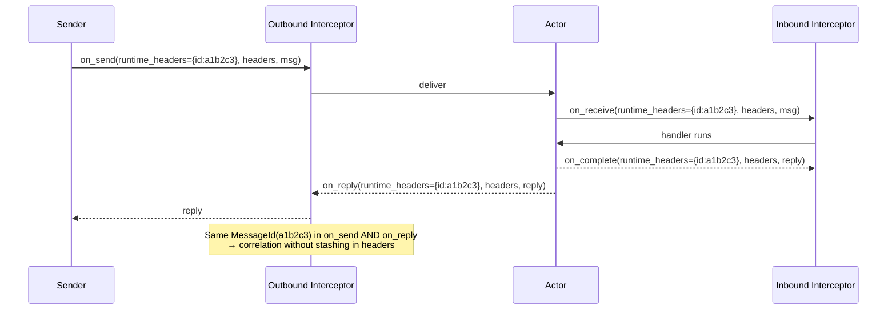

**Header flow — request headers travel with the reply:**

For ask and stream, the **request's user headers are preserved and
returned with the reply**:

| Header flow | Tell | Ask | Stream |
|---|---|---|---|
| **Request headers → handler** | ✅ `ctx.headers` | ✅ `ctx.headers` | ✅ `ctx.headers` |
| **Request headers → reply** | N/A | ✅ carried back | ✅ with each item |
| **`RuntimeHeaders`** | Assigned | Same ID in reply | Same ID in each item |

**Envelope struct:**

```rust
/// An envelope wrapping a message body with headers.
/// Used for LOCAL sends — the message is passed by move (no serialization).
pub struct Envelope<M> {
    /// Runtime-managed, read-only headers (MessageId, timestamp).
    pub runtime_headers: RuntimeHeaders,
    /// User/interceptor-managed headers (trace context, priority, custom).
    pub headers: Headers,
    /// The message body.
    pub body: M,
}
```

**`Envelope<M>` vs `WireEnvelope` — two distinct types for two paths:**
|---|---|---|
| **Used for** | Local sends (same process) | Remote sends (cross-node) |
| **Message body** | `M` — typed, passed by move | `Vec<u8>` — serialized bytes |
| **Headers** | `Headers` — TypeId-keyed TypeMap | `WireHeaders` — string→bytes map |
| **Serialization** | None — zero-cost | Full — via `MessageSerializer` |
| **Can contain `Arc`, closures** | ✅ Yes | ❌ No (must be serializable) |
| **Version field** | No | `version: Option<u32>` |
| **Defined in** | §5.1 | §10.1 |

The runtime automatically chooses which path based on the target `ActorId`:
- Same node (`target.node == local_node`) → `Envelope<M>`, pass by move
- Different node → convert to `WireEnvelope`, serialize, send over network

**How remote header transport works:**

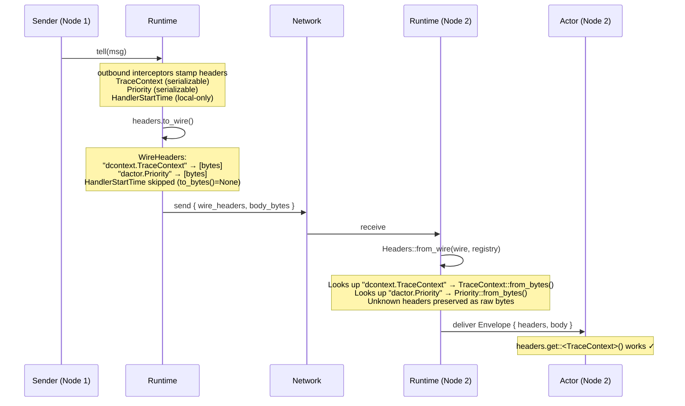

**Header Registry:**

Each node maintains a registry of known header types so it can deserialize
incoming wire headers back into typed values:

```rust
/// Registry of header deserializers, populated at startup.
pub struct HeaderRegistry {
    deserializers: HashMap<String, Box<dyn Fn(&[u8]) -> Result<Box<dyn HeaderValue>, ActorError>>>,
}

impl HeaderRegistry {
    /// Register a header type so it can be deserialized from wire format.
    pub fn register<H: HeaderValue + Default>(&mut self) {
        let sample = H::default();
        let name = sample.header_name().to_string();
        self.deserializers.insert(
            name,
            Box::new(|bytes| Ok(Box::new(H::from_bytes(bytes)?))),
        );
    }
}

// At startup:
registry.register::<dcontext::TraceContext>();
registry.register::<dcontext::CorrelationId>();
registry.register::<dactor::Priority>();
```

**Three categories of headers:**

| Category | `to_bytes()` | Crosses wire? | Example |
|---|:---:|:---:|---|
| **Serializable** | `Some(bytes)` | ✅ | `TraceContext`, `CorrelationId`, `Priority` |
| **Local-only** | `None` | ❌ Stripped | `HandlerStartTime(Instant)`, `SpanContext(tracing::Span)` |
| **Unknown remote** | — | ✅ Preserved as raw bytes | Headers from a newer version of a peer service |

Unknown headers (names not in the local `HeaderRegistry`) are preserved as
raw `WireHeader` entries in the `Headers` map. They can be forwarded to the
next hop without deserialization — enabling forward compatibility when
different nodes run different versions.

**dactor does NOT define concrete header types** like `TraceContext` or
`CorrelationId`. The `Headers` container is a generic typed map — any type
implementing `HeaderValue` can be inserted. Concrete context types (trace
context, correlation IDs, auth tokens, deadlines) are provided by external
crates such as [`dcontext`](https://github.com/Yaming-Hub/dcontext) and
consumed by interceptors for context propagation. This keeps dactor free of
opinionated context structures.

The only built-in header type is `Priority`:

- **`Priority`** — message priority level for priority mailboxes (§5.6)

```rust
/// Message priority level for priority mailboxes.
/// See §5.6 for details and usage.
pub use crate::mailbox::Priority;

impl HeaderValue for Priority {
    fn header_name(&self) -> &'static str { "dactor.Priority" }
    fn to_bytes(&self) -> Option<Vec<u8>> {
        Some(bincode::serialize(self).unwrap())
    }
    fn from_bytes(bytes: &[u8]) -> Result<Self, ActorError> {
        bincode::deserialize(bytes).map_err(|e| ActorError::new(ErrorCode::Internal, e.to_string()))
    }
    fn as_any(&self) -> &dyn std::any::Any { self }
}
```

**Example: external crate provides context, interceptor propagates it:**

```rust
// In dcontext crate (external):
pub struct TraceContext { pub trace_id: String, pub span_id: String }

impl dactor::HeaderValue for TraceContext {
    fn header_name(&self) -> &'static str { "dcontext.TraceContext" }

    fn to_bytes(&self) -> Option<Vec<u8>> {
        // Serializable — crosses the wire
        Some(serde_json::to_vec(self).unwrap())
    }

    fn from_bytes(bytes: &[u8]) -> Result<Self, ActorError> {
        serde_json::from_slice(bytes)
            .map_err(|e| ActorError::new(ErrorCode::Internal, e.to_string()))
    }

    fn as_any(&self) -> &dyn std::any::Any { self }
}

// Local-only header — never crosses the wire:
struct HandlerStartTime(Instant);

impl dactor::HeaderValue for HandlerStartTime {
    fn header_name(&self) -> &'static str { "internal.HandlerStartTime" }
    fn to_bytes(&self) -> Option<Vec<u8>> { None }  // ← local-only
    fn from_bytes(_: &[u8]) -> Result<Self, ActorError> { unreachable!() }
    fn as_any(&self) -> &dyn std::any::Any { self }
}
```

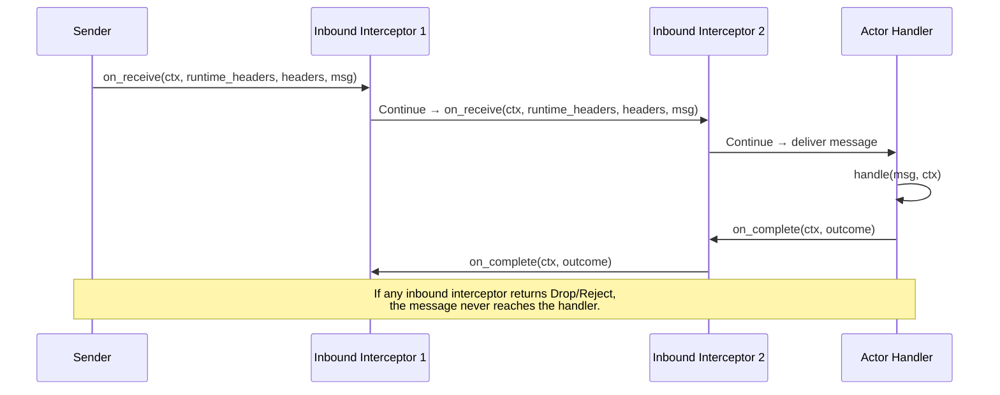

### 5.2 Inbound Interceptor Pipeline

**Rationale:** Akka has `Behaviors.intercept`, HTTP frameworks have middleware.
An interceptor pipeline lets users add cross-cutting concerns (logging,
metrics, tracing, auth) without modifying actor code.

```rust
/// Outcome of an interceptor's processing.
pub enum Disposition {
    /// Continue to the next interceptor / deliver the message.
    Continue,
    /// Delay the message by the specified duration before proceeding.
    ///
    /// **Inbound (on_receive):** The message remains in the mailbox at its
    /// current position — it does NOT change queue order. The runtime sleeps
    /// for the delay, then continues the interceptor chain. Other messages
    /// already in the queue are not affected.
    ///
    /// **Outbound (on_send):** The delay occurs before the message is sent,
    /// blocking the caller's `tell()`/`ask()`/`stream()`/`feed()` call for
    /// the specified duration. This provides natural caller-side throttling.
    ///
    /// Multiple interceptors can each return `Delay` — delays are cumulative.
    Delay(Duration),
    /// Drop the message silently. For `tell()`, the sender sees `Ok(())`
    /// — fire-and-forget has no error feedback. For `ask()`, the reply
    /// channel is dropped so the sender's `.await` yields a channel error.
    Drop,
    /// Reject the message with a reason. Only the reason string is provided
    /// here — the runtime automatically attaches the interceptor's `name()`
    /// when constructing the error for the caller. Semantics differ by send mode:
    /// - `tell()`: behaves like `Drop` (fire-and-forget has no error path)
    /// - `ask()`: sender receives `Err(RuntimeError::Rejected { interceptor, reason })`
    ///   immediately — giving a clear, actionable error
    /// - `stream()` / `feed()`: sender receives `Err(RuntimeError::Rejected { .. })`
    ///   before any stream items flow
    Reject(String),
    /// Tell the caller to retry after the suggested duration. Unlike `Delay`
    /// (which holds the message in the pipeline), `Retry` returns immediately
    /// to the caller with `Err(RuntimeError::RetryAfter { .. })`, letting the
    /// caller decide whether and when to resend. The message is NOT delivered.
    ///
    /// Use cases: circuit breakers, load shedding, backpressure signaling
    /// where the caller should back off rather than queue up.
    ///
    /// Semantics per send mode:
    /// - `tell()`: behaves like `Drop` (fire-and-forget has no error path)
    /// - `ask()`: sender receives `Err(RuntimeError::RetryAfter { interceptor, retry_after })`
    /// - `stream()` / `feed()`: same as `ask()`
    Retry(Duration),
}
```

**How the runtime handles `Rejected` and `Retry` errors:**

```rust
// Inside the runtime's interceptor pipeline execution:
let mut total_delay = Duration::ZERO;
for interceptor in &interceptors {
    match interceptor.on_receive(&ctx, &runtime_headers, &mut headers, &*msg) {
        Disposition::Continue => continue,
        Disposition::Delay(duration) => {
            total_delay += duration;  // cumulative
            continue;
        }
        Disposition::Drop => return drop_message(),
        Disposition::Reject(reason) => {
            return Err(RuntimeError::Rejected {
                interceptor: interceptor.name(),
                reason,
            });
        }
        Disposition::Retry(retry_after) => {
            return Err(RuntimeError::RetryAfter {
                interceptor: interceptor.name(),
                retry_after,
            });
        }
    }
}
if !total_delay.is_zero() {
    tokio::time::sleep(total_delay).await;
}
// deliver message to handler
```

**What the caller sees:**

```rust
match actor.ask(Transfer { amount: 1000 }).await {
    Ok(receipt) => { /* success */ }
    Err(RuntimeError::Rejected { interceptor, reason }) => {
        // interceptor = "rate-limiter"
        // reason = "exceeded 100 requests/sec for actor order-processor"
        eprintln!("Rejected by '{}': {}", interceptor, reason);
    }
    Err(other) => { /* other errors */ }
}

/// Metadata about the message and its target, provided to interceptors
/// alongside the mutable headers. All fields are read-only.
pub struct InboundContext<'a> {
    /// The unique ID of the target actor.
    pub actor_id: ActorId,
    /// The name the actor was spawned with.
    pub actor_name: &'a str,
    /// The Rust type name of the message (e.g., `"my_crate::Increment"`).
    /// Obtained via `std::any::type_name::<M>()` at dispatch time.
    pub message_type: &'static str,
    /// How the message was sent: `Tell`, `Ask`, `Stream`, or `Feed`.
    pub send_mode: SendMode,
    /// Whether this message arrived from a remote node (cross-network).
    pub remote: bool,
    /// The node that sent this message. `None` for local sends.
    pub origin_node: Option<NodeId>,
}

/// How the message was sent — lets interceptors vary behavior
/// (e.g., `Reject` is only meaningful for `Ask`; `Delay` on outbound
/// throttles the caller's send call).
#[derive(Debug, Clone, Copy, PartialEq, Eq)]
pub enum SendMode {
    Tell,
    Ask,
    Stream,
    Feed,
}

/// An interceptor that can observe or modify messages in transit.
///
/// Interceptors form an ordered pipeline. Each interceptor sees the
/// envelope headers and message context before the actor's handler,
/// and can modify headers, log, record metrics, or reject the message.
///
/// ## Lifecycle per send mode
///
/// ### `Tell` (fire-and-forget)
/// ```text
/// on_receive → handler executes → on_complete(outcome=Success)
///                                  on_complete(outcome=HandlerError) if handler fails
/// ```
///
/// ### `Ask` (request-reply)
/// ```text
/// on_receive → handler executes → on_complete(outcome=Reply)
///                                  on_complete(outcome=HandlerError) if handler fails
/// ```
/// The interceptor can observe (but not modify) the reply or error.
/// This enables metrics (latency, error rates) and tracing (span
/// completion) without coupling to the reply type.
///
/// ### `Stream` (request-stream)
/// ```text
/// on_receive → handler starts → on_stream_item per item
///                              → on_complete(outcome=StreamCompleted)   if stream ends normally
///                              → on_complete(outcome=StreamCancelled)   if consumer drops stream
///                              → on_complete(outcome=HandlerError)      if handler fails
/// ```
/// `on_complete` is called exactly **once** at the end of the stream,
/// not per item. For per-item observation, use `on_stream_item`.
///
/// ### `Feed` (client-streaming)
/// ```text
/// on_receive → handler starts consuming StreamReceiver
///   → on_stream_item per input item   (as items arrive from caller)
///   → on_complete(outcome=Replied)         if handler returns Ok
///   → on_complete(outcome=HandlerError)    if handler fails
///   → on_complete(outcome=StreamCancelled) if cancel token fires
/// ```
/// The real interception happens per-Item via `on_stream_item`.
/// On the outbound (caller) side,
/// `OutboundInterceptor::on_stream_item` fires for each Item *before*
/// it is sent to the actor — enabling per-item throttling and metrics.
pub trait InboundInterceptor: Send + Sync + 'static {
    /// Human-readable name for this interceptor (e.g., "auth-check",
    /// "rate-limiter", "circuit-breaker"). Included in `Rejected` errors
    /// and dead letter events so operators know which interceptor
    /// blocked a message.
    fn name(&self) -> &'static str;

    /// Called before the message is delivered to the actor's handler.
    /// The message body is provided as `&dyn Any` (shared reference) —
    /// interceptors can downcast to the concrete type for content-based
    /// decisions but **cannot mutate the message body**. To carry
    /// per-message data through the pipeline, use mutable `headers`.
    fn on_receive(
        &self,
        ctx: &InboundContext<'_>,
        runtime_headers: &RuntimeHeaders,
        headers: &mut Headers,
        message: &dyn Any,
    ) -> Disposition {
        let _ = (ctx, runtime_headers, message);
        Disposition::Continue
    }

    /// Called after the actor's handler finishes (for Tell/Ask/Feed) or
    /// after the stream ends (for Stream). Called exactly once per
    /// message, regardless of send mode.
    fn on_complete(
        &self,
        ctx: &InboundContext<'_>,
        headers: &Headers,
        outcome: &Outcome,
    ) {
        let _ = (ctx, outcome);
    }

    /// Called for each item emitted by a streaming handler.
    /// Only invoked when `send_mode == Stream`. Default is a no-op.
    /// The item is provided as `&dyn Any` for optional downcasting.
    fn on_stream_item(
        &self,
        ctx: &InboundContext<'_>,
        headers: &Headers,
        seq: u64,
        item: &dyn Any,
    ) {
        let _ = (ctx, seq, item);
    }
}

/// The outcome of a handler invocation, passed to `on_complete`.
pub enum Outcome {
    /// Tell: handler returned successfully. No reply value.
    TellSuccess,

    /// Ask: handler returned a reply successfully.
    /// The reply is type-erased — interceptors can downcast via
    /// `reply.downcast_ref::<ConcreteReply>()` if they know the type.
    AskSuccess {
        reply: &dyn Any,
    },

    /// The handler panicked or returned an error.
    /// Carries the full structured `ActorError` (see §7.1).
    HandlerError {
        error: ActorError,
    },

    /// Stream completed normally — the actor dropped the `StreamSender`
    /// after sending all items.
    StreamCompleted {
        /// Total number of items emitted.
        items_emitted: u64,
    },

    /// Stream was cancelled — the consumer dropped the `BoxStream`
    /// before the actor finished sending. The actor's next
    /// `StreamSender::send()` returned `ConsumerDropped`.
    StreamCancelled {
        /// Number of items successfully emitted before cancellation.
        items_emitted: u64,
    },
}
```

**Correlating request and reply across callbacks:**

The interceptor sees the request message in `on_receive` and the reply in
`on_complete` — but these are **separate callbacks**. The handler takes
ownership of the message (`msg: M`, moved), so the original message is not
available in `on_complete`. To correlate them, stash data from the request
into headers during `on_receive` and read it back in `on_complete`:

```rust
/// Example: log the request message type alongside the reply value.
struct RequestReplyLogger;

// A local-only header to carry request info across callbacks.
struct RequestInfo { message_type: String, received_at: Instant }
impl HeaderValue for RequestInfo {
    fn header_name(&self) -> &'static str { "internal.RequestInfo" }
    fn to_bytes(&self) -> Option<Vec<u8>> { None }  // local-only
    fn from_bytes(_: &[u8]) -> Result<Self, ActorError> { unreachable!() }
    fn as_any(&self) -> &dyn std::any::Any { self }
}

impl InboundInterceptor for RequestReplyLogger {
    fn name(&self) -> &'static str { "request-reply-logger" }

    fn on_receive(
        &self, ctx: &InboundContext<'_>, _runtime_headers: &RuntimeHeaders, headers: &mut Headers, _msg: &dyn Any,
    ) -> Disposition {
        // Stash request info in headers for on_complete to read
        headers.insert(RequestInfo {
            message_type: ctx.message_type.to_string(),
            received_at: Instant::now(),
        });
        Disposition::Continue
    }

    fn on_complete(
        &self, ctx: &InboundContext<'_>, headers: &Headers, outcome: &Outcome,
    ) {
        let info = headers.get::<RequestInfo>();
        let latency = info.map(|i| i.received_at.elapsed()).unwrap_or_default();

        match outcome {
            Outcome::AskSuccess { reply } => {
                tracing::info!(
                    actor = ctx.actor_name,
                    request = info.map(|i| i.message_type.as_str()).unwrap_or("?"),
                    latency_ms = latency.as_millis(),
                    "ask completed with reply"
                );
            }
            Outcome::StreamCompleted { items_emitted } => {
                tracing::info!(
                    actor = ctx.actor_name,
                    request = info.map(|i| i.message_type.as_str()).unwrap_or("?"),
                    items = items_emitted,
                    latency_ms = latency.as_millis(),
                    "stream completed"
                );
            }
            _ => {}
        }
    }
}
```

**Summary of what each callback sees:**

| Callback | Sees request message? | Sees reply/items? | When called |
|---|---|---|---|
| `on_receive(ctx, runtime_headers, headers, msg)` | ✅ `message: &dyn Any` | ❌ | Before handler runs |
| `on_complete(outcome)` | ❌ (stash in headers) | ✅ `AskSuccess { reply: &dyn Any }` | After handler finishes |
| `on_stream_item(item)` | ❌ (stash in headers) | ✅ `item: &dyn Any` | Per stream item |

Headers are the bridge — they're mutable in `on_receive` and readable in
`on_complete` / `on_stream_item`, carrying data across the handler boundary.

**Example: Logging interceptor (using external context crate)**

```rust
use dcontext::CorrelationId;  // from external crate

struct LoggingInterceptor;

impl InboundInterceptor for LoggingInterceptor {
    fn name(&self) -> &'static str { "logging" }
    fn on_receive(
        &self, ctx: &InboundContext<'_>, _runtime_headers: &RuntimeHeaders, headers: &mut Headers, _message: &dyn Any,
    ) -> Disposition {
        let cid = headers.get::<CorrelationId>().map(|c| c.0.as_str()).unwrap_or("-");
        tracing::info!(
            actor = ctx.actor_name,
            actor_id = %ctx.actor_id,
            message = ctx.message_type,
            mode = ?ctx.send_mode,
            correlation_id = cid,
            "message received"
        );
        Disposition::Continue
    }
}
```

**Interceptor access to message body and reply value:**

Because `Message: Send + 'static`, all messages and replies are compatible
with `Any`. Interceptors receive them as `&dyn Any` and can downcast to
concrete types for content-aware interception.

```rust
use std::any::Any;

/// An interceptor that validates transfer amounts and audits results.
struct TransferAuditInterceptor;

impl InboundInterceptor for TransferAuditInterceptor {
    fn name(&self) -> &'static str { "transfer-audit" }

    fn on_receive(
        &self,
        ctx: &InboundContext<'_>,
        _runtime_headers: &RuntimeHeaders,
        _headers: &mut Headers,
        message: &dyn Any,
    ) -> Disposition {
        // Downcast to inspect the message body
        if let Some(transfer) = message.downcast_ref::<TransferFunds>() {
            if transfer.amount > 1_000_000 {
                tracing::warn!(
                    amount = transfer.amount,
                    from = %transfer.from_account,
                    "large transfer requires manual approval"
                );
                return Disposition::Reject("transfer exceeds $1M limit".into());
            }
        }
        // For message types we don't care about, pass through
        Disposition::Continue
    }

    fn on_complete(
        &self,
        ctx: &InboundContext<'_>,
        _headers: &Headers,
        outcome: &Outcome,
    ) {
        // Downcast the reply to inspect the result
        if let Outcome::AskSuccess { reply } = outcome {
            if let Some(receipt) = reply.downcast_ref::<Receipt>() {
                tracing::info!(
                    tx_id = %receipt.transaction_id,
                    actor = ctx.actor_name,
                    "transfer completed successfully"
                );
            }
        }
    }
}
```

**When to downcast vs. when not to:**

| Interceptor type | Needs downcasting? | Example |
|---|:---:|---|
| Logging (generic) | ❌ | Logs `ctx.message_type` as a string — doesn't need the value |
| Metrics | ❌ | Counts messages, measures latency — type-agnostic |
| OpenTelemetry | ❌ | Reads/writes headers only |
| Audit / compliance | ✅ | Inspects transfer amounts, PII fields |
| Validation | ✅ | Checks message fields before handler runs |
| Response caching | ✅ | Caches reply by message content hash |
| Content-based routing | ✅ | Routes based on message fields |

Most interceptors are generic and never downcast. Content-aware interceptors
downcast when they recognize a specific message type and pass through for
all others — this is safe because `downcast_ref` returns `None` for
unrecognized types.

**Registration:**

```rust
// Global — applies to all actors:
runtime.add_inbound_interceptor(Box::new(TransferAuditInterceptor));

// Or per-actor at spawn time via SpawnConfig:
let config = SpawnConfig {
    inbound_interceptors: vec![Box::new(TransferAuditInterceptor)],
    ..Default::default()
};
runtime.spawn_with_config("bank", args, deps, config)?;
```

**Interceptor lifecycle and statefulness:**

Interceptors are **long-lived, shared, and stateful**. They are created
once and live for the lifetime of the runtime (global) or the actor
(per-actor). Multiple actors and messages pass through the same interceptor
instance concurrently.

| Aspect | Design |
|---|---|
| **Lifetime** | Same as the runtime (global) or the actor (per-actor) |
| **Sharing** | Global interceptors are shared across all actors on the node. Per-actor interceptors are shared across all messages to that actor. |
| **Concurrency** | Multiple actor tasks may call `on_receive` concurrently (for global interceptors). `Send + Sync` is required. |
| **Statefulness** | ✅ Yes — interceptors can hold internal state |

**How to hold state safely:**

Since interceptors are `Send + Sync + 'static`, internal state must use
thread-safe types:

```rust
/// Stateful interceptor — counts messages and enforces rate limits.
struct RateLimiter {
    /// Thread-safe counter per actor.
    counts: DashMap<ActorId, AtomicU64>,
    /// Max messages per second per actor.
    max_rate: u64,
    /// When this interceptor was created.
    created_at: Instant,
}

impl InboundInterceptor for RateLimiter {
    fn name(&self) -> &'static str { "rate-limiter" }

    fn on_receive(
        &self, ctx: &InboundContext<'_>, _runtime_headers: &RuntimeHeaders, _headers: &mut Headers, _msg: &dyn Any,
    ) -> Disposition {
        let count = self.counts
            .entry(ctx.actor_id.clone())
            .or_insert(AtomicU64::new(0));
        let current = count.fetch_add(1, Ordering::Relaxed);
        if current > self.max_rate {
            return Disposition::Reject("rate limit exceeded".into());
        }
        Disposition::Continue
    }
}
```

**Recommended state patterns:**

| State type | Thread-safe wrapper | Use case |
|---|---|---|
| Counters | `AtomicU64` | Rate limiting, message counting |
| Per-actor maps | `DashMap<ActorId, V>` | Circuit breaker state per actor |
| Shared config | `Arc<Config>` (immutable) | Policy configuration |
| Mutable config | `ArcSwap<Config>` | Hot-reloadable config |
| Metrics sinks | `Arc<MetricsRegistry>` | Aggregated metrics |
| Time tracking | `AtomicI64` (epoch ms) | Sliding window rate limits |

**Lifecycle hooks:** Interceptors do **not** have lifecycle callbacks
(no `on_start`, `on_stop`). They are plain trait objects — initialize
state in the constructor, clean up via `Drop`. If an interceptor needs
async initialization (e.g., connect to a metrics backend), do it before
registering:

```rust
// Initialize before registering
let metrics_backend = MetricsBackend::connect("http://prometheus:9090").await;
let interceptor = MetricsInterceptor::new(metrics_backend);
runtime.add_inbound_interceptor(Box::new(interceptor))?;
```

**Removal:** Global interceptors cannot be removed after registration
(the runtime holds `Vec<Box<dyn InboundInterceptor>>`). Per-actor
interceptors live as long as the actor — they are dropped when the
actor stops. If dynamic interceptor management is needed, use a wrapper
that checks an `AtomicBool` to enable/disable itself:

```rust
struct ToggleableInterceptor {
    inner: Box<dyn InboundInterceptor>,
    enabled: Arc<AtomicBool>,
}

impl InboundInterceptor for ToggleableInterceptor {
    fn name(&self) -> &'static str { self.inner.name() }

    fn on_receive(
        &self, ctx: &InboundContext<'_>, runtime_headers: &RuntimeHeaders, headers: &mut Headers, msg: &dyn Any,
    ) -> Disposition {
        if self.enabled.load(Ordering::Relaxed) {
            self.inner.on_receive(ctx, runtime_headers, headers, msg)
        } else {
            Disposition::Continue
        }
    }

    fn on_complete(
        &self, ctx: &InboundContext<'_>, headers: &Headers, outcome: &Outcome,
    ) {
        self.inner.on_complete(ctx, headers, outcome);
    }

    fn on_stream_item(
        &self, ctx: &InboundContext<'_>, headers: &Headers, seq: u64, item: &dyn Any,
    ) {
        self.inner.on_stream_item(ctx, headers, seq, item);
    }
}
```

### 5.3 Outbound Interceptor (Sender-Side)

**Rationale:** The interceptor pipeline in §5.2 runs on the **receiver side**
— it intercepts messages arriving at an actor. But cross-cutting concerns
like trace context propagation, correlation IDs, and auth tokens need to be
**stamped onto outgoing messages by the sender**, before they leave the
sending node.

HTTP frameworks solve this with client middleware (e.g., reqwest's
`RequestBuilder` middleware). gRPC has client interceptors. dactor introduces
**outbound interceptors** that run on the sender side, automatically enriching
every outgoing message's headers. The caller only calls `tell(msg)` — headers
are stamped automatically:

```rust
// Outbound interceptors handle header injection automatically:
actor.tell(Transfer { amount: 500 })?;
// ↑ outbound interceptors inject TraceContext, CorrelationId,
//   Priority, auth tokens, etc. — no manual envelope needed
```

**Outbound interceptor trait:**

```rust
/// An outbound interceptor that enriches messages before they are sent.
///
/// Runs on the SENDER side. Intercepts both outgoing requests AND
/// incoming replies/stream items — like HTTP client middleware that
/// sees both the request and the response.
pub trait OutboundInterceptor: Send + Sync + 'static {
    /// Human-readable name for this outbound interceptor.
    fn name(&self) -> &'static str;

    /// Called before a message is sent. Inspect or modify headers,
    /// optionally inspect the message body via downcasting,
    /// or reject the send.
    fn on_send(
        &self,
        ctx: &OutboundContext<'_>,
        headers: &mut Headers,
        message: &dyn Any,
    ) -> Disposition {
        let _ = (ctx, message);
        Disposition::Continue
    }

    /// Called when an ask() reply is received back on the sender side.
    /// Allows the sender to observe, log, or validate the reply.
    /// The reply is type-erased — downcast if you know the type.
    fn on_reply(
        &self,
        ctx: &OutboundContext<'_>,
        headers: &Headers,
        outcome: &Outcome,
    ) {
        let _ = (ctx, outcome);
    }

    /// Called for each stream item received back on the sender side.
    /// Allows per-item observation from the sender's perspective.
    fn on_stream_item(
        &self,
        ctx: &OutboundContext<'_>,
        headers: &Headers,
        seq: u64,
        item: &dyn Any,
    ) {
        let _ = (ctx, seq, item);
    }
}

/// Context for outbound interceptors — describes the outgoing message.
pub struct OutboundContext<'a> {
    /// The target actor's ID.
    pub target_id: ActorId,
    /// The target actor's name (if known).
    pub target_name: Option<&'a str>,
    /// The Rust type name of the message being sent.
    pub message_type: &'static str,
    /// How the message is being sent.
    pub send_mode: SendMode,
    /// Whether this is a cross-node send.
    pub remote: bool,
}
```

**Outbound vs Inbound — what each side intercepts:**

| | Outbound (sender side) | Inbound (receiver side) |
|---|---|---|
| **Request message** | `on_send(msg)` — before sending | `on_receive(msg)` — before handling |
| **Ask reply** | `on_reply(outcome)` — when reply arrives back | `on_complete(AskSuccess)` — after handler returns |
| **Stream item** | `on_stream_item(item)` — when item arrives back | `on_stream_item(item)` — when handler emits |
| **Stream end** | `on_reply(StreamCompleted)` — when stream ends | `on_complete(StreamCompleted)` — when handler finishes |
| **Error** | `on_reply(HandlerError)` — when error arrives back | `on_complete(HandlerError)` — when handler fails |
| **Can reject?** | ✅ `on_send` returns `Disposition` | ✅ `on_receive` returns `Disposition` |

This mirrors HTTP client/server middleware: the client (outbound) sees
request → response, the server (inbound) sees request → handler → response.

**Registration:**

```rust
// Global — applies to all outgoing messages from this runtime:
runtime.add_outbound_interceptor(Box::new(TraceContextPropagator));
runtime.add_outbound_interceptor(Box::new(CorrelationIdInjector));
runtime.add_outbound_interceptor(Box::new(AuthTokenInjector::new(token_provider)));
```

**Example: Trace context propagation**

```rust
struct TraceContextPropagator;

impl OutboundInterceptor for TraceContextPropagator {
    fn name(&self) -> &'static str { "trace-propagator" }

    fn on_send(&self, _ctx: &OutboundContext<'_>, headers: &mut Headers, _message: &dyn Any) -> Disposition {
        // Capture the current trace context and inject it into headers
        if let Some(current_span) = tracing::Span::current().context() {
            headers.insert(TraceContext::from_span(&current_span));
        }
        Disposition::Continue
    }
}
```

**Example: Auto-correlation ID**

```rust
struct CorrelationIdInjector;

impl OutboundInterceptor for CorrelationIdInjector {
    fn name(&self) -> &'static str { "correlation-id" }

    fn on_send(&self, _ctx: &OutboundContext<'_>, headers: &mut Headers, _message: &dyn Any) -> Disposition {
        // Only inject if not already present (don't overwrite forwarded IDs)
        if headers.get::<CorrelationId>().is_none() {
            headers.insert(CorrelationId(uuid::Uuid::new_v4().to_string()));
        }
        Disposition::Continue
    }
}
```

**Message flow with both inbound and outbound interceptors:**

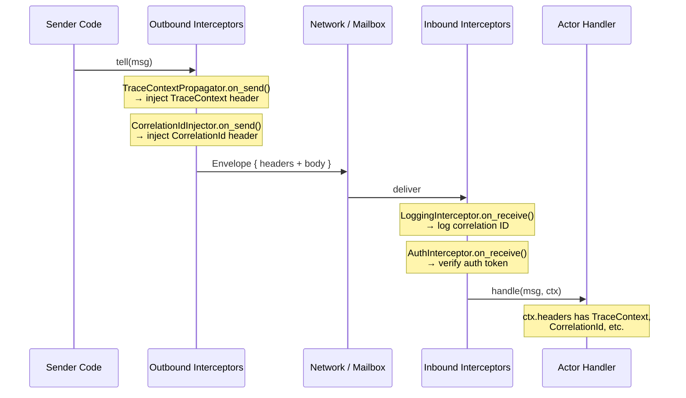

**Impact on `ActorRef` API:**

With outbound interceptors handling header injection, the `ActorRef` API
is clean — `tell(msg)` is the only send method. Outbound interceptors
stamp headers automatically based on message type, context, and policies.

### 5.4 Dead Letter Handling

**Problem:** Messages can be lost in several ways: actor stopped before
consuming them, mailbox overflow with `DropNewest`/`DropOldest`, interceptor
`Drop`/`Reject`, network failure. What happens to these messages?

**Design:** dactor provides a configurable dead letter sink. Lost messages
are forwarded to a `DeadLetterHandler` which can log, count, alert, or
store them for debugging.

```rust
/// A handler for messages that could not be delivered.
pub trait DeadLetterHandler: Send + Sync + 'static {
    /// Called when a message is lost. The message body is type-erased
    /// (serialized to bytes if possible, otherwise `None`).
    fn on_dead_letter(&self, event: DeadLetterEvent);
}

/// Describes a message that was not delivered.
#[derive(Debug)]
pub struct DeadLetterEvent {
    /// Why the message was not delivered.
    pub reason: DeadLetterReason,
    /// The target actor (may no longer exist).
    pub target_actor: ActorId,
    /// The target actor's name.
    pub target_name: String,
    /// The Rust type name of the message.
    pub message_type: &'static str,
    /// Headers from the envelope (if available).
    pub headers: Option<Headers>,
}

#[derive(Debug)]
#[non_exhaustive]
pub enum DeadLetterReason {
    /// The target actor has stopped.
    ActorStopped,
    /// The mailbox was full and the overflow strategy discarded the message.
    MailboxOverflow,
    /// An interceptor dropped the message silently.
    InterceptorDrop { interceptor: &'static str },
    /// An interceptor rejected the message.
    InterceptorReject { interceptor: &'static str, reason: String },
    /// Network delivery failed (remote actor unreachable).
    NetworkFailure { detail: String },
}
```

**Execution context:** The `DeadLetterHandler::on_dead_letter()` method is
called **synchronously on the task that detected the lost message** — this
may be the actor's own task (for `MailboxOverflow`), the interceptor pipeline
task (for `InterceptorDrop`/`InterceptorReject`), or the runtime's network
I/O task (for `NetworkFailure`). Implementations **must not block** — if
expensive work is needed (e.g., writing to a database), spawn a background
task or send to a dedicated actor. The runtime does not spawn a separate
task for dead letter handling.

**Registration:**

```rust
impl ActorRuntime {
    /// Set the dead letter handler. Only one handler is active at a time.
    /// Default: `LoggingDeadLetterHandler` which logs at WARN level.
    fn set_dead_letter_handler(&self, handler: Box<dyn DeadLetterHandler>);
}
```

**Built-in handlers:**

```rust
/// Logs dead letters at WARN level (default).
pub struct LoggingDeadLetterHandler;

/// Counts dead letters and exposes metrics.
pub struct CountingDeadLetterHandler { /* AtomicU64 counters */ }

/// Discards dead letters silently (for tests or high-throughput systems).
pub struct NullDeadLetterHandler;
```

### 5.5 Outbound Throttling (`dactor-throttle`)

**Problem:** Without network-level priority (§5.8), a chatty actor can
flood the outbound path and overwhelm peer nodes. dactor's core doesn't
implement throttling (consistent with "delegate, don't own"), but outbound
interceptors have the ability to `Reject` messages — which is all that's
needed to build throttling as an extension.

**Design:** `dactor-throttle` is a **separate crate** — an optional
dependency with zero cost if not used. It provides ready-made outbound
interceptors for common throttling patterns.

```toml
# Only add if you need throttling
[dependencies]
dactor-throttle = "0.1"
```

**Built-in throttling interceptors:**

```rust
/// Per-actor rate limiter — throttles messages if an actor exceeds
/// the configured send rate within a sliding window.
///
/// Uses `Disposition::Delay` to slow down the caller rather than
/// rejecting outright. Falls back to `Reject` if the rate is
/// severely exceeded (> 2× the limit).
pub struct ActorRateLimiter {
    /// Max messages per actor per window.
    max_rate: u64,
    /// Sliding window duration.
    window: Duration,
    /// Per-actor sliding window state.
    state: DashMap<ActorId, SlidingWindow>,
}

impl OutboundInterceptor for ActorRateLimiter {
    fn name(&self) -> &'static str { "actor-rate-limiter" }

    fn on_send(
        &self, ctx: &OutboundContext<'_>, _headers: &mut Headers, _msg: &dyn Any,
    ) -> Disposition {
        let window = self.state
            .entry(ctx.target_id.clone())
            .or_insert(SlidingWindow::new(self.window));
        let count = window.increment();
        if count > self.max_rate * 2 {
            // Severely over limit — reject immediately
            Disposition::Reject(format!(
                "actor {} exceeded {}× rate limit",
                ctx.target_name.unwrap_or("?"), self.max_rate
            ))
        } else if count > self.max_rate {
            // Over limit — delay the caller to smooth out the burst
            let backoff_ms = ((count - self.max_rate) * 10).min(1000);
            Disposition::Delay(Duration::from_millis(backoff_ms))
        } else {
            Disposition::Continue
        }
    }
}
```

```rust
/// Peer pressure monitor — periodically measures round-trip time to
/// each peer node and dynamically adjusts throttling based on observed
/// latency. When a peer is under pressure (high RTT), outbound messages
/// to actors on that node are throttled.
pub struct PeerPressureThrottle {
    /// RTT thresholds for throttling levels.
    thresholds: PressureThresholds,
    /// Current measured RTT per peer node.
    peer_rtt: Arc<DashMap<NodeId, Duration>>,
    /// Background task handle for periodic probing.
    probe_task: JoinHandle<()>,
}

pub struct PressureThresholds {
    /// Below this RTT: no throttling.
    pub healthy: Duration,        // e.g., 10ms
    /// Above healthy, below this: soft throttle (delay low-priority).
    pub moderate: Duration,       // e.g., 100ms
    /// Above this: hard throttle (reject all but CRITICAL).
    pub severe: Duration,         // e.g., 500ms
}

impl OutboundInterceptor for PeerPressureThrottle {
    fn name(&self) -> &'static str { "peer-pressure-throttle" }

    fn on_send(
        &self, ctx: &OutboundContext<'_>, headers: &mut Headers, _msg: &dyn Any,
    ) -> Disposition {
        if !ctx.remote { return Disposition::Continue; }  // local: no throttle

        let rtt = self.peer_rtt
            .get(&ctx.target_id.node)
            .map(|r| *r)
            .unwrap_or(Duration::ZERO);

        let priority = headers.get::<Priority>()
            .copied()
            .unwrap_or(Priority::NORMAL);

        if rtt > self.thresholds.severe && priority.0 > Priority::CRITICAL.0 {
            // Severe pressure — reject non-critical messages
            Disposition::Reject("peer under severe pressure".into())
        } else if rtt > self.thresholds.moderate && priority.0 > Priority::HIGH.0 {
            // Moderate pressure — delay low-priority messages proportionally
            let delay_ms = rtt.as_millis().saturating_sub(self.thresholds.healthy.as_millis());
            Disposition::Delay(Duration::from_millis(delay_ms as u64))
        } else {
            Disposition::Continue
        }
    }
}
```

**How the peer pressure monitor works:**

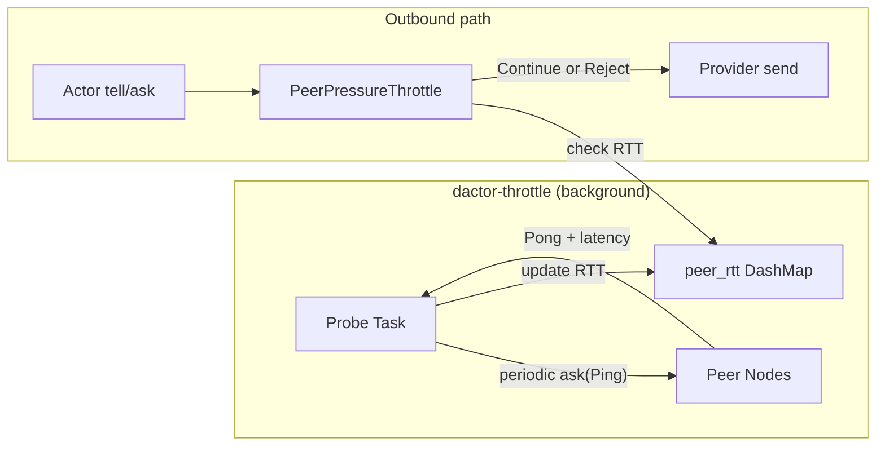

The probe task runs independently — it periodically sends lightweight
`ask()` messages to a system actor on each peer node (or uses the
provider's native health ping) and records the round-trip time. The
outbound interceptor reads this RTT (lock-free via `DashMap`) and
makes throttling decisions per message based on current peer pressure.

**Registration:**

```rust
use dactor_throttle::{ActorRateLimiter, PeerPressureThrottle, PressureThresholds};

// Per-actor rate limiting
runtime.add_outbound_interceptor(Box::new(ActorRateLimiter {
    max_rate: 1000,
    window: Duration::from_secs(1),
    state: DashMap::new(),
}))?;

// Peer pressure-based throttling
let throttle = PeerPressureThrottle::new(
    &runtime,
    PressureThresholds {
        healthy: Duration::from_millis(10),
        moderate: Duration::from_millis(100),
        severe: Duration::from_millis(500),
    },
);
runtime.add_outbound_interceptor(Box::new(throttle))?;
```

**Why a separate crate, not built-in:**

| Consideration | Decision |
|---|---|
| Core simplicity | Throttling policy is opinionated — different apps need different strategies |
| Zero cost | Apps that don't need throttling pay nothing (no dependency, no code) |
| Customizable | Users can write their own outbound interceptors with custom logic |
| Composable | Multiple throttling interceptors can be stacked |
| Consistent with dactor principles | "Delegate, don't own" — core provides the hook (outbound interceptor + Reject), extension provides the policy |

---

### 5.6 Mailbox Configuration

**Rationale:** kameo defaults to bounded, ractor to unbounded. Akka supports
priority mailboxes natively, kameo supports custom mailboxes. The abstraction
should let users choose FIFO or priority ordering.

```rust
/// Mailbox sizing strategy for an actor.
#[derive(Debug, Clone)]
pub enum MailboxConfig {
    /// Unbounded FIFO mailbox — never blocks senders. Risk of memory exhaustion.
    Unbounded,
    /// Bounded FIFO mailbox with backpressure.
    Bounded {
        capacity: usize,
        /// What to do when the mailbox is full.
        overflow: OverflowStrategy,
    },
    /// Priority mailbox — messages are delivered in priority order rather
    /// than FIFO. Priority is determined by the `Priority` header in the
    /// message envelope, ordered by the `MessageComparer` trait (§5.6).
    ///
    /// Supported natively by: Akka (`PriorityMailbox`), Kameo (custom mailbox).
    /// Adapter-implemented for: ractor (priority queue wrapper).
    ///
    /// Message ordering within the queue is controlled by the
    /// `MessageComparer` trait set via `SpawnConfig.comparer`.
    /// Default: `StrictPriorityComparer` (lowest Priority(u8) first).
    Priority {
        /// Optional capacity limit. `None` = unbounded priority queue.
        capacity: Option<usize>,
    },
}

#[non_exhaustive]
pub enum OverflowStrategy {
    /// Block the sender until space is available.
    Block,
    /// Drop the newest message (the one being sent).
    DropNewest,
    /// Drop the oldest message in the mailbox.
    /// ⚠️ **Experimental:** No current adapter supports this natively.
    /// All adapters return `NotSupported`. Retained for future adapters
    /// that may provide efficient queue eviction.
    DropOldest,
    /// Return an error to the sender.
    RejectWithError,
}

impl Default for MailboxConfig {
    fn default() -> Self {
        MailboxConfig::Unbounded
    }
}
```

**Priority header** (defined in §5.6):

```rust
/// Priority level for a message. Used by priority mailboxes to determine
/// delivery order. Implemented as a numeric value — lower = higher priority.
///
/// Standard levels: Critical(0) > High(64) > Normal(128) > Low(192) > Background(255)
/// Gaps between levels allow inserting custom priorities at any position.
#[derive(Debug, Clone, Copy, PartialEq, Eq, PartialOrd, Ord, Hash)]
pub struct Priority(pub u8);

impl Priority {
    /// System-critical messages (e.g., shutdown commands, health checks).
    pub const CRITICAL: Priority = Priority(0);
    /// High-priority business messages.
    pub const HIGH: Priority = Priority(64);
    /// Default priority for normal messages.
    pub const NORMAL: Priority = Priority(128);
    /// Low-priority messages (e.g., telemetry, background sync).
    pub const LOW: Priority = Priority(192);
    /// Background tasks — only run when the mailbox is otherwise idle.
    pub const BACKGROUND: Priority = Priority(255);
}

impl Default for Priority {
    fn default() -> Self {
        Priority::NORMAL
    }
}
```

Custom priorities slot into the gaps — no separate variant needed:

```rust
// Between HIGH and NORMAL:
let urgent_but_not_critical = Priority(96);

// Between NORMAL and LOW:
let slightly_below_normal = Priority(160);

// Higher than CRITICAL (if ever needed):
// Not possible — 0 is the highest. By design.
```

**How it works:**

1. Priority is set via an outbound interceptor (see §5.3) that inspects the
   message type and assigns the appropriate priority header:
   ```rust
   struct PriorityPolicy;
   impl OutboundInterceptor for PriorityPolicy {
       fn name(&self) -> &'static str { "priority-policy" }
       fn on_send(&self, ctx: &OutboundContext<'_>, headers: &mut Headers, msg: &dyn Any) -> Disposition {
           if msg.downcast_ref::<ShutdownCommand>().is_some() {
               headers.insert(Priority::CRITICAL);
           } else if msg.downcast_ref::<HealthCheck>().is_some() {
               headers.insert(Priority::HIGH);
           }
           // Messages without explicit priority get Priority::NORMAL (default)
           Disposition::Continue
       }
   }
   ```

2. The priority mailbox dequeues messages in priority order (lowest numeric
   value first). Within the same priority level, messages are FIFO.

3. Messages without a `Priority` header get `Priority::NORMAL` (128) by default.

**Adapter support:**

| Adapter | Strategy | Implementation |
|---|:---:|---|
| dactor-ractor | ⚙️ Adapter | ractor has no priority mailbox; adapter wraps with `BinaryHeap`-based priority channel |
| dactor-kameo | ✅ Library | kameo supports custom mailbox implementations; adapter plugs in priority queue mailbox |
| dactor-mock | ⚙️ Adapter | mock runtime implements priority queue directly |

**Fairness and starvation:**

Priority mailboxes risk starving low-priority messages when high-priority
messages arrive continuously. dactor provides a **pluggable `MessageComparer`
trait** — a custom ordering function that the priority queue uses to decide
which message to dequeue next. The default implementation compares by
`Priority(u8)` value only. Applications can override with a richer
comparison that factors in age, message type, sender, etc. to prevent
starvation.

This single trait replaces both priority ordering and fairness policy — they
are the same concept: "given two queued messages, which one should be
processed first?"

```rust
/// Metadata about a queued message, provided to `MessageComparer`
/// for ordering decisions. The comparer does NOT see the message body
/// (which is type-erased in the queue) — it works with metadata only.
pub struct QueuedMessageMeta {
    /// The priority header value (default: `Priority::NORMAL`).
    pub priority: Priority,
    /// How long this message has been waiting in the queue.
    /// Recalculated each time a message is dequeued for comparison —
    /// this is a computed value (`Instant::now() - enqueue_time`),
    /// not a fixed timestamp stored at enqueue time.
    pub age: Duration,
    /// Rust type name of the message.
    pub message_type: &'static str,
    /// The sender's node (if known).
    pub origin_node: Option<NodeId>,
    /// Whether this message was sent via ask (true) or tell (false).
    pub is_ask: bool,
}

/// Trait that controls message ordering in a priority queue.
/// Used by both the actor's inbound mailbox (§5.6) and the
/// outbound send queue's user lane (§5.8).
///
/// The queue calls `compare()` to decide which of two messages
/// should be dequeued first. Return `Ordering::Less` if `a` should
/// be processed before `b`.
///
/// The default implementation (`StrictPriorityComparer`) compares
/// by `Priority(u8)` only — lower value = higher priority.
pub trait MessageComparer: Send + Sync + 'static {
    fn compare(&self, a: &QueuedMessageMeta, b: &QueuedMessageMeta) -> std::cmp::Ordering;
}
```

**Built-in comparers:**

```rust
/// Default: strict priority ordering by Priority(u8) value.
/// Lower value = dequeued first. FIFO within same priority.
/// Can starve low-priority messages under sustained high-priority load.
pub struct StrictPriorityComparer;

impl MessageComparer for StrictPriorityComparer {
    fn compare(&self, a: &QueuedMessageMeta, b: &QueuedMessageMeta) -> Ordering {
        a.priority.0.cmp(&b.priority.0)
    }
}

/// Weighted: serve `weight` high-priority messages, then 1 low-priority.
/// Prevents complete starvation while still favoring high priority.
pub struct WeightedComparer {
    pub weight: usize,
    // internal counter tracked by the queue
}

/// Aging: boost messages that have waited longer than `max_wait`.
/// If a message has been queued longer than `max_wait`, it is treated
/// as CRITICAL regardless of its original priority.
pub struct AgingComparer {
    pub max_wait: Duration,
}

impl MessageComparer for AgingComparer {
    fn compare(&self, a: &QueuedMessageMeta, b: &QueuedMessageMeta) -> Ordering {
        let a_pri = if a.age > self.max_wait { 0 } else { a.priority.0 };
        let b_pri = if b.age > self.max_wait { 0 } else { b.priority.0 };
        a_pri.cmp(&b_pri)
    }
}
```

**Custom comparer example — ask-first policy:**

```rust
/// Prioritize ask() messages over tell() at the same priority level,
/// because ask() has a caller waiting for a reply.
struct AskFirstComparer;

impl MessageComparer for AskFirstComparer {
    fn compare(&self, a: &QueuedMessageMeta, b: &QueuedMessageMeta) -> Ordering {
        // First by priority value
        let pri = a.priority.0.cmp(&b.priority.0);
        if pri != Ordering::Equal { return pri; }
        // Then ask before tell (ask=true sorts before ask=false)
        b.is_ask.cmp(&a.is_ask)
    }
}
```

**Registration (per-actor via SpawnConfig):**

```rust
let config = SpawnConfig {
    mailbox: MailboxConfig::Priority {
        capacity: Some(1000),
    },
    comparer: Some(Box::new(AgingComparer { max_wait: Duration::from_secs(30) })),
    ..Default::default()
};
runtime.spawn_with_config("worker", args, deps, config)?;
```

**Also used by the outbound send queue (§5.8):**

```rust
runtime.set_outbound_queue_config(OutboundQueueConfig {
    user_lane_capacity: Some(10_000),
    comparer: Some(Box::new(WeightedComparer { weight: 20 })),
});
```

### 5.7 Message Ordering Guarantees

Ordering is a fundamental contract that actors rely on. dactor specifies:

1. **Same sender → same actor (local):** Messages are delivered in send order
   (FIFO within the same priority level). This matches all 6 surveyed frameworks.

2. **Different senders → same actor:** No ordering guarantee between senders.
   Messages from sender A and sender B may interleave arbitrarily.

3. **Priority mailbox (receiver-side):** Messages are ordered by priority
   first, then FIFO within each priority level. A `HIGH` message sent after
   a `LOW` message will be delivered first.

4. **Timer-injected messages:** Timer messages (`send_after`, `send_interval`)
   enter the mailbox like any other message and follow mailbox ordering rules.
   They have `Priority::NORMAL` unless an outbound interceptor sets a
   different priority.

5. **Handler execution:** Handlers on the same actor execute **sequentially**
   (one at a time), never concurrently. This is the fundamental actor model
   guarantee — no locking needed inside handlers.

6. **Cross-node messages:** No ordering guarantee across nodes. Network latency,
   retries, and partitions can reorder messages. Applications requiring
   cross-node ordering should use sequence numbers or vector clocks.

7. **Outbound network priority (optional, §5.8):** When the `outbound-priority`
   feature is enabled, the runtime maintains a per-destination outbound send
   queue that respects the `Priority` header. Without this feature, outbound
   messages are sent in the order the adapter receives them (FIFO).

### 5.8 Network-Level Message Priority

**Problem:** Priority in §5.6 controls the *receiver's* mailbox ordering
only. When messages travel across the network, they compete for I/O
resources. A `CRITICAL` message can get stuck behind thousands of
`BACKGROUND` messages in the network send buffer.

**dactor's position:** As an abstraction framework, dactor does **not**
implement or re-wrap the network layer. dactor defines **logical priority**
(`Priority(u8)`) and enforces it at the mailbox level. Network-level
prioritization is the **provider's responsibility**.

If the provider supports network-level priority natively, the adapter maps
dactor's `Priority` to the provider's mechanism. If it doesn't, outbound
messages are sent FIFO — priority is only enforced at the receiver's mailbox.

**How existing frameworks handle outbound priority:**

| Framework | Outbound priority? | Mechanism |
|---|:---:|---|
| **Erlang/OTP** | ✅ Partial | EEP 76: runtime dequeues priority messages before normal ones for `dist_ctrl`. Once on TCP wire, order is fixed. |
| **Akka** | ✅ Native | Artery transport: control lane (system) + data lane (user). Control always sent first. |
| **Ractor** | ⚠️ Partial | System messages (Stop) prioritized via separate channel. No user-level outbound priority. |
| **Kameo** | ❌ None | All outbound messages share one libp2p connection. |
| **Coerce** | ❌ None | All outbound messages share one gRPC/TCP connection. |

**Adapter mapping:**

| Adapter | Provider supports outbound priority? | Adapter behavior |
|---|:---:|---|
| dactor-ractor | ⚠️ System messages only | Maps dactor control messages to ractor's system channel. User-level priority: not supported on outbound. |
| dactor-kameo | ❌ | No outbound priority. Messages sent FIFO. |
| dactor-coerce | ❌ | No outbound priority. Messages sent FIFO. |
| dactor-mock | ⚙️ Simulated | MockNetwork can simulate outbound priority for testing. |

**What this means for applications:**

- **Receiver-side priority (§5.6) is always available** — the mailbox
  priority queue works regardless of network ordering.
- **End-to-end priority** depends on the provider. With Akka-style providers
  that support outbound lanes, high-priority messages reach the receiver
  faster. With providers that don't, all messages arrive FIFO and the
  receiver's priority queue reorders them upon delivery.
- For most applications, receiver-side priority is sufficient. Network-level
  priority matters mainly under sustained high-throughput scenarios where
  the send buffer is consistently full.

## 6. Actor Lifecycle & Supervision

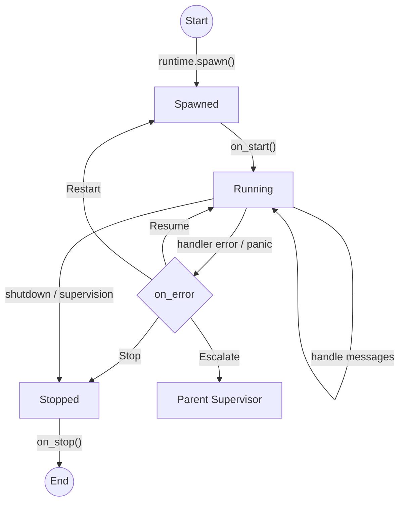

### 6.1 Supervision Strategies

**Rationale:** Erlang supervisors, Akka supervision strategies, ractor
parent-child supervision, kameo `on_link_died`.

```rust
/// Notification sent to a supervisor when a child actor terminates.
pub struct ChildTerminated {
    pub child_id: ActorId,
    pub child_name: String,
    /// `None` for graceful shutdown, `Some(reason)` for failure.
    pub reason: Option<String>,
}

/// Strategy applied by a supervisor when a child fails.
pub trait SupervisionStrategy: Send + Sync + 'static {
    fn on_child_failed(&self, event: &ChildTerminated) -> SupervisionAction;
}

pub enum SupervisionAction {
    /// Restart the failed child actor.
    Restart,
    /// Stop the failed child and don't restart.
    Stop,
    /// Escalate the failure to the parent supervisor.
    Escalate,
}

/// Built-in strategies (matching Erlang/Akka conventions):
pub struct OneForOne;       // restart only the failed child
pub struct OneForAll;       // restart all children when one fails
pub struct RestForOne;      // restart the failed child and all after it
```

**When the adapter does not support supervision:**

Supervision involves two capabilities: `watch` (monitoring actor termination)
and `ErrorAction::Restart` / `Escalate` (reacting to failures). If the
adapter doesn't support these natively and can't implement them as shims,
the framework degrades as follows:

| Feature | Adapter supports | Adapter doesn't support |
|---|---|---|
| `watch()` / `unwatch()` | Delivers `ChildTerminated` to watcher | Returns `Err(NotSupported)` — app should check `runtime.is_supported(RuntimeCapability::Watch)` at startup |
| `ErrorAction::Restart` | Runtime re-creates actor via `Actor::create(args, deps)` → `on_start()` | Actor is **stopped** instead — `Restart` degrades to `Stop`. A warning is logged: `"adapter does not support restart, stopping actor"` |
| `ErrorAction::Escalate` | Runtime forwards failure to parent supervisor | Actor is **stopped** instead — `Escalate` degrades to `Stop`. Warning logged. |
| `SupervisionStrategy` | Applied when child fails | Ignored — strategies have no effect without `watch` support |
| `Handler<ChildTerminated>` | Notifications delivered | Never invoked — no watch means no termination notifications |

**Recommended startup validation:**

```rust
let caps = runtime.capabilities();
if !runtime.is_supported(RuntimeCapability::Watch) {
    tracing::warn!("adapter does not support supervision — actors will stop on error, not restart");
    // Application can decide: continue without supervision, or fail fast
}
```

**Design rationale — degrade to Stop, don't panic:**

When `Restart` or `Escalate` is requested but the adapter can't fulfill it,
the safest behavior is to stop the actor. This avoids:
- Silent infinite loops (if restart were silently ignored)
- Panics that bring down the whole runtime
- Undefined behavior from partial restart support

The application's `on_error()` still runs, and the dead letter handler
receives any unprocessed messages. The warning log makes the degradation
visible to operators.

**DeathWatch** — any actor can watch another:

```rust
pub trait ActorRuntime: Send + Sync + 'static {
    // ... existing methods ...

    /// Watch an actor. When it terminates, the watcher receives a
    /// `ChildTerminated` notification via its message handler.
    /// Returns `Err(NotSupported)` if the adapter doesn't support death watch.
    fn watch<A: Actor>(
        &self,
        watcher: &ActorRef<A>,
        target: ActorId,
    ) -> Result<(), RuntimeError>;

    /// Stop watching an actor.
    /// Returns `Err(NotSupported)` if the adapter doesn't support death watch.
    fn unwatch<A: Actor>(
        &self,
        watcher: &ActorRef<A>,
        target: ActorId,
    ) -> Result<(), RuntimeError>;
}
```

### 6.2 Watch / DeathWatch

**Problem:** When an actor calls `watch(target)`, how does it receive the
`ChildTerminated` notification? Does the runtime inject a synthetic message,
or must the actor explicitly implement a handler for it?

**Decision:** The actor must implement `Handler<ChildTerminated>`. This is
explicit, type-safe, and consistent with the Handler pattern — no magic
injection.

```rust
/// Notification delivered when a watched actor terminates.
/// Actors that call `watch()` must implement `Handler<ChildTerminated>`
/// to receive these notifications.
#[derive(Debug, Clone, Serialize, Deserialize)]
pub struct ChildTerminated {
    pub child_id: ActorId,
    pub child_name: String,
    /// `None` for graceful shutdown, `Some(reason)` for failure.
    pub reason: Option<String>,
}

impl Message for ChildTerminated {
    type Reply = ();
}
```

**Usage:**

```rust
struct Supervisor {
    children: Vec<ActorId>,
}

impl Actor for Supervisor {}

#[async_trait]
impl Handler<ChildTerminated> for Supervisor {
    async fn handle(&mut self, msg: ChildTerminated, ctx: &mut ActorContext) {
        tracing::warn!(child = %msg.child_id, reason = ?msg.reason, "child died");
        self.children.retain(|id| *id != msg.child_id);
        // Optionally restart the child
    }
}
```

If an actor calls `watch()` but does **not** implement `Handler<ChildTerminated>`,
the notification is silently dropped (same as an unhandled message). This
avoids forcing every actor to handle termination events.

### 6.3 Actor State Persistence

**Problem:** When an actor restarts (after crash, node migration, or deployment),
its in-memory state is lost. Applications need a way to persist and recover
actor state across restarts without hand-rolling storage logic in every actor.

**Research:** Provider support varies dramatically:

| Framework | Persistence Support | Model |
|---|---|---|
| **Akka** | ✅ Built-in (`EventSourcedBehavior`, `DurableStateBehavior`) | Event sourcing + snapshots, pluggable journal/snapshot stores |
| **Coerce** | ✅ Built-in (`PersistentActor`, `Recover<M>`, `RecoverSnapshot<S>`) | Event sourcing + manual snapshots, journal with sequence IDs |
| **Ractor** | ❌ None | Application manages via `pre_start` / `post_stop` hooks |
| **Kameo** | ❌ None | Application manages via `on_start` / `on_stop` hooks |

**Design decision:** dactor provides a **dual-mode persistence abstraction** inspired
by Akka's two patterns, adapted for Rust:

1. **Event-sourced persistence** — State rebuilt by replaying persisted events
2. **Durable state persistence** — Full state snapshot stored directly

Both modes share the same storage backend traits and lifecycle integration.

#### 6.3.1 Persistence ID

Every persistent actor has a globally unique identity for storage:

```rust
/// Uniquely identifies a persistent actor's journal/snapshot in storage.
/// Format convention: "type:id" (e.g., "BankAccount:acct-123").
#[derive(Debug, Clone, PartialEq, Eq, Hash, Serialize, Deserialize)]
pub struct PersistenceId(pub String);

impl PersistenceId {
    pub fn new(entity_type: &str, entity_id: &str) -> Self {
        Self(format!("{entity_type}:{entity_id}"))
    }
}
```

The `PersistenceId` is **separate from `ActorId`** — it identifies the persistent
entity across incarnations, while `ActorId` identifies the running actor instance.
Multiple actor restarts share the same `PersistenceId`.

#### 6.3.2 Persistent Actor Trait

```rust
/// Marker trait for actors with persistent state.
/// Actors implement either `EventSourced` or `DurableState` (not both).
#[async_trait]
pub trait PersistentActor: Actor {
    /// The persistence identity for this actor's journal/snapshot store.
    fn persistence_id(&self) -> PersistenceId;

    /// Called before recovery begins. Use for pre-recovery setup.
    async fn pre_recovery(&mut self, _ctx: &mut ActorContext) {}

    /// Called after recovery completes. Actor is ready to process messages.
    async fn post_recovery(&mut self, _ctx: &mut ActorContext) {}

    /// Policy when recovery fails (e.g., corrupt journal).
    fn recovery_failure_policy(&self) -> RecoveryFailurePolicy {
        RecoveryFailurePolicy::Stop
    }

    /// Policy when a persist operation fails.
    fn persist_failure_policy(&self) -> PersistFailurePolicy {
        PersistFailurePolicy::Stop
    }
}
```

#### 6.3.3 Event-Sourced Persistence

State is rebuilt by replaying a sequence of domain events:

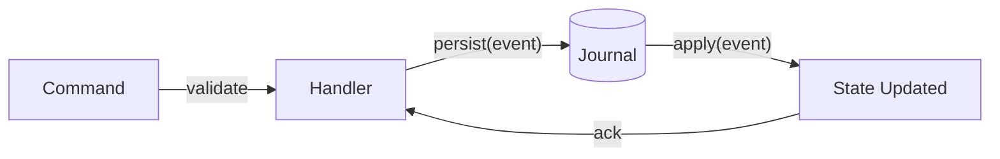

**Recovery flow:**

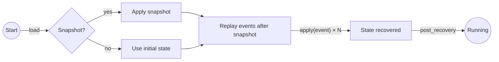

```rust
/// Event-sourced persistence: state = f(initial_state, events[0..n])
#[async_trait]
pub trait EventSourced: PersistentActor {
    /// The domain event type that modifies actor state.
    type Event: Send + Sync + Serialize + DeserializeOwned + 'static;

    /// Apply a single event to the actor's state. Must be deterministic
    /// and side-effect free — called during both normal operation and recovery.
    fn apply(&mut self, event: &Self::Event);

    /// Persist an event to the journal, then apply it to state.
    /// Returns `Err` if persistence fails (subject to `persist_failure_policy`).
    async fn persist(
        &mut self,
        event: Self::Event,
        ctx: &mut ActorContext,
    ) -> Result<(), PersistError>;

    /// Persist multiple events atomically, then apply all in order.
    async fn persist_batch(
        &mut self,
        events: Vec<Self::Event>,
        ctx: &mut ActorContext,
    ) -> Result<(), PersistError>;

    /// Take a snapshot of the current state. Snapshots are optional
    /// optimization — they reduce recovery time by skipping old events.
    async fn snapshot(&self, ctx: &mut ActorContext) -> Result<(), PersistError>
    where
        Self: Serialize;

    /// Configuration for automatic snapshotting. `None` = manual only.
    fn snapshot_config(&self) -> Option<SnapshotConfig> {
        None
    }

    /// The last applied sequence number (managed by the runtime).
    fn last_sequence_id(&self, ctx: &ActorContext) -> SequenceId;
}

/// Monotonically increasing event sequence number.
#[derive(Debug, Clone, Copy, PartialEq, Eq, PartialOrd, Ord)]
pub struct SequenceId(pub i64);
```

**Usage in a handler:**

```rust
struct BankAccount {
    balance: i64,
}

#[derive(Serialize, Deserialize)]
enum AccountEvent {
    Deposited(i64),
    Withdrawn(i64),
}

impl EventSourced for BankAccount {
    type Event = AccountEvent;

    fn apply(&mut self, event: &AccountEvent) {
        match event {
            AccountEvent::Deposited(amount) => self.balance += amount,
            AccountEvent::Withdrawn(amount) => self.balance -= amount,
        }
    }
}

#[async_trait]
impl Handler<Deposit> for BankAccount {
    async fn handle(&mut self, msg: Deposit, ctx: &mut ActorContext) -> Result<(), ActorError> {
        // Validate command
        if msg.amount <= 0 {
            return Err(ActorError::new(ErrorCode::InvalidArgument, "negative deposit"));
        }
        // Persist event (applies automatically after journal write)
        self.persist(AccountEvent::Deposited(msg.amount), ctx).await?;
        Ok(())
    }
}
```

#### 6.3.4 Durable State Persistence

State is stored and loaded directly — no event replay:

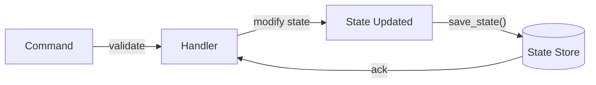

**Recovery flow:**

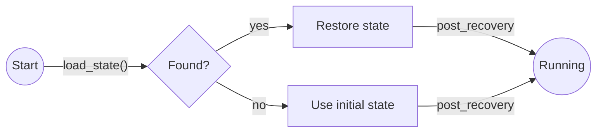

```rust
/// Durable state persistence: full state stored directly.
/// Simpler than event sourcing but no audit trail or replay.
#[async_trait]
pub trait DurableState: PersistentActor + Serialize + DeserializeOwned {
    /// Save the current state to the state store.
    async fn save_state(&self, ctx: &mut ActorContext) -> Result<(), PersistError>;

    /// Configuration for automatic state saving. `None` = manual only.
    fn save_config(&self) -> Option<SaveConfig> {
        None
    }
}
```

**Usage:**

```rust
#[derive(Serialize, Deserialize)]
struct SessionCache {
    sessions: HashMap<String, SessionData>,
}

impl DurableState for SessionCache {}

#[async_trait]
impl Handler<UpdateSession> for SessionCache {
    async fn handle(&mut self, msg: UpdateSession, ctx: &mut ActorContext) -> Result<(), ActorError> {
        self.sessions.insert(msg.session_id, msg.data);
        // Save full state (no events, just current snapshot)
        self.save_state(ctx).await?;
        Ok(())
    }
}
```

#### 6.3.5 Snapshot Configuration

```rust
/// Controls when automatic snapshots are taken (event-sourced actors).
pub struct SnapshotConfig {
    /// Take snapshot every N events.
    pub every_n_events: Option<u64>,
    /// Take snapshot if interval elapsed since last snapshot.
    pub interval: Option<Duration>,
    /// Retention: keep at most N snapshots. Older ones are deleted.
    pub retention_count: Option<u32>,
    /// Delete journal events older than the oldest retained snapshot.
    pub delete_events_on_snapshot: bool,
}

/// Controls when automatic state saves occur (durable state actors).
pub struct SaveConfig {
    /// Save after every N messages handled.
    pub every_n_messages: Option<u64>,
    /// Save if interval elapsed since last save.
    pub interval: Option<Duration>,
}
```

#### 6.3.6 Storage Backend

```rust
/// Pluggable journal storage for event-sourced actors.
#[async_trait]
pub trait JournalStorage: Send + Sync + 'static {
    /// Append an event to the journal.
    async fn write_event(
        &self,
        persistence_id: &PersistenceId,
        sequence_id: SequenceId,
        event_type: &str,
        payload: &[u8],
    ) -> Result<(), StorageError>;

    /// Append a batch of events atomically.
    async fn write_event_batch(
        &self,
        persistence_id: &PersistenceId,
        entries: &[(SequenceId, &str, &[u8])],
    ) -> Result<(), StorageError>;

    /// Read events from a given sequence number onwards.
    async fn read_events(
        &self,
        persistence_id: &PersistenceId,
        from_sequence: SequenceId,
    ) -> Result<Vec<JournalEntry>, StorageError>;

    /// Read the highest sequence number for a persistence ID.
    async fn read_highest_sequence(
        &self,
        persistence_id: &PersistenceId,
    ) -> Result<Option<SequenceId>, StorageError>;

    /// Delete events up to (inclusive) a sequence number.
    async fn delete_events_to(
        &self,
        persistence_id: &PersistenceId,
        to_sequence: SequenceId,
    ) -> Result<(), StorageError>;
}

/// Pluggable snapshot storage.
#[async_trait]
pub trait SnapshotStorage: Send + Sync + 'static {
    /// Save a snapshot.
    async fn save_snapshot(
        &self,
        persistence_id: &PersistenceId,
        sequence_id: SequenceId,
        payload: &[u8],
    ) -> Result<(), StorageError>;

    /// Load the most recent snapshot.
    async fn load_latest_snapshot(
        &self,
        persistence_id: &PersistenceId,
    ) -> Result<Option<SnapshotEntry>, StorageError>;

    /// Delete snapshots older than a sequence number.
    async fn delete_snapshots_before(
        &self,
        persistence_id: &PersistenceId,
        sequence_id: SequenceId,
    ) -> Result<(), StorageError>;
}

/// Pluggable state store for durable state actors.
#[async_trait]
pub trait StateStorage: Send + Sync + 'static {
    /// Save the current state (overwrites previous).
    async fn save_state(
        &self,
        persistence_id: &PersistenceId,
        payload: &[u8],
    ) -> Result<(), StorageError>;

    /// Load the most recently saved state.
    async fn load_state(
        &self,
        persistence_id: &PersistenceId,
    ) -> Result<Option<Vec<u8>>, StorageError>;

    /// Delete stored state.
    async fn delete_state(
        &self,
        persistence_id: &PersistenceId,
    ) -> Result<(), StorageError>;
}

/// A single journal entry.
pub struct JournalEntry {
    pub sequence_id: SequenceId,
    pub event_type: String,
    pub payload: Vec<u8>,
}

/// A single snapshot entry.
pub struct SnapshotEntry {
    pub sequence_id: SequenceId,
    pub payload: Vec<u8>,
}

/// Combined storage provider registered with the runtime.
pub trait StorageProvider: Send + Sync + 'static {
    fn journal_storage(&self) -> Option<Arc<dyn JournalStorage>>;
    fn snapshot_storage(&self) -> Option<Arc<dyn SnapshotStorage>>;
    fn state_storage(&self) -> Option<Arc<dyn StateStorage>>;
}
```

**Built-in implementations:**

| Storage | Crate | Use Case |
|---|---|---|
| `InMemoryStorage` | `dactor` | Testing, development |
| `SqliteStorage` | `dactor-sqlite` (future) | Single-node production |
| `PostgresStorage` | `dactor-postgres` (future) | Multi-node production |

#### 6.3.7 Lifecycle Integration

Persistence is integrated into the actor lifecycle (updating the §6 diagram):

```mermaid
graph TD
    S((Start)) -->|"runtime.spawn()"| SP[Spawned]
    SP -->|"on_start()"| PR{Persistent?}
    PR -->|no| R[Running]
    PR -->|yes| REC[Recovery]
    REC -->|"pre_recovery()"| LD[Load snapshot + replay events]
    LD -->|"post_recovery()"| R
    LD -->|"recovery failed"| RF{Policy?}
    RF -->|Stop| ST[Stopped]
    RF -->|Retry| REC
    R -->|"handle messages"| R
    R -->|"persist() / save_state()"| R
    R -->|"handler error / panic"| E{on_error}
    E -->|Resume| R
    E -->|Restart| SP
    E -->|Stop| ST
    E -->|Escalate| P[Parent Supervisor]
    R -->|"shutdown / supervision"| ST
    ST -->|"on_stop()"| F((End))
```

**Key behaviors:**

- **Spawn with recovery:** When a `PersistentActor` starts, the runtime
  automatically runs recovery before delivering any messages. The actor
  does not see commands until recovery completes.
- **Restart recovery:** On `ErrorAction::Restart`, the actor goes through
  the full spawn → recovery cycle again. The journal/state store survives
  the restart (same `PersistenceId`).
- **Async spawn:** `runtime.spawn()` returns `ActorRef<A>` immediately.
  Messages sent before recovery completes are buffered in the mailbox.
  The actor processes them only after `post_recovery()`.
- **No messages during recovery:** The runtime guarantees sequential execution —
  recovery runs to completion before the first `handle()` call.

#### 6.3.8 Recovery Failure Policies

```rust
/// What to do when recovery fails (corrupt journal, storage unavailable).
pub enum RecoveryFailurePolicy {
    /// Stop the actor. Supervisor may restart it.
    Stop,
    /// Retry recovery with exponential backoff.
    Retry {
        max_attempts: Option<u32>,
        initial_delay: Duration,
    },
    /// Skip recovery and start with initial state (data loss risk).
    SkipAndStart,
}

/// What to do when a persist/save operation fails.
pub enum PersistFailurePolicy {
    /// Stop the actor. Unacknowledged message may be retried by caller.
    Stop,
    /// Return error to the handler. Handler decides what to do.
    ReturnError,
    /// Retry the persist operation.
    Retry {
        max_attempts: Option<u32>,
        initial_delay: Duration,
    },
}

/// Errors from persistence operations.
#[derive(Debug)]
pub enum PersistError {
    /// Storage backend unavailable.
    StorageUnavailable(String),
    /// Serialization/deserialization failed.
    SerializationFailed(String),
    /// Journal entry corrupted or unreadable.
    CorruptEntry { sequence_id: SequenceId, detail: String },
    /// No storage provider configured for this runtime.
    NotConfigured,
}
```

#### 6.3.9 Runtime Configuration

```rust
// Register storage provider with the runtime
let storage = InMemoryStorage::new();
let runtime = RuntimeBuilder::new()
    .with_storage_provider(storage)
    .build()
    .await?;

// Spawn a persistent actor — recovery happens automatically
let account = BankAccount { balance: 0 };
let account_ref = runtime.spawn("account-123", account).await?;
// Messages are buffered until recovery completes, then delivered in order.
account_ref.tell(Deposit { amount: 100 }).await?;
```

#### 6.3.10 Provider Adapter Mapping

| dactor Feature | coerce | ractor | kameo |
|---|---|---|---|
| `EventSourced` trait | ✅ Maps to `PersistentActor` + `Recover<M>` | ⚙️ Adapter (hooks + external storage) | ⚙️ Adapter (hooks + external storage) |
| `DurableState` trait | ⚙️ Adapter (use snapshot store only) | ⚙️ Adapter (hooks + external storage) | ✅ Maps to `kameo-persistence` snapshots |
| `JournalStorage` | ✅ Maps to `JournalStorage` | ⚙️ Adapter provides | ⚙️ Adapter provides (kameo has no journal) |
| `SnapshotStorage` | ✅ Maps to snapshot in `JournalStorage` | ⚙️ Adapter provides | ✅ Maps to `kameo-persistence` |
| `StateStorage` | ⚙️ Adapter (snapshot store) | ⚙️ Adapter provides | ✅ Maps to `kameo-persistence` |
| Recovery on start | ✅ Native (`started()` runs recovery) | ⚙️ Adapter (in `pre_start`) | ⚙️ Adapter (in `on_start`) |
| `RecoveryFailurePolicy` | ✅ Maps to `recovery_failure_policy()` | ⚙️ Adapter logic | ⚙️ Adapter logic |
| `SnapshotConfig` | ⚙️ Adapter (coerce has manual-only) | ⚙️ Adapter logic | ⚙️ Adapter logic |

> **Note:** For ractor and kameo, the adapter implements the full persistence
> lifecycle: it wraps the actor, intercepts `on_start` to run recovery, wraps
> `handle` to auto-persist events, and intercepts `on_stop` for cleanup.
> The adapter owns the `JournalStorage`/`StateStorage` instance — the provider
> runtime is unaware of persistence.
>
> **Provider-specific persistence mapping:**
>
> - **coerce:** Native event sourcing. dactor's `EventSourced` maps directly to
>   coerce's `PersistentActor` + `Recover<M>`. Journal and snapshot storage
>   delegate to coerce's built-in backends (in-memory, Redis).
> - **kameo:** `kameo-persistence` supports **snapshots only** (no event journal).
>   `DurableState` maps to kameo-persistence's snapshot API. `EventSourced` is
>   **not natively supported** — the adapter provides its own `JournalStorage`
>   implementation (e.g., `InMemoryStorage` for tests, pluggable DB for production),
>   bypassing kameo's persistence entirely for event sourcing.
> - **ractor:** No built-in persistence. The adapter provides all storage
>   implementations and manages the full recovery lifecycle in `pre_start`.

#### 6.3.11 Event Sourcing vs Durable State — When to Use Which

| Consideration | EventSourced | DurableState |
|---|---|---|
| **Recovery speed** | Slower (replay events; snapshots help) | Fast (load state directly) |
| **Storage size** | O(n) events | O(1) state |
| **Audit trail** | ✅ Complete history of all changes | ❌ Only current state |
| **Replay / time travel** | ✅ Can reconstruct any past state | ❌ Not possible |
| **Projections / CQRS** | ✅ Multiple read models from event stream | ❌ Not applicable |
| **Complexity** | Higher (event design, apply must be deterministic) | Lower (just serialize state) |
| **Schema evolution** | Harder (old events must remain readable) | Easier (migrate current state) |
| **Best for** | Domain models, financial systems, audit-required | Caches, config, simple state machines |

---

## 7. Error Model

```mermaid
graph TB
    subgraph "Caller receives"
        RE[RuntimeError]
    end
    RE --> Send[Send Error<br/>mailbox closed]
    RE --> NS[NotSupported<br/>adapter limitation]
    RE --> Rej[Rejected<br/>interceptor blocked]
    RE --> AE[Actor Error<br/>handler failed]
    
    AE --> Code[ErrorCode<br/>Internal / Timeout / ...]
    AE --> Msg[message: String]
    AE --> Det[details: Vec&lt;ErrorDetail&gt;]
    AE --> Chain[chain: Vec&lt;String&gt;<br/>source error chain]
```

### 7.1 ActorError — Structured, Serializable Errors

**Problem:** When a caller makes a remote `ask()` and the actor fails, what
error can be sent back? Rust's `dyn Error` is **not serializable** — it
contains vtable pointers and type IDs that are meaningless across processes.
Returning a raw `String` loses structure. We need a serializable, structured
error type that gives callers enough information to handle failures
programmatically.

**Design inspiration:**
- **gRPC** `Status` — code + message + structured details (protobuf `Any`)
- **Erlang** — `{error, Reason}` where Reason is any serializable term
- **Akka** — `StatusReply` with `Status.Failure(exception)` (JVM-serializable)

**Approach:** Define `ActorError` — a structured, serializable error type
that carries a category code (for programmatic handling), a human-readable
message (for logging), optional structured details (for debugging), and an
optional error chain (as strings, since the original error objects can't
cross the wire).

```rust
use serde::{Serialize, Deserialize};

/// A structured, serializable error returned by actor handlers.
///
/// This is the error type that crosses node boundaries. It replaces
/// `Box<dyn Error>` in the remote case. Local calls can convert from
/// any `impl Error` via `From` impls.
///
/// Inspired by gRPC's Status model (code + message + details).
#[derive(Debug, Clone, Serialize, Deserialize)]
pub struct ActorError {
    /// Machine-readable error category for programmatic handling.
    pub code: ErrorCode,

    /// Human-readable error message (for logging / user display).
    pub message: String,

    /// Optional structured details — serializable key-value pairs
    /// for debugging, retry hints, validation errors, etc.
    pub details: Vec<ErrorDetail>,

    /// Error chain — string representations of the causal chain
    /// (`source()` chain in Rust). The original error objects can't
    /// be serialized, but their Display strings can.
    pub chain: Vec<String>,

    /// Optional typed payload — application-specific error data that
    /// can be serialized across the wire. The `payload_type` identifies
    /// how to interpret the bytes, so the receiver can deserialize it
    /// back to the original error type.
    ///
    /// Example: a `ValidationErrors` struct serialized as bincode,
    /// with `payload_type = "myapp.ValidationErrors"`.
    pub payload: Option<ErrorPayload>,
}

/// Application-specific error data attached to an ActorError.
/// The `type_name` tells the receiver how to deserialize `data`.
#[derive(Debug, Clone, Serialize, Deserialize)]
pub struct ErrorPayload {
    /// Stable type name identifying the payload format
    /// (e.g., "myapp.ValidationErrors", "myapp.RetryInfo").
    pub type_name: String,
    /// Serialized bytes of the application error type.
    pub data: Vec<u8>,
}

/// Machine-readable error category, modeled after gRPC status codes
/// but tailored for actor systems.
#[derive(Debug, Clone, Copy, PartialEq, Eq, Hash, Serialize, Deserialize)]
#[non_exhaustive]
pub enum ErrorCode {
    /// The actor's handler returned an error or panicked.
    /// Analogous to gRPC `INTERNAL`.
    Internal,

    /// The message was invalid or the actor rejected it on
    /// business-logic grounds.
    /// Analogous to gRPC `INVALID_ARGUMENT`.
    InvalidArgument,

    /// The actor could not be found or has stopped.
    /// Analogous to gRPC `NOT_FOUND`.
    ActorNotFound,

    /// The actor is alive but not ready to process messages
    /// (e.g., still initializing, shutting down).
    /// Analogous to gRPC `UNAVAILABLE`.
    Unavailable,

    /// The operation timed out (e.g., ask timeout).
    /// Analogous to gRPC `DEADLINE_EXCEEDED`.
    Timeout,

    /// The caller is not authorized to send this message.
    /// Analogous to gRPC `PERMISSION_DENIED`.
    PermissionDenied,

    /// A precondition for the operation was not met
    /// (e.g., state machine in wrong state).
    /// Analogous to gRPC `FAILED_PRECONDITION`.
    FailedPrecondition,

    /// The actor or system is overloaded (e.g., mailbox full,
    /// rate limit exceeded).
    /// Analogous to gRPC `RESOURCE_EXHAUSTED`.
    ResourceExhausted,

    /// The operation is not implemented by this actor or adapter.
    /// Analogous to gRPC `UNIMPLEMENTED`.
    Unimplemented,

    /// Catch-all for errors that don't fit other categories.
    /// Analogous to gRPC `UNKNOWN`.
    Unknown,

    /// The operation was cancelled by the caller (via CancellationToken).
    /// Analogous to gRPC `CANCELLED`.
    Cancelled,
}

/// A single key-value detail attached to an `ActorError`.
#[derive(Debug, Clone, Serialize, Deserialize)]
pub struct ErrorDetail {
    pub key: String,
    pub value: String,
}
```

**`ErrorCodec` — bidirectional error translation:**

> **Design only — not yet implemented.**

The runtime provides an `ErrorCodec` trait that applications implement to
translate between their custom error types and `ActorError`. The codec works
in both directions:

- **Handler side (encoding):** Convert a custom error into `ActorError` with
  a serialized payload
- **Caller side (decoding):** Extract the payload from `ActorError` back into
  the original custom error type

```rust
/// Object-safe error codec for bidirectional error translation.
///
/// Implementations translate between application error types and `ActorError`.
/// Uses `&dyn Any` / `Box<dyn Any>` for object safety — implementations
/// downcast internally to their concrete error type.
pub trait ErrorCodec: Send + Sync + 'static {
    /// Stable type name for wire identification.
    fn type_name(&self) -> &'static str;

    /// Try to encode a type-erased error into an ActorError payload.
    /// Returns `None` if this codec doesn't handle the given error type.
    fn try_encode(&self, error: &dyn Any) -> Option<ActorError>;

    /// Try to decode an ActorError payload into a type-erased error.
    /// Returns `None` if the payload_type doesn't match.
    fn try_decode(&self, error: &ActorError) -> Option<Box<dyn Any + Send>>;
}
```

**Example: ValidationErrors codec**

```rust
#[derive(Debug, Serialize, Deserialize)]
struct ValidationErrors {
    field_errors: Vec<FieldError>,
}

#[derive(Debug, Serialize, Deserialize)]
struct FieldError {
    field: String,
    message: String,
    code: String,
}

struct ValidationErrorCodec;

impl ErrorCodec for ValidationErrorCodec {
    fn type_name(&self) -> &'static str { "myapp.ValidationErrors" }

    fn try_encode(&self, error: &dyn Any) -> Option<ActorError> {
        let ve = error.downcast_ref::<ValidationErrors>()?;
        Some(ActorError::new(ErrorCode::InvalidArgument, "validation failed")
            .with_details(format!("{:?}", ve)))
    }

    fn try_decode(&self, error: &ActorError) -> Option<Box<dyn Any + Send>> {
        let details = error.details.as_ref()?;
        // In a real codec you'd parse the details string back into the error type.
        // This is a simplified example.
        Some(Box::new(ve))
    }
}
```

**Registration:**

```rust
// Register directly — ErrorCodec is object-safe, no wrapper needed
runtime.register_error_codec(Box::new(ValidationErrorCodec));
```

**Handler side — returning custom errors:**

```rust
#[async_trait]
impl Handler<CreateUser> for UserService {
    async fn handle(&mut self, msg: CreateUser, ctx: &mut ActorContext)
        -> Result<UserId, ActorError>
    {
        let mut errors = Vec::new();
        if msg.email.is_empty() {
            errors.push(FieldError {
                field: "email".into(),
                message: "required".into(),
                code: "REQUIRED".into(),
            });
        }
        if !errors.is_empty() {
            // The registered ErrorCodec encodes ValidationErrors
            // into ActorError with payload automatically
            return Err(ctx.encode_error(ValidationErrors { field_errors: errors }));
        }
        Ok(self.create(msg).await?)
    }
}
```

**Caller side — extracting custom errors:**

```rust
match user_service.ask(CreateUser { email: "".into() }, None).await {
    Ok(user_id) => println!("Created: {user_id}"),
    Err(RuntimeError::Actor(actor_err)) => {
        // Try to decode the payload back to the original type
        if let Some(validation) = runtime.decode_error::<ValidationErrors>(&actor_err) {
            for field_err in &validation.field_errors {
                eprintln!("  {}: {} ({})", field_err.field, field_err.message, field_err.code);
            }
        } else {
            // Unknown error type — fall back to generic handling
            eprintln!("Error [{}]: {}", actor_err.code, actor_err.message);
        }
    }
    Err(other) => eprintln!("Runtime error: {other}"),
}
```

**Wire flow:**

```mermaid
sequenceDiagram
    participant H as Handler (Node 2)
    participant EC1 as ErrorCodec (Node 2)
    participant N as Network
    participant EC2 as ErrorCodec (Node 1)
    participant C as Caller (Node 1)

    H->>EC1: ctx.encode_error(ValidationErrors)
    EC1->>EC1: encode → ActorError with payload<br/>type_name: "myapp.ValidationErrors"<br/>data: [serialized bytes]
    EC1->>N: serialize ActorError (including payload)
    N->>EC2: deserialize ActorError
    C->>EC2: runtime.decode_error::<ValidationErrors>(&err)
    EC2->>EC2: check type_name match<br/>deserialize payload.data
    EC2-->>C: Some(ValidationErrors { field_errors: [...] })
```

**Key points:**

- `ErrorPayload.type_name` is a stable string identifier — both sides must
  register a codec with the same `type_name` to encode/decode
- If no codec is registered for a given `type_name`, the payload bytes are
  preserved but opaque — the caller falls back to `ErrorCode` + `message`
- Multiple codecs can be registered for different error types
- Local calls can skip serialization — the codec is still useful for
  consistent error creation, but the payload doesn't need to be
  serialized/deserialized within the same process

**How `ActorError` builds with details:**

```rust
impl ActorError {
    pub fn with_details(mut self, details: impl Into<String>) -> Self {
        self.details = Some(details.into());
        self
    }
}
```

**How errors flow in different scenarios:**

```mermaid
sequenceDiagram
    participant C as Caller
    participant A1 as Actor

    Note over C,A1: Local ask — same process
    C->>A1: ask(msg)
    A1-->>C: Result::Err(ActorError)<br/>code: Internal<br/>message: panic message<br/>chain: panicked at ...
```

```mermaid
sequenceDiagram
    participant C as Caller
    participant Ad as Adapter (local)
    participant N as Network
    participant A2 as Actor (remote)

    Note over C,A2: Remote ask — cross-node
    C->>Ad: ask(msg)
    Ad->>N: serialize msg
    N->>A2: deliver
    A2->>A2: handler returns Err(ActorError)
    A2->>N: serialize ActorError
    N->>Ad: deliver error bytes
    Ad->>Ad: deserialize ActorError
    Ad-->>C: Err(ActorError)
    Note over C: Same ActorError type — code,<br/>message, details, chain intact
```

**Conversion from standard Rust errors:**

```rust
impl ActorError {
    /// Create from any `impl std::error::Error`, capturing the
    /// source chain as strings.
    pub fn from_error(code: ErrorCode, err: impl std::error::Error) -> Self {
        let mut chain = Vec::new();
        let message = err.to_string();
        let mut source = err.source();
        while let Some(cause) = source {
            chain.push(cause.to_string());
            source = cause.source();
        }
        Self {
            code,
            message,
            details: Vec::new(),
            chain,
            payload: None,
        }
    }

    /// Create a simple error with just a code and message.
    pub fn new(code: ErrorCode, message: impl Into<String>) -> Self {
        Self {
            code,
            message: message.into(),
            details: Vec::new(),
            chain: Vec::new(),
        }
    }

    /// Add a structured detail (builder pattern).
    pub fn with_detail(mut self, key: impl Into<String>, value: impl Into<String>) -> Self {
        self.details.push(ErrorDetail { key: key.into(), value: value.into() });
        self
    }
}
```

**Usage in actor handlers:**

```rust
#[async_trait]
impl Handler<TransferFunds> for BankAccount {
    async fn handle(&mut self, msg: TransferFunds, _ctx: &mut ActorContext)
        -> Result<Receipt, ActorError>
    {
        if msg.amount > self.balance {
            return Err(ActorError::new(ErrorCode::FailedPrecondition, "insufficient funds")
                .with_detail("balance", self.balance.to_string())
                .with_detail("requested", msg.amount.to_string()));
        }
        // ... process transfer
        Ok(Receipt { id: "tx-123".into() })
    }
}
```

**Caller side:**

```rust
match account.ask(TransferFunds { amount: 1000 }).await {
    Ok(receipt) => println!("Transfer succeeded: {}", receipt.id),
    Err(RuntimeError::Actor(err)) => {
        // Programmatic handling based on code:
        match err.code {
            ErrorCode::FailedPrecondition => {
                let balance = err.details.iter()
                    .find(|d| d.key == "balance")
                    .map(|d| &d.value);
                eprintln!("Insufficient funds (balance: {:?}): {}", balance, err.message);
            }
            ErrorCode::Timeout => eprintln!("Request timed out, retrying..."),
            _ => eprintln!("Unexpected error: {}", err.message),
        }
        // Full chain for debugging:
        for (i, cause) in err.chain.iter().enumerate() {
            eprintln!("  caused by [{}]: {}", i, cause);
        }
    }
    Err(other) => eprintln!("Runtime error: {}", other),
}
```

**Updated `RuntimeError` enum:**

The `RuntimeError` enum gains an `Actor` variant for handler-returned errors:

```rust
/// Error returned when sending a message to an actor fails
/// (mailbox closed, actor stopped, network failure for remote sends).
#[derive(Debug, Clone)]
pub struct ActorSendError {
    pub reason: String,
}

impl fmt::Display for ActorSendError {
    fn fmt(&self, f: &mut fmt::Formatter<'_>) -> fmt::Result {
        write!(f, "actor send failed: {}", self.reason)
    }
}

impl std::error::Error for ActorSendError {}

/// Error returned by processing group operations.
#[derive(Debug, Clone)]
pub struct GroupError {
    pub reason: String,
}

impl fmt::Display for GroupError {
    fn fmt(&self, f: &mut fmt::Formatter<'_>) -> fmt::Result {
        write!(f, "group error: {}", self.reason)
    }
}

impl std::error::Error for GroupError {}

/// Error returned by cluster event operations.
#[derive(Debug, Clone)]
pub struct ClusterError {
    pub reason: String,
}

impl fmt::Display for ClusterError {
    fn fmt(&self, f: &mut fmt::Formatter<'_>) -> fmt::Result {
        write!(f, "cluster error: {}", self.reason)
    }
}

impl std::error::Error for ClusterError {}

pub enum RuntimeError {
    Send(ActorSendError),
    Group(GroupError),
    Cluster(ClusterError),
    NotSupported(NotSupportedError),
    Rejected { interceptor: &'static str, reason: String },
    /// Error returned by an actor handler (local or deserialized from remote).
    Actor(ActorError),
}
```

**Relationship to `Outcome::HandlerError`:**

The `Outcome::HandlerError` passed to interceptors' `on_complete` now carries
the full `ActorError` rather than a plain string. See §5.2 for the
authoritative `Outcome` enum definition (with `TellSuccess`, `AskSuccess`,
etc.).

### 7.2 Error Mapping per Adapter

| dactor `ErrorCode` | ractor | kameo | coerce |
|---|---|---|---|
| `Internal` | `ActorProcessingErr` | Handler panic | Handler error |
| `ActorNotFound` | Actor cell dead | `SendError::ActorNotRunning` | Actor not in system |
| `Unavailable` | Spawn failure | Actor not started | Node unreachable |
| `Timeout` | `call` timeout | `ask` timeout | `send` timeout |
| `ResourceExhausted` | — | Mailbox full (`try_send` error) | — |
| `InvalidArgument` | — (application-level) | — (application-level) | — (application-level) |
| `PermissionDenied` | — (interceptor) | — (interceptor) | — (interceptor) |
| `FailedPrecondition` | — (application-level) | — (application-level) | — (application-level) |
| `Unimplemented` | `NotSupported` | `NotSupported` | `NotSupported` |
| `Unknown` | Catch-all | Catch-all | Catch-all |

---

## 8. Framework Runtime

The dactor runtime is the infrastructure layer that sits between application
actors and the adapter. It manages system actors, internal registries, and
node-to-node coordination — all using the adapter's existing actor messaging
infrastructure. The runtime doesn't own the network or the actor execution
engine; it uses the adapter for both.

### 8.1 Architecture

```mermaid
graph TB
    subgraph "dactor Runtime (per node)"
        subgraph "System Actors (auto-spawned)"
            SM[SpawnManager]
            CM[CancelManager]
            WM[WatchManager]
        end
        subgraph "Internal Registries"
            TR[TypeRegistry<br/>actor factories]
            HR[HeaderRegistry<br/>header deserializers]
            ER[ErrorCodecRegistry<br/>error translators]
            ND[NodeDirectory<br/>peer system actor refs]
        end
        subgraph "Core Services"
            OI[Outbound Interceptors]
            II[Inbound Interceptors]
            DL[Dead Letter Handler]
            MS[MessageSerializer]
        end
    end
    subgraph "Adapter"
        AR[ActorRuntime impl<br/>spawn, tell, ask]
    end
    subgraph "Application"
        A1[Actor A]
        A2[Actor B]
    end

    A1 & A2 --> OI --> AR
    AR --> II --> A1 & A2
    SM & CM & WM --> AR
```

### 8.2 System Actors

System actors are **native provider actors** — they are built directly on
top of the provider crate (ractor, kameo, coerce), not on dactor's
abstraction layer. They use the provider's native node identity and
messaging, which means:

- They **don't depend on dactor's `NodeId`** — they use the provider's native
  identity (ractor node name, kameo PeerId, coerce node tag)
- They **don't go through dactor's interceptor pipeline** — they use the
  provider's raw `tell()`/`ask()` directly
- They are **spawned by the adapter** during startup, not by the dactor runtime

This design ensures dactor never touches the network — all transport is
the provider's responsibility, even for runtime operations.

| System Actor | Responsibility | Built on |
|---|---|---|
| `SpawnManager` | Processes remote spawn requests | Provider's native actor API |
| `CancelManager` | Processes remote cancellation | Provider's native actor API |
| `WatchManager` | Watch/unwatch, delivers `ChildTerminated` | Provider's native actor API |

**How system actors relate to dactor:**

```mermaid
graph TB
    subgraph "Application Layer (dactor abstraction)"
        AA[Application Actors]
        AA -->|"dactor tell/ask<br/>(interceptors, headers, priority)"| DA[dactor Runtime]
    end
    subgraph "System Layer (native provider)"
        SM[SpawnManager]
        CM[CancelManager]
        WM[WatchManager]
    end
    subgraph "Provider (ractor / kameo / coerce)"
        P[Provider Runtime + Transport]
    end

    DA -->|"delegates to"| P
    SM & CM & WM -->|"native provider messaging"| P
    DA -->|"invokes system actors<br/>via adapter"| SM & CM & WM
```

The dactor runtime invokes system actors through the adapter — it never
sends messages directly. The adapter knows how to reach the system actors
on remote nodes using the provider's native identity and transport.

### 8.3 Internal Registries

| Registry | Purpose | Populated by |
|---|---|---|
| `TypeRegistry` | Maps type name → `ActorFactory` for remote spawn (§9.2) | `runtime.register_remote_actor::<A>()` at startup |
| `HeaderRegistry` | Maps header name → deserializer for `Headers::from_wire()` (§5.1) | `registry.register::<H>()` at startup |
| `ErrorCodecRegistry` | Maps error type name → `ErrorCodec` for encode/decode (§7.1) | `runtime.register_error_codec()` at startup |
| `NodeDirectory` | Maps `NodeId` → peer system actor `ActorRef`s | Auto-populated on cluster join (§10.2) |

### 8.4 Startup Sequence

```mermaid
sequenceDiagram
    participant App as Application
    participant R as Runtime
    participant A as Adapter
    participant SA as System Actors
    participant CD as ClusterDiscovery

    App->>R: RuntimeBuilder::new()
    App->>R: .adapter(RactorRuntime::new())
    App->>R: .message_serializer(BincodeSerializer)
    App->>R: .register_remote_actor::<MyActor>()
    App->>R: .register_error_codec(MyCodec)
    App->>R: .add_inbound_interceptor(LoggingInterceptor)
    App->>R: .add_outbound_interceptor(TracePropagator)
    App->>R: .cluster_discovery(KubernetesDiscovery::new(...))
    App->>R: .build()

    R->>A: initialize adapter
    A->>SA: spawn SpawnManager (native provider actor)
    A->>SA: spawn CancelManager (native provider actor)
    A->>SA: spawn WatchManager (native provider actor)

    R->>CD: start discovery
    CD-->>R: node_joined(addr)
    R->>A: adapter.connect(addr)
    Note over A: provider handles native node join
    A-->>R: connected, NodeId from provider identity
    R->>R: store NodeId(node-2) mapping in NodeDirectory

    R-->>App: Runtime ready
    App->>R: runtime.spawn("my-actor", args, deps)
```

---

## 9. Remote Actors

### 9.0 Transport Abstraction

**Problem:** Remote actor communication requires a network transport, but
different adapters use different protocols (gRPC, TCP, QUIC, libp2p). The
framework needs an abstract transport layer that adapters can implement.

**Design:** The `Transport` trait defines how nodes send and receive
`WireEnvelope`s. It is adapter-agnostic — implementations plug in the
adapter's native networking.

```rust
/// Abstract transport for sending WireEnvelopes between nodes.
#[async_trait]
pub trait Transport: Send + Sync + 'static {
    /// Fire-and-forget: send an envelope to a remote node.
    async fn send(&self, target: &NodeId, envelope: WireEnvelope) -> Result<(), TransportError>;

    /// Request-reply: send an envelope and wait for a reply.
    async fn send_request(&self, target: &NodeId, envelope: WireEnvelope)
        -> Result<WireEnvelope, TransportError>;

    /// Check if a node is reachable.
    async fn is_reachable(&self, node: &NodeId) -> bool;

    /// Establish / tear down connections.
    async fn connect(&self, node: &NodeId) -> Result<(), TransportError>;
    async fn disconnect(&self, node: &NodeId) -> Result<(), TransportError>;
}
```

**`InMemoryTransport`:** Channel-based transport for testing without real
networking. Two transports can be `link()`ed for bidirectional communication.
`complete_request()` simulates remote replies for ask flows.

**`TransportRegistry`:** Maps `NodeId` → `Arc<dyn Transport>` for multi-node
routing. When a message needs to reach a remote node, the registry is
consulted to find the appropriate transport.

**`RemoteActorRef<A>`:** Implements `ActorRef<A>` for actors on remote nodes.
Constructed via `RemoteActorRefBuilder` which registers message serializers
and outbound interceptors. `tell()` serializes and spawns a fire-and-forget
send task; `ask()` spawns a task that sends and awaits a reply via
`Transport::send_request()`.

```rust
let remote = RemoteActorRefBuilder::<Counter>::new(actor_id, "counter", transport)
    .register_tell::<Increment>()       // serde_json serializer
    .register_ask::<GetCount>()          // serializer + reply deserializer
    .add_outbound_interceptor(Arc::new(TracePropagator))
    .build();

// Location-transparent — same API as local ActorRef:
remote.tell(Increment(1))?;
let count = remote.ask(GetCount, None)?.await?;
```

### 9.0.1 Connection Management (AdapterCluster)

Adapters implement the `AdapterCluster` trait for connection lifecycle:

```rust
#[async_trait]
pub trait AdapterCluster: Send + Sync + 'static {
    async fn connect(&self, node: &NodeId) -> Result<(), ClusterError>;
    async fn disconnect(&self, node: &NodeId) -> Result<(), ClusterError>;
    async fn reconnect(&self, node: &NodeId) -> Result<(), ClusterError>;
    async fn is_reachable(&self, node: &NodeId) -> bool;
    async fn connected_nodes(&self) -> Vec<NodeId>;
}
```

### 9.0.2 Cluster Event Emitter

`ClusterEventEmitter` dispatches `NodeJoined`/`NodeLeft` events to
subscribers. Adapters call `emit()` when the cluster topology changes.
Subscribers receive events via callbacks registered with `subscribe()`.

### 9.0.3 Health Checking

```rust
/// Result of a node health check.
pub enum HealthStatus { Healthy, Unhealthy { reason: String }, Timeout }

/// Adapters delegate health checks to the provider's mechanism.
#[async_trait]
pub trait HealthChecker: Send + Sync + 'static {
    async fn check(&self, node: &NodeId) -> HealthStatus;
}

/// Called when a node becomes unreachable.
#[async_trait]
pub trait UnreachableHandler: Send + Sync + 'static {
    async fn on_node_unreachable(&self, node: &NodeId);
}
```

### 9.0.4 Wire Interceptor (Envelope-Level Load Control)

**Problem:** Before a remote message is deserialized, the runtime should be
able to shed load — reject oversized payloads, rate-limit by source, or
apply backpressure. Deserializing a message only to reject it wastes CPU.

**Design:** `WireInterceptor` operates on `WireEnvelope`s at the transport
boundary. It sees only headers + raw bytes, not typed messages. A
`WireInterceptorPipeline` runs interceptors in order; the first non-Accept
disposition short-circuits.

```text
Transport → WireInterceptorPipeline → TypeRegistry deserialize → Actor dispatch
```

```rust
pub trait WireInterceptor: Send + Sync + 'static {
    fn name(&self) -> &'static str;
    fn on_receive(&self, envelope: &WireEnvelope) -> WireDisposition;
}

pub enum WireDisposition {
    Accept,               // proceed to dispatch
    Delay(Duration),      // backpressure, then accept
    Reject(String),       // error reply to caller (ask) or dead letter (tell)
    Drop,                 // silently discard
}
```

**Built-in interceptors:**

| Interceptor | Purpose |
|---|---|
| `MaxBodySizeInterceptor` | Reject envelopes exceeding a byte limit |
| `RateLimitWireInterceptor` | Token-bucket rate limit with configurable backoff |

**Difference from inbound/outbound interceptors:**

| | WireInterceptor | InboundInterceptor | OutboundInterceptor |
|---|---|---|---|
| **Side** | Receiver | Receiver | Sender |
| **Input** | `&WireEnvelope` (bytes) | `&dyn Any` (typed msg) | `&dyn Any` (typed msg) |
| **Deserialization** | Before | After | Before (on sender) |
| **Can modify headers** | No (read-only) | Yes | Yes |
| **Use case** | Load shedding | Auth, logging, metrics | Trace propagation, auth injection |

**`WireEnvelope.target_name`:** The envelope carries the target actor's
human-readable name (in addition to the `ActorId`) so wire interceptors
can make decisions based on actor name without additional lookups.

> **Security note:** `target_name` is sender-supplied metadata and is NOT
> validated against the receiver's actor registry. Wire interceptors should
> treat it as a hint for logging/metrics, not as an authoritative identity
> for policy enforcement. Use `target` (`ActorId`) for authoritative routing.

**Metrics and dead letter integration:** Wire interceptor Drop/Reject
decisions are reported to:
- **`RuntimeMetrics`**: `wire_dropped`, `wire_rejected`, `wire_delayed` counters
- **`DeadLetterHandler`**: via `DeadLetterReason::WireInterceptorDrop` and
  `DeadLetterReason::WireInterceptorReject` — the envelope's `target`,
  `target_name`, `message_type`, and `send_mode` are preserved in the dead
  letter event without deserializing the body.

### 9.1 Serialization Contract

**Problem:** When messages cross node boundaries, they must be serialized.
Not all messages need to be serializable (local-only actors don't need it).
The design must make this explicit without forcing serialization on all users.
Additionally, different applications have different serialization needs —
some want speed (bincode), some want human-readability (JSON), some want
schema evolution (protobuf).

**Design:** Two components:

1. **`RemoteMessage`** — a marker trait that identifies messages capable of
   crossing node boundaries
2. **`MessageSerializer`** — a pluggable trait that controls how messages
   are serialized/deserialized for wire transport

```rust
/// Marker for messages that can cross node boundaries.
/// Requires serde Serialize + Deserialize in addition to Message.
pub trait RemoteMessage: Message + Serialize + DeserializeOwned {}

/// Blanket impl: any Message that is also Serialize + DeserializeOwned
/// automatically implements RemoteMessage.
impl<M> RemoteMessage for M
where
    M: Message + Serialize + DeserializeOwned,
{}
```

**`MessageSerializer` — pluggable serialization:**

```rust
/// Trait for serializing and deserializing messages for wire transport.
///
/// The runtime uses this for all remote communication: tell, ask, stream, feed,
/// remote spawn (actor Args), error payloads, and headers.
///
/// Applications can register a custom serializer to use a format that
/// fits their needs (speed, readability, schema evolution, compression).
pub trait MessageSerializer: Send + Sync + 'static {
    /// Human-readable name (for logging and diagnostics).
    fn name(&self) -> &'static str;

    /// Serialize a value to bytes.
    fn serialize<T: Serialize>(&self, value: &T) -> Result<Vec<u8>, ActorError>;

    /// Deserialize a value from bytes.
    fn deserialize<T: DeserializeOwned>(&self, bytes: &[u8]) -> Result<T, ActorError>;
}
```

**Built-in serializers:**

```rust
/// Bincode — fast, compact binary format. Default.
pub struct BincodeSerializer;

impl MessageSerializer for BincodeSerializer {
    fn name(&self) -> &'static str { "bincode" }

    fn serialize<T: Serialize>(&self, value: &T) -> Result<Vec<u8>, ActorError> {
        bincode::serialize(value)
            .map_err(|e| ActorError::new(ErrorCode::Internal, format!("bincode serialize: {e}")))
    }

    fn deserialize<T: DeserializeOwned>(&self, bytes: &[u8]) -> Result<T, ActorError> {
        bincode::deserialize(bytes)
            .map_err(|e| ActorError::new(ErrorCode::Internal, format!("bincode deserialize: {e}")))
    }
}

/// JSON — human-readable, good for debugging and interop.
pub struct JsonSerializer;

impl MessageSerializer for JsonSerializer {
    fn name(&self) -> &'static str { "json" }

    fn serialize<T: Serialize>(&self, value: &T) -> Result<Vec<u8>, ActorError> {
        serde_json::to_vec(value)
            .map_err(|e| ActorError::new(ErrorCode::Internal, format!("json serialize: {e}")))
    }

    fn deserialize<T: DeserializeOwned>(&self, bytes: &[u8]) -> Result<T, ActorError> {
        serde_json::from_slice(bytes)
            .map_err(|e| ActorError::new(ErrorCode::Internal, format!("json deserialize: {e}")))
    }
}
```

**Registration:**

```rust
// Default: bincode (fast, compact)
let runtime = RactorRuntime::new();  // uses BincodeSerializer

// Override with JSON (readable, good for debugging)
runtime.set_message_serializer(Box::new(JsonSerializer));

// Or a custom serializer (e.g., protobuf, MessagePack, compressed bincode)
runtime.set_message_serializer(Box::new(MyCustomSerializer));
```

**Where the serializer is used:**

| What | Serialized via `MessageSerializer` |
|---|---|
| Remote `tell()` / `ask()` message body | ✅ |
| Remote `ask()` reply | ✅ |
| `stream()` items | ✅ |
| `feed()` initial request | ✅ |
| `feed()` streamed items | ✅ |
| `feed()` final reply | ✅ |
| Remote spawn `Args` | ✅ |
| `ActorError` (including `ErrorPayload`) | ✅ |
| `WireHeaders` (header values via `HeaderValue::to_bytes`) | ❌ — headers serialize themselves |
| `CancelRequest` and control messages | ❌ — fixed internal format |
| Local sends | ❌ — no serialization, pass by move |

**Compile-time enforcement:** When an adapter detects a cross-node send
(the target `ActorId.node` differs from the local node), it requires the
message to implement `RemoteMessage`. The runtime uses the registered
`MessageSerializer` for the actual byte conversion.

**Remote messages are always wrapped in a `WireEnvelope`:**

Every remote message travels as a `WireEnvelope` — the wire-format
representation of an `Envelope`. This ensures headers (trace context,
priority, correlation ID) travel atomically with the message body. The
`MessageSerializer` serializes the entire `WireEnvelope`, not just the body.

```rust
/// Wire-format envelope sent over the network.
/// Combines serialized headers + serialized message body into one unit.
#[derive(Serialize, Deserialize)]
pub(crate) struct WireEnvelope {
    /// Target actor ID on the remote node.
    pub target: ActorId,
    /// The Rust type name of the message (for handler dispatch on remote).
    pub message_type: String,
    /// Optional message schema version. When present, the receiver can
    /// use a `MessageVersionHandler` to migrate or reject messages from
    /// older/newer senders. When absent, no version checking is performed.
    pub version: Option<u32>,
    /// Send mode — how the remote should handle this.
    pub send_mode: SendMode,
    /// Serialized headers (from `Headers::to_wire()`).
    pub headers: WireHeaders,
    /// Serialized message body (from `MessageSerializer::serialize()`).
    pub body: Vec<u8>,
    /// For ask: a request_id so the reply can be routed back.
    pub request_id: Option<u64>,
}
```

**Message versioning:**

The `version` field enables schema evolution for remote messages. Messages
can declare their version, and the receiver can register a
`MessageVersionHandler` to handle version mismatches — migrating old formats,
rejecting incompatible versions, or logging warnings.

```rust
/// Declare the wire version on a message type.
/// If not implemented, `version` is `None` in the envelope (no versioning).
pub trait Versioned {
    /// The current schema version of this message type.
    fn version() -> u32;
}

// Example:
impl Versioned for TransferFunds {
    fn version() -> u32 { 2 }  // v2 added `memo` field
}
```

```rust
/// Handles version mismatches on the receiver side.
/// Registered per message type name.
pub trait MessageVersionHandler: Send + Sync + 'static {
    /// Called when the receiver gets a message with a different version
    /// than expected. Can migrate the bytes, reject, or pass through.
    ///
    /// - `message_type`: the Rust type name
    /// - `received_version`: version from the sender's envelope
    /// - `expected_version`: version from the local `Versioned` impl
    /// - `body`: the serialized message bytes
    ///
    /// Returns migrated bytes or an error.
    fn handle_mismatch(
        &self,
        message_type: &str,
        received_version: u32,
        expected_version: u32,
        body: &[u8],
    ) -> Result<Vec<u8>, ActorError>;
}
```

**Built-in handlers:**

```rust
/// Reject any version mismatch — strict compatibility.
pub struct RejectVersionMismatch;

impl MessageVersionHandler for RejectVersionMismatch {
    fn handle_mismatch(
        &self, message_type: &str, received: u32, expected: u32, _body: &[u8],
    ) -> Result<Vec<u8>, ActorError> {
        Err(ActorError::new(
            ErrorCode::FailedPrecondition,
            format!("{message_type}: expected version {expected}, got {received}"),
        ))
    }
}

/// Accept any version — rely on serde's `#[serde(default)]` for
/// forward/backward compatibility. Log a warning on mismatch.
pub struct AcceptWithWarning;
```

**Custom migration example:**

```rust
struct TransferFundsMigrator;

impl MessageVersionHandler for TransferFundsMigrator {
    fn handle_mismatch(
        &self, _msg_type: &str, received: u32, expected: u32, body: &[u8],
    ) -> Result<Vec<u8>, ActorError> {
        match (received, expected) {
            (1, 2) => {
                // v1 → v2: deserialize v1, add default `memo` field, re-serialize as v2
                let mut v1: TransferFundsV1 = bincode::deserialize(body)?;
                let v2 = TransferFundsV2 {
                    from: v1.from, to: v1.to, amount: v1.amount,
                    memo: String::new(),  // default for new field
                };
                Ok(bincode::serialize(&v2)?)
            }
            _ => Err(ActorError::new(
                ErrorCode::FailedPrecondition,
                format!("cannot migrate from v{received} to v{expected}"),
            )),
        }
    }
}
```

**Registration:**

```rust
// Register per message type
runtime.register_version_handler(
    "myapp::TransferFunds",
    Box::new(TransferFundsMigrator),
);

// Or use a global policy
runtime.set_default_version_handler(Box::new(AcceptWithWarning));
```

**Receiver-side flow with versioning:**

```mermaid
sequenceDiagram
    participant W as Wire
    participant R as Runtime (receiver)
    participant VH as MessageVersionHandler
    participant A as Actor Handler

    W->>R: WireEnvelope { version: 1, body: [...] }
    R->>R: local version = TransferFunds::version() = 2
    R->>R: version mismatch: 1 ≠ 2

    R->>VH: handle_mismatch("TransferFunds", 1, 2, body)
    VH->>VH: migrate v1 bytes → v2 bytes
    VH-->>R: Ok(migrated_bytes)

    R->>R: deserialize migrated_bytes → TransferFunds v2
    R->>A: handle(msg, ctx)
```

```mermaid
graph LR
    subgraph "Sender side"
        M[Message body] --> S["MessageSerializer::serialize()"]
        H[Headers] --> TW["Headers::to_wire()"]
        S --> WE["WireEnvelope { headers, body, target, ... }"]
        TW --> WE
        WE --> SS["MessageSerializer::serialize(wire_envelope)"]
        SS --> B["bytes on wire"]
    end
    subgraph "Receiver side"
        B2["bytes from wire"] --> DS["MessageSerializer::deserialize()"]
        DS --> WE2[WireEnvelope]
        WE2 --> DH["Headers::from_wire()"]
        WE2 --> DM["MessageSerializer::deserialize(body)"]
        DH --> E["Envelope { headers, body }"]
        DM --> E
        E --> HA[Actor Handler]
    end
```

**The send path in detail:**

```rust
// Inside the runtime's cross-node send path (tell example):
fn send_remote<M: RemoteMessage>(
    &self, target: ActorId, msg: M, headers: Headers, send_mode: SendMode,
) -> Result<(), RuntimeError> {
    // 1. Run outbound interceptors (stamp headers)
    let mut headers = headers;
    for interceptor in &self.outbound_interceptors {
        interceptor.on_send(&ctx, &mut headers, &msg as &dyn Any);
    }

    // 2. Serialize message body
    let body = self.serializer.serialize(&msg)?;

    // 3. Convert headers to wire format
    let wire_headers = headers.to_wire();

    // 4. Build wire envelope
    let envelope = WireEnvelope {
        target,
        message_type: std::any::type_name::<M>().to_string(),
        send_mode,
        headers: wire_headers,
        body,
        request_id: None,
    };

    // 5. Serialize the entire envelope
    let bytes = self.serializer.serialize(&envelope)?;

    // 6. Hand to adapter's transport
    self.adapter.send_to_node(target.node, bytes)
}
```

**Local sends** never serialize — the `Envelope { headers, body }` is passed
by move through in-process channels. Messages can contain non-serializable
types (`Arc`, channels, closures) without any issue.

**Schema evolution:** dactor does not prescribe a versioning strategy. The
choice of `MessageSerializer` affects what evolution strategies are available:

| Serializer | Schema evolution | Trade-off |
|---|---|---|
| `BincodeSerializer` (default) | `#[serde(default)]` for new fields | Fast + compact, but fragile across versions |
| `JsonSerializer` | `#[serde(default)]`, `#[serde(rename)]`, ignore unknown fields | Readable + flexible, but larger |
| Custom protobuf | Native field numbering, backward/forward compat | Best evolution, more setup |
| Custom MessagePack | Similar to JSON but binary + compact | Good middle ground |

### 9.2 Remote Actor Spawning

> All remote runtime operations (spawn, cancel, watch) use **system actors**
> (§8.2) via the adapter's existing remote messaging — no separate transport.

All three backend libraries (ractor, kameo, coerce) support spawning actors
on remote nodes. dactor exposes this via `SpawnConfig::target_node`.

**Local spawn** (default):

```rust
// Spawns on the current node
let actor = runtime.spawn("counter", Counter { count: 0 });
```

**Remote spawn** (on a specific node):

```rust
// Spawns on node 3
let config = SpawnConfig {
    target_node: Some(NodeId("node-3".into())),
    ..Default::default()
};
let actor = runtime.spawn_with_config::<Counter>("counter", CounterArgs { initial: 0 }, (), config)?;
// actor is an ActorRef<Counter> — location-transparent
// tell/ask work identically, adapter handles network transport
```

**From within an actor** (spawn child on remote node):

```rust
#[async_trait]
impl Handler<ScaleOut> for Coordinator {
    async fn handle(&mut self, msg: ScaleOut, ctx: &mut ActorContext) {
        // Spawn a worker on each available node
        for node_id in &msg.target_nodes {
            let config = SpawnConfig {
                target_node: Some(*node_id),
                ..Default::default()
            };
            let worker = ctx.spawn_with_config::<Worker>(
                &format!("worker-{}", node_id.0),
                WorkerArgs { task: msg.task.clone() },
                (),
                config,
            )?;
            self.workers.push(worker);
        }
    }
}
```

**How it works under the hood:**

```mermaid
sequenceDiagram
    participant C as Caller (Node 1)
    participant R as Runtime (Node 1)
    participant N as Network
    participant R2 as Runtime (Node 3)
    participant A as Actor (Node 3)

    C->>R: spawn_with_config("counter", CounterArgs{initial:0}, {target_node: 3})
    R->>N: serialize Args + SpawnConfig
    N->>R2: deliver spawn request
    R2->>A: create actor, run on_start()
    R2->>N: return ActorId (node=3, local=42)
    N->>R: return remote ActorRef
    R-->>C: ActorRef<Counter> (points to Node 3)
    Note over C: All tell/ask calls are now remote
```

**Requirements for remote spawn:**

- The actor's **`Args` type** must implement `Serialize + DeserializeOwned` so
  the construction arguments can be transferred to the remote node
- All **message types** the actor handles must also implement
  `RemoteMessage` (i.e., `Serialize + Deserialize`)
- The remote node must have the **same actor type** compiled in (same
  Rust type, compatible binary)

**How serialization actually works:**

Remote spawn involves two challenges that remote *messaging* does not:
(1) the actor's construction arguments must be serialized and sent, and (2) the remote
node must know how to reconstruct the actor and register all its `Handler<M>`
impls — which are Rust trait impls, not data.

The solution is a **type registry** combined with serialized `Args`:

```mermaid
sequenceDiagram
    participant C as Caller (Node 1)
    participant R as Local Runtime
    participant N as Network
    participant R2 as Remote Runtime (Node 3)
    participant TR as Type Registry (Node 3)
    participant A as Actor Instance

    Note over C: spawn_with_config("counter", CounterArgs{initial:0}, {node:3})

    R->>R: 1. Serialize CounterArgs{initial:0} via serde → bytes
    R->>R: 2. Build SpawnRequest:<br/>  type_name: "my_crate::Counter"<br/>  args_bytes: [serialized Args]<br/>  name: "counter"<br/>  config: SpawnConfig
    R->>N: 3. Send SpawnRequest over network

    N->>R2: 4. Receive SpawnRequest
    R2->>TR: 5. Lookup "my_crate::Counter" in type registry
    TR-->>R2: 6. Returns ActorFactory<Counter>

    R2->>R2: 7. factory.create_from_bytes(args_bytes) → Counter
    R2->>A: 8. Local spawn — same as local spawn
    A->>A: 9. on_start() runs

    R2->>N: 10. Return ActorId{node:3, local:42}
    N->>R: 11. Build remote ActorRef<Counter>
    R-->>C: 12. Return ActorRef (routes to Node 3)
```

**Step-by-step:**

1. **Serialize the actor's `Args`** — the local runtime calls `serde` to
   serialize `CounterArgs { initial: 0 }` into bytes. The codec is
   configurable (default: `bincode` for speed, or `serde_json` for
   debuggability). Only the `Args` struct is serialized — `Handler`
   trait impls are not data and cannot be serialized.

2. **Build a `SpawnRequest`** — a wire message containing:
   ```rust
   #[derive(Serialize, Deserialize)]
   struct SpawnRequest {
       /// Fully-qualified Rust type name (e.g., "my_crate::Counter").
       /// Used to look up the factory on the remote node.
       type_name: String,
       /// Serialized actor Args (construction arguments).
       args_bytes: Vec<u8>,
       /// Actor name.
       name: String,
       /// Spawn configuration (mailbox, interceptors are NOT serialized —
       /// interceptors are per-node config, not portable).
       config: RemoteSpawnConfig,
   }

   #[derive(Serialize, Deserialize)]
   struct RemoteSpawnConfig {
       mailbox: MailboxConfig,
       // Note: interceptors and target_node are NOT included —
       // interceptors are local to the spawning node, and target_node
       // has already been consumed to route the request.
   }
   ```

3. **Remote type registry** — each node maintains a registry of actor types
   it can spawn. When the remote node receives a `SpawnRequest`, it looks
   up the `type_name` in the registry to find an `ActorFactory`:

   ```rust
   /// Registry of actor types that can be spawned on this node.
   /// Populated at startup (or via plugin loading).
   pub struct TypeRegistry {
       factories: HashMap<String, Box<dyn ErasedActorFactory>>,
   }

   /// Factory that can reconstruct an actor from serialized Args bytes.
   /// One per actor type — registered at startup.
   pub trait ActorFactory<A: Actor>: Send + Sync + 'static {
       /// Deserialize Args from bytes and create the actor via
       /// `Actor::create(args, deps)` with locally-resolved deps.
       fn create_from_bytes(&self, args_bytes: &[u8], deps: A::Deps) -> Result<A, ActorError>;
   }

   // Registration at startup:
   runtime.register_remote_actor::<Counter>();
   runtime.register_remote_actor::<Worker>();
   ```

   The `register_remote_actor::<A>()` call generates a factory that knows
   how to `bincode::deserialize::<A::Args>(bytes)` and call
   `A::create(args, deps)` — because the Rust type `A` with all its trait
   impls is compiled into the binary on both nodes.

4. **Reconstruct and spawn locally** — the factory deserializes the Args
   bytes, resolves `Deps` locally on the remote node, and calls
   `Actor::create(args, deps)` followed by the normal local spawn.
   From this point, the actor is a regular local actor on the remote node.

5. **Return the `ActorId`** — the remote node sends back the assigned
   `ActorId { node: 3, local: 42 }`, and the caller wraps it in a remote
   `ActorRef` that routes subsequent `tell()`/`ask()` calls over the network.

**What is NOT serialized:**

| Component | Serialized? | Why |
|---|:---:|---|
| Actor `Args` (`initial_count`, `config`, etc.) | ✅ | Data — serde handles this |
| Actor `Deps` (actor refs, DB pools, etc.) | ❌ | Local — re-resolved on target node |
| `Handler<M>` trait impls | ❌ | Code — compiled into both binaries |
| `Actor` lifecycle hooks | ❌ | Code — compiled into both binaries |
| `Interceptors` in SpawnConfig | ❌ | Per-node config — not portable |
| `on_start()` side effects (DB connections) | ❌ | Re-executed on remote via `on_start()` |

**Key insight:** The remote node must have the **same Rust binary** (or at
least the same actor types compiled in). Remote spawn is not "send arbitrary
code" — it's "send construction arguments to a node that already knows how
to run this actor type." This is the same model used by Erlang (both nodes
must have the same module loaded) and Akka (both nodes must have the same
class on the classpath).

**Actor trait bound for remote-spawnable actors:**

```rust
/// Marker for actors that can be spawned on remote nodes.
/// Requires the actor's Args to be serializable.
pub trait RemoteActor: Actor
where
    Self::Args: Serialize + DeserializeOwned,
{}

impl<A> RemoteActor for A
where
    A: Actor,
    A::Args: Serialize + DeserializeOwned,
{}
```

**Adapter support:**

| Adapter | Strategy | Detail |
|---|:---:|---|
| dactor-ractor | ✅ Library | `ractor_cluster` supports remote actor spawning |
| dactor-kameo | ✅ Library | kameo supports distributed actors via libp2p |
| dactor-coerce | ✅ Library | coerce supports remote actors with sharding and K8s discovery |
| dactor-mock | ⚙️ Adapter | MockCluster spawns on simulated nodes in-process |

**What if the target node is unavailable?**

| Scenario | Behavior |
|---|---|
| Target node is down | `spawn_with_config()` returns `Err(RuntimeError::Send(...))` |
| Target node doesn't exist | `spawn_with_config()` returns `Err(RuntimeError::Actor(ActorError { code: ActorNotFound }))` |
| Network partition | `spawn_with_config()` blocks until timeout, then returns `Err` |
| Actor type not registered on remote | Remote node returns error; caller gets `Err(RuntimeError::Actor(ActorError { code: Unimplemented }))` |

### 9.3 Serializable Actor References

**Question:** Can I send an `ActorRef` to another machine and use it to call
the actor from there?

**Answer: Yes.** `ActorRef` is **location-transparent and serializable**. This
is a fundamental property of distributed actor systems — Erlang PIDs and Akka
ActorRefs both work this way.

| Framework | Reference type | Serializable? | Location transparent? |
|---|---|:---:|:---:|
| **Erlang** | PID | ✅ Built-in | ✅ Send to any node |
| **Akka** | ActorRef | ✅ Via actor path | ✅ Remoting handles routing |
| **dactor** | `ActorRef<A>` | ✅ Via `ActorId` | ✅ Adapter handles routing |

**How it works:**

An `ActorRef<A>` is essentially a wrapper around an `ActorId` (which contains
`NodeId` + local sequence number) plus routing metadata. When serialized, only
the `ActorId` is sent — the receiving node reconstructs a remote `ActorRef`
that routes messages back to the original actor over the network.

```mermaid
sequenceDiagram
    participant A as Actor A (Node 1)
    participant B as Actor B (Node 2)
    participant C as Actor C (Node 3)

    Note over A: A has ActorRef<C> (points to Node 3)
    A->>B: tell(WorkRequest { reply_to: ActorRef<A>, target: ActorRef<C> })
    Note over B: B receives serialized ActorRefs
    Note over B: B can now talk directly to A and C

    B->>C: target.ask(DoWork { ... })
    C-->>B: reply

    B->>A: reply_to.tell(WorkDone { ... })
    Note over A: A receives result from B
```

**Serialization of `ActorRef`:**

```rust
/// ActorRef serializes to just its ActorId — the minimum data needed
/// to route messages to the actor from any node.
impl<A: Actor> Serialize for ActorRef<A> {
    fn serialize<S: Serializer>(&self, serializer: S) -> Result<S::Ok, S::Error> {
        self.id().serialize(serializer)
    }
}

/// Deserialization reconstructs a remote ActorRef from the ActorId.
/// The local runtime wraps it with network routing logic.
impl<A: Actor> Deserialize for ActorRef<A> {
    fn deserialize<D: Deserializer>(deserializer: D) -> Result<Self, D::Error> {
        let actor_id = ActorId::deserialize(deserializer)?;
        // The adapter creates a remote ActorRef that routes via network
        Ok(ActorRef::remote(actor_id))
    }
}
```

**Use cases for passing ActorRefs in messages:**

1. **Reply-to pattern** — sender includes its own ref so the receiver can
   reply directly, without the sender polling:
   ```rust
   struct ProcessOrder {
       order: Order,
       reply_to: ActorRef<OrderCoordinator>,  // "send result here"
   }
   ```

2. **Delegation** — an actor forwards work to another actor along with a
   reference to a third actor that should receive the result:
   ```rust
   struct Delegate {
       task: Task,
       result_collector: ActorRef<Collector>,  // "send output here"
   }
   ```

3. **Service discovery** — an actor advertises itself by sending its ref to
   a registry or other actors:
   ```rust
   registry.tell(Register {
       service_name: "payment",
       actor: self_ref.clone(),  // "I am the payment service"
   });
   ```

4. **Actor migration** — move work from one node to another by sending
   actor refs that point to services on the new node.

**Constraints:**

- The receiving node must be able to reach the target node's network
  (they must be in the same cluster or have network connectivity).
- If the target actor has stopped by the time the remote call arrives,
  the caller gets `Err(ActorNotFound)` (see §9.5).
- `ActorRef` deserialization requires a runtime context — it cannot happen
  in pure `serde` without access to the adapter's routing layer. In
  practice, the adapter provides a custom deserializer or the ref is
  reconstructed post-deserialization.

### 9.4 Remote Actor Call Example

**Remote actor call example:**

Messages used for remote calls must implement `Serialize + Deserialize` so
they can cross node boundaries. The caller uses the same `tell()` / `ask()`
API — the adapter handles serialization transparently. Errors from the
remote actor arrive as structured `ActorError` (see §7.1).

```rust
use dactor::prelude::*;
use serde::{Serialize, Deserialize};

// ── Messages must be serializable for remote calls ─────────

#[derive(Serialize, Deserialize)]
struct TransferFunds {
    from_account: String,
    to_account: String,
    amount: u64,
}
impl Message for TransferFunds {
    type Reply = Result<Receipt, ActorError>;
}

#[derive(Serialize, Deserialize)]
struct Receipt {
    transaction_id: String,
    new_balance: u64,
}

// ── Actor lives on a remote node ────────────────────────────

struct BankAccount {
    account_id: String,
    balance: u64,
}

impl Actor for BankAccount {}

#[async_trait]
impl Handler<TransferFunds> for BankAccount {
    async fn handle(
        &mut self,
        msg: TransferFunds,
        _ctx: &mut ActorContext,
    ) -> Result<Receipt, ActorError> {
        if msg.amount > self.balance {
            return Err(
                ActorError::new(ErrorCode::FailedPrecondition, "insufficient funds")
                    .with_detail("balance", self.balance.to_string())
                    .with_detail("requested", msg.amount.to_string()),
            );
        }
        self.balance -= msg.amount;
        Ok(Receipt {
            transaction_id: uuid::Uuid::new_v4().to_string(),
            new_balance: self.balance,
        })
    }
}

// ── Caller on a different node ──────────────────────────────

#[tokio::main]
async fn main() {
    let runtime = dactor_ractor::RactorRuntime::new();

    // Obtain a reference to an actor on a remote node.
    // The ActorRef<BankAccount> is location-transparent — the caller
    // doesn't know or care whether the actor is local or remote.
    let remote_account: ActorRef<BankAccount> = runtime
        .lookup("bank-account-alice")       // registry lookup
        .await
        .expect("actor not found");

    // Remote ask — message is serialized, sent over the network,
    // deserialized on the remote node, handled by BankAccount,
    // reply is serialized back and deserialized on the caller side.
    match remote_account.ask(TransferFunds {
        from_account: "alice".into(),
        to_account: "bob".into(),
        amount: 500,
    }).await {
        Ok(Ok(receipt)) => {
            println!("Transfer succeeded: tx={}, balance={}",
                receipt.transaction_id, receipt.new_balance);
        }
        Ok(Err(actor_err)) => {
            // Structured error from the remote actor (deserialized)
            eprintln!("Transfer failed: [{}] {}",
                actor_err.code, actor_err.message);
            for detail in &actor_err.details {
                eprintln!("  {}: {}", detail.key, detail.value);
            }
        }
        Err(runtime_err) => {
            // Infrastructure error (network, timeout, serialization, etc.)
            eprintln!("Runtime error: {}", runtime_err);
        }
    }
}
```

**What happens under the hood for a remote `ask()`:**

```mermaid
sequenceDiagram
    participant C as Caller (Node 1)
    participant R as Runtime (Node 1)
    participant N as Network
    participant R2 as Runtime (Node 2)
    participant II as Inbound Interceptors
    participant H as BankAccount Handler

    C->>R: ask(TransferFunds)
    R->>R: 1. serialize(TransferFunds)
    R->>R: 2. build WireEnvelope + request_id
    R->>N: 3. send bytes

    N->>R2: 4. receive bytes
    R2->>R2: 5. deserialize WireEnvelope
    R2->>II: 6. run inbound interceptor chain
    II->>H: 7. handle(&mut self, msg)
    H-->>R2: 8. Result‹Receipt, ActorError›
    R2->>R2: 9. serialize reply
    R2->>N: 10. send reply bytes

    N->>R: 11. receive reply bytes
    R->>R: 12. deserialize reply
    R-->>C: Ok(receipt) or Err(ActorError) or Err(RuntimeError)
```

**Three layers of errors the caller may see:**

| Layer | Type | Example | When |
|---|---|---|---|
| **Business error** | `ActorError` (inside `Ok`) | Insufficient funds, validation failure | Handler returns `Err(ActorError)` — this is application-level, serialized cleanly |
| **Runtime error** | `RuntimeError::Actor(ActorError)` | Handler panicked, unhandled exception | Handler panics — adapter captures and wraps as `ActorError` |
| **Infrastructure error** | `RuntimeError::Send` / `NotSupported` | Network timeout, node down, serialization failure | Message never reached the actor or reply was lost |

### 9.5 Sending to Unavailable Actors

When sending a message (local or remote) to an actor that is not available,
the behavior depends on the send mode and the reason for unavailability.

**Three failure scenarios:**

```mermaid
graph LR
    subgraph "Actor State"
        NS[Not Started<br/>on_start in progress]
        ST[Stopped<br/>was running, now dead]
        NE[Does Not Exist<br/>never spawned / wrong ID]
    end

    subgraph "tell() behavior"
        T_NS["Queued ✓<br/>delivered after on_start"]
        T_ST["Err(Send) or Dead Letter"]
        T_NE["Err(Send)"]
    end

    subgraph "ask() behavior"
        A_NS["Blocks until on_start,<br/>then handled ✓"]
        A_ST["Err(Actor: ActorNotFound)"]
        A_NE["Err(Actor: ActorNotFound)"]
    end

    NS --> T_NS
    NS --> A_NS
    ST --> T_ST
    ST --> A_ST
    NE --> T_NE
    NE --> A_NE
```

#### 9.5.1 Scenario 1: Actor not yet started (`on_start` in progress)

The actor has been spawned but `on_start()` has not completed.

| Send mode | Behavior |
|---|---|
| `tell()` | Message is **queued** in the mailbox. Delivered after `on_start()` completes. Returns `Ok(())` — the caller is unaware of the delay. |
| `ask()` | The future **blocks** until `on_start()` completes and the handler processes the message. If using `ask_with(cancel)`, the cancellation token's deadline includes the `on_start()` wait time. |
| `stream()` | Same as `ask()` — the stream setup is queued until `on_start()` completes. |

This is by design — `spawn()` returns an `ActorRef` immediately, and
callers can start sending without waiting for initialization.

#### 9.5.2 Scenario 2: Actor has stopped (was running, now dead)

The actor existed but has been stopped (graceful shutdown, error, or
supervision decision).

| Send mode | Behavior | Error |
|---|---|---|
| `tell()` | Returns `Err(RuntimeError::Send(...))`. The message is forwarded to the dead letter handler (§5.4). | `ActorSendError("actor stopped")` |
| `ask()` | Returns `Err(RuntimeError::Actor(ActorError { code: ActorNotFound, ... }))`. | Caller gets a structured error with the actor ID. |
| `stream()` | Returns `Err(RuntimeError::Actor(ActorError { code: ActorNotFound, ... }))`. | Same as `ask()`. |

**Remote variant:** If the actor was on a remote node, the adapter may not
immediately know it has stopped. The message is sent over the network, and
the remote node replies with an error. The caller sees the same `ActorNotFound`
error, but with higher latency. If the remote node itself is down, the caller
sees `Err(RuntimeError::Send(...))` after a network timeout.

#### 9.5.3 Scenario 3: Actor does not exist (never spawned / wrong ID)

The `ActorRef` points to an actor that was never created, or the ID is
invalid (e.g., stale reference from a previous incarnation).

| Send mode | Behavior | Error |
|---|---|---|
| `tell()` | Returns `Err(RuntimeError::Send(...))`. Message goes to dead letter handler. | `ActorSendError("actor not found")` |
| `ask()` | Returns `Err(RuntimeError::Actor(ActorError { code: ActorNotFound, ... }))`. | Immediate error — no network round-trip needed for local refs. |
| `stream()` | Returns `Err(RuntimeError::Actor(ActorError { code: ActorNotFound, ... }))`. | Same as `ask()`. |

**How can this happen?**
- Stale `ActorRef` from before a restart (new incarnation, different `ActorId.local`)
- Serialized/deserialized `ActorRef` pointing to an actor that no longer exists
- Bug: wrong actor name in `runtime.lookup()`

**Remote variant:** The remote node looks up the actor ID in its registry
and returns `ActorNotFound`. If the remote **node** doesn't exist (wrong
`NodeId`), the caller gets a network-level error after timeout.

#### 9.5.4 Summary table

| Scenario | `tell()` return | `ask()` return | Dead letter? |
|---|---|---|---|
| Not started (on_start pending) | `Ok(())` — queued | Blocks, then `Ok(reply)` | No |
| Stopped | `Err(Send)` | `Err(Actor { ActorNotFound })` | Yes |
| Never existed | `Err(Send)` | `Err(Actor { ActorNotFound })` | Yes |
| Remote node down | `Err(Send)` | `Err(Send)` after timeout | Yes |
| Remote actor stopped | `Err(Send)` | `Err(Actor { ActorNotFound })` | Yes (on remote) |

### 9.6 Outbound Interceptors on Remote Actor Refs

**Problem:** `RemoteActorRef` must run the outbound interceptor pipeline
**before serialization**, just as the design specifies in §5.3. Without this,
cross-cutting concerns like trace propagation, auth token injection, and
sender-side rate limiting cannot work for remote calls.

**Design:** `RemoteActorRef` stores an optional `Vec<Arc<dyn OutboundInterceptor>>`
and runs the pipeline synchronously in `tell()` and `ask()` before the message
body is serialized:

```
Caller → on_send() pipeline → serialize body → Headers::to_wire() → WireEnvelope → Transport
                                                                          ↓ (ask only)
                                                              reply arrives via Transport
                                                                          ↓
                                                              deserialize reply body
                                                                          ↓
                                                              on_reply() pipeline → AskReply
```

**`tell()` flow:**

1. Create empty `Headers` and `RuntimeHeaders`
2. Build `OutboundContext { remote: true, ... }`
3. For each interceptor: call `on_send(ctx, runtime_headers, headers, &msg)`
   - `Continue` → proceed to next
   - `Reject(reason)` → return `Err(ActorSendError)` immediately
   - `Drop` → return `Err(ActorSendError)` immediately
   - `Delay(d)` → applied in the spawned send task (future enhancement)
4. Serialize the message body via the registered serializer
5. Convert `Headers` to `WireHeaders` via `to_wire()` (local-only headers excluded)
6. Build `WireEnvelope` with wire headers and serialized body
7. Spawn task: `transport.send(target_node, envelope)`

**`ask()` flow:** Same as tell steps 1-6, then:
7. Spawn task: `transport.send_request(target_node, envelope)`
8. On reply: deserialize reply body
9. Call `on_reply(ctx, runtime_headers, headers, &Outcome::AskSuccess { reply })`
   for each interceptor (observation only, no disposition)
10. Deliver reply via `AskReply` oneshot channel

**Registration via builder:**

```rust
let remote = RemoteActorRefBuilder::<MyActor>::new(actor_id, "name", transport)
    .add_outbound_interceptor(Arc::new(TraceContextPropagator))
    .add_outbound_interceptor(Arc::new(AuthTokenInjector::new(token)))
    .register_tell::<Increment>()
    .register_ask::<GetCount>()
    .build();

// Headers are now stamped automatically on every send:
remote.tell(Increment(1))?;  // trace-id + auth headers injected
let count = remote.ask(GetCount, None)?.await?;
```

**Key design choices:**

| Decision | Rationale |
|---|---|
| Interceptors run before serialization | Interceptors see the typed message (`&dyn Any`) for inspection/routing, and stamp typed `Headers` which convert to `WireHeaders` |
| `Reject`/`Drop` return `Err` synchronously | Caller gets immediate feedback; no background task is spawned |
| `on_reply` runs in the spawned task | Reply arrives asynchronously; interceptors observe but don't control delivery |
| Interceptors are `Arc`-shared | `RemoteActorRef` is `Clone`; all clones share the same interceptor pipeline |

---

## 10. Cluster Management

**Problem:** In production deployments (Kubernetes, VMSS, cloud auto-scaling),
nodes come and go dynamically. The actor framework needs to know when nodes
join or leave the cluster, but **the framework itself should not own the
discovery mechanism** — that's the infrastructure layer's responsibility
(Kubernetes API, DNS, consul, etcd, etc.).

**How existing frameworks handle discovery:**

| Framework | Discovery mechanism | Pluggable? |
|---|---|---|
| **Erlang/OTP** | `net_adm:ping`, EPMD (Erlang Port Mapper Daemon) | Custom via `-connect_all` |
| **Akka** | Akka Discovery — plugins for K8s API, DNS, AWS, config | ✅ Fully pluggable |
| **Ractor** | `ractor_cluster` — static seed nodes or custom | Partially |
| **Kameo** | libp2p Kademlia DHT — decentralized | Built-in P2P |
| **Coerce** | `coerce-k8s` — Kubernetes pod label selection | ✅ Pluggable providers |

### 10.1 Cluster Discovery

**dactor design:** Introduce a `ClusterDiscovery` trait that the **application
implements** to bridge its infrastructure's node discovery into dactor's
cluster events. dactor provides built-in implementations for common platforms,
but the trait is open for custom implementations.

```rust
/// Trait for cluster node discovery. Implemented by the application or
/// by platform-specific crates (e.g., dactor-k8s, dactor-consul).
///
/// The discovery provider is responsible for detecting when nodes
/// join or leave and reporting these events to the runtime.
#[async_trait]
pub trait ClusterDiscovery: Send + Sync + 'static {
    /// Start discovering nodes. The provider calls `emitter.emit()`
    /// for each node join/leave event it detects.
    async fn start(&self, emitter: ClusterEventEmitter) -> Result<(), ActorError>;

    /// Stop discovery (cleanup connections, watchers, etc.).
    async fn stop(&self);
}

/// Handle provided to ClusterDiscovery for emitting events into the runtime.
pub struct ClusterEventEmitter { /* internal channel to runtime */ }

impl ClusterEventEmitter {
    /// Report a node joining the cluster.
    pub fn node_joined(&self, node_id: NodeId, addr: NodeAddr);

    /// Report a node leaving the cluster (graceful or detected failure).
    pub fn node_left(&self, node_id: NodeId, reason: LeaveReason);
}

/// Why a node left the cluster.
#[derive(Debug, Clone)]
pub enum LeaveReason {
    /// Node shut down gracefully.
    Graceful,
    /// Node was detected as failed (missed heartbeats, connection lost).
    Failed { detail: String },
    /// Node was explicitly removed by an operator.
    Removed,
}

/// Network address of a node.
#[derive(Debug, Clone, Serialize, Deserialize)]
pub struct NodeAddr {
    pub host: String,
    pub port: u16,
}
```

**Built-in discovery providers** (separate crates):

```rust
// Kubernetes — watches pod endpoints matching a label selector
let discovery = KubernetesDiscovery::new(KubernetesConfig {
    namespace: "default".into(),
    label_selector: "app=my-actor-cluster".into(),
    port_name: "actor".into(),
});

// Static seed list — for development or static infrastructure
let discovery = StaticDiscovery::new(vec![
    NodeAddr { host: "node1.example.com".into(), port: 9000 },
    NodeAddr { host: "node2.example.com".into(), port: 9000 },
]);

// DNS SRV — resolve nodes via DNS service records
let discovery = DnsSrvDiscovery::new("_actor._tcp.my-cluster.example.com");

// Register with runtime
runtime.set_cluster_discovery(Box::new(discovery));
```

**Flow:**

```mermaid
sequenceDiagram
    participant K as Infrastructure (K8s / DNS / Consul)
    participant D as ClusterDiscovery impl
    participant R as dactor Runtime
    participant A as Application Actors

    D->>K: watch for pod changes
    K-->>D: pod "node-3" started
    D->>R: emitter.node_joined(NodeId(node-3), addr)
    R->>A: ClusterEvent::NodeJoined(NodeId(node-3))
    Note over A: actors can now send messages to Node 3

    K-->>D: pod "node-2" terminated
    D->>R: emitter.node_left(NodeId(node-2), Failed)
    R->>A: ClusterEvent::NodeLeft(NodeId(node-2))
    Note over A: actors handle node departure
```

### 10.2 Node Join/Leave Protocol

When `ClusterDiscovery` detects a new node, the flow is:

1. Discovery reports a new node address to the dactor runtime
2. Runtime tells the adapter to connect
3. **Adapter tells the provider** — the provider handles all networking
   (TCP connect, libp2p dial, gRPC handshake) using its native protocol
4. Provider's native node join completes — system actors on both nodes
   can now communicate using the provider's native messaging
5. Adapter converts the provider's native identity to `NodeId(String)`
6. Adapter reports the `NodeId` back to the dactor runtime
7. Runtime stores the `NodeId` in the `NodeDirectory`

**Key principle:** dactor never touches the network. The provider handles
all transport. System actors are native provider actors that communicate
using the provider's own messaging — they don't go through dactor's
abstraction layer.

```mermaid
sequenceDiagram
    participant CD as ClusterDiscovery
    participant R as dactor Runtime
    participant A as Adapter
    participant P as Provider
    participant SA as System Actors (native)

    CD-->>R: node_joined(addr)
    R->>A: adapter.connect(addr)
    A->>P: provider.native_connect(addr)
    Note over P: provider handles TCP/libp2p/gRPC

    P-->>A: connection established

    A->>A: wrap provider native identity as NodeId
    A-->>R: connected, peer NodeId("node2@host")

    R->>R: NodeDirectory stores NodeId
    R->>R: emit ClusterEvent::NodeJoined
```

**The `AdapterCluster` trait:**

```rust
#[async_trait]
pub trait AdapterCluster: Send + Sync + 'static {
    /// Tell the provider to connect to a new peer node.
    /// The provider handles all networking natively.
    /// Returns the NodeId derived from the provider's native identity.
    async fn connect(&self, addr: NodeAddr) -> Result<NodeId, ActorError>;

    /// Tell the provider to disconnect from a peer node.
    async fn disconnect(&self, node_id: NodeId) -> Result<(), ActorError>;

    /// Register callback for provider-native health failure detection.
    fn on_node_unreachable(&self, callback: Box<dyn Fn(NodeId) + Send + Sync>);
}
```

**What each provider does inside `connect()`:**

| Provider | Native join process | NodeId derivation |
|---|---|---|
| **ractor** | `client_connect(addr)` creates `NodeSession` (TCP + auth) | Adapter wraps ractor node name as NodeId(String) |
| **kameo** | `swarm.dial(multiaddr)` establishes libp2p connection | Adapter wraps PeerId.to_base58() as NodeId(String) |
| **coerce** | `RemoteActorSystem` cluster worker connects via protobuf | Adapter wraps coerce node tag as NodeId(String) |

**Node leave flow:**

```mermaid
sequenceDiagram
    participant CD as ClusterDiscovery
    participant R as dactor Runtime
    participant A as Adapter
    participant P as Provider
    participant App as Application Actors

    alt Discovery detects leave
        CD-->>R: node_left(addr)
        R->>A: adapter.disconnect(NodeId(node-2))
        A->>P: provider.native_disconnect()
    else Provider detects failure
        P-->>A: node unreachable (native event)
        A-->>R: on_node_unreachable(NodeId(node-2))
    end

    R->>R: remove NodeId(node-2) from NodeDirectory
    R->>App: ClusterEvent::NodeLeft(NodeId(node-2))
```

### 10.3 Node Health Monitoring

**Problem:** Once nodes are discovered, the cluster needs to detect when a
node becomes unhealthy (network partition, process crash, resource exhaustion).

**Key insight:** Most providers **already implement health monitoring**:

| Provider | Built-in health mechanism |
|---|---|
| **ractor** | `ractor_cluster` — periodic ping/pong between peer nodes, detects unresponsive peers |
| **kameo** | libp2p connection monitoring — P2P-level keepalive, connection drop detection |
| **coerce** | Built-in health checks, system topics for node status, liveness probes |

**dactor should NOT duplicate this.** If dactor runs its own heartbeat layer
on top of the provider's heartbeat, two problems arise:

1. **Conflicting health views** — dactor thinks a node is alive but the
   provider thinks it's dead (or vice versa). Which one wins? The provider
   owns the transport connection, so its view is authoritative.
2. **Wasted resources** — two heartbeat mechanisms ping the same nodes,
   doubling network and CPU overhead for no benefit.

**dactor design:** Delegate health monitoring to the provider via the
`AdapterCluster` trait. The adapter reports health events to dactor, which
translates them into `ClusterEvent::NodeLeft`:

**Flow:**

```mermaid
sequenceDiagram
    participant P as Provider Health (ractor/kameo/coerce)
    participant A as Adapter
    participant R as dactor Runtime
    participant App as Application Actors

    P->>P: heartbeat ping/pong fails for Node 2
    P->>A: node 2 unreachable (provider-native event)
    A->>R: on_node_unreachable callback → NodeId(node-2)
    R->>R: remove Node 2 from NodeDirectory
    R->>App: ClusterEvent::NodeLeft(NodeId(node-2))
    R->>App: ChildTerminated for watched actors on Node 2
```

**Two sources of "node left" events — unified handling:**

| Source | Detects | Authoritative for |
|---|---|---|
| `ClusterDiscovery` (infrastructure) | Pod termination, scale-down, graceful shutdown | Planned changes (K8s knows the pod is gone) |
| `AdapterCluster::on_node_unreachable` (provider) | Network partition, process crash, OOM kill | Transport-level failures (provider owns the connection) |

Both feed into the same `ClusterEvent::NodeLeft`. The runtime deduplicates
— if both sources report the same node leaving, only one event is emitted
to application actors.

**What if the provider doesn't have health monitoring?**

For providers without built-in health checks, the adapter can implement a
simple heartbeat as an adapter-level shim (not in dactor core). This is the
adapter's responsibility — dactor doesn't prescribe how health is detected,
only that the adapter reports failures via `on_node_unreachable`.

| Adapter | Health source |
|---|---|
| dactor-ractor | ✅ Provider: `ractor_cluster` ping/pong → `on_node_unreachable` |
| dactor-kameo | ✅ Provider: libp2p connection monitoring → `on_node_unreachable` |
| dactor-coerce | ✅ Provider: built-in health checks → `on_node_unreachable` |
| dactor-mock | ⚙️ Simulated: `MockCluster::crash_node()` triggers `on_node_unreachable` |

### 10.4 Cluster State API

Applications need to query the current cluster topology at runtime — which
nodes are connected, their status, and what system actors are available.
The runtime exposes a read-only `ClusterState` API:

```rust
impl ActorRuntime {
    /// Get a snapshot of the current cluster state.
    fn cluster_state(&self) -> ClusterState;
}

/// Read-only snapshot of the cluster topology.
#[derive(Debug, Clone)]
pub struct ClusterState {
    /// This node's identity.
    pub local_node: NodeId,
    /// All known peer nodes and their current status.
    pub peers: Vec<PeerNode>,
}

/// Information about a peer node in the cluster.
#[derive(Debug, Clone)]
pub struct PeerNode {
    /// The peer's node ID.
    pub node_id: NodeId,
    /// Network address (as reported by ClusterDiscovery).
    pub addr: NodeAddr,
    /// Current connection status.
    pub status: PeerStatus,
    /// When this node was first seen (joined the cluster).
    pub joined_at: Instant,
    /// When the last successful communication occurred.
    pub last_seen: Instant,
}

/// Connection status of a peer node.
#[derive(Debug, Clone, Copy, PartialEq, Eq)]
pub enum PeerStatus {
    /// Transport connected, handshake completed, fully operational.
    Connected,
    /// Discovery reported the node, but transport not yet established.
    Connecting,
    /// Provider reported the node as unreachable (health check failed).
    /// May recover if the network partition heals.
    Unreachable,
    /// Node confirmed down (discovery + provider both agree it's gone).
    Disconnected,
}
```

**Usage:**

```rust
// List all connected peers
let state = runtime.cluster_state();
println!("Local node: {}", state.local_node);
for peer in &state.peers {
    println!("  {} ({:?}) — last seen {:?} ago",
        peer.node_id, peer.status, peer.last_seen.elapsed());
}

// Check if a specific node is reachable before spawning on it
let node3_ok = state.peers.iter()
    .any(|p| p.node_id == NodeId("node-3".into()) && p.status == PeerStatus::Connected);
if node3_ok {
    runtime.spawn_with_config("worker", args, deps,
        SpawnConfig { target_node: Some(NodeId("node-3".into())), ..Default::default() })?;
}

// Get count of healthy nodes for scaling decisions
let connected_count = state.peers.iter()
    .filter(|p| p.status == PeerStatus::Connected)
    .count();
```

**Integration with observability (§11):**

The `MetricsInterceptor` can expose cluster metrics automatically:

```rust
// Cluster metrics available via MetricsRegistry:
metrics_registry.cluster_peer_count()          // total known peers
metrics_registry.cluster_connected_count()     // currently connected
metrics_registry.cluster_unreachable_count()   // currently unreachable
```

---

## 11. Observability

### 11.1 Overview

**Problem:** In production, operators need visibility into actor system health:
which actors are busiest, which fail most, what message sizes look like, how
long handlers take. Building this into every actor's handler code is
error-prone and repetitive.

**Design:** dactor provides observability primarily through the **interceptor
pipeline** (§5.2). Because interceptors see every message with full context
(`InboundContext`), they are the natural place to collect metrics. dactor
also provides a built-in `MetricsInterceptor` and a `RuntimeMetrics` query
API for common operational needs.

### 11.2 Built-in `MetricsInterceptor`

A ready-to-use interceptor that tracks per-actor and per-message-type
statistics. Each actor gets its own `ActorMetricsHandle` at spawn time;
the interceptor holds a direct `Arc<ActorMetricsHandle>` — no global
map lookup on the message path.

```rust
/// Per-actor metrics handle. Uses atomics for counters — no global lock
/// per message. The internal bucket state uses a per-actor Mutex with
/// minimal contention (single writer: the actor's own task).
pub struct ActorMetricsHandle {
    message_count: AtomicU64,
    error_count: AtomicU64,
    inner: Mutex<HandleInner>,  // windowed buckets
    window: Duration,
    bucket_duration: Duration,
}

/// Built-in interceptor that holds a direct Arc<ActorMetricsHandle>.
/// No global map lookup per message — counters use atomics.
pub struct MetricsInterceptor {
    handle: Arc<ActorMetricsHandle>,
}

impl MetricsInterceptor {
    pub fn new(handle: Arc<ActorMetricsHandle>) -> Self { ... }
    pub fn handle(&self) -> &Arc<ActorMetricsHandle> { ... }
}

impl InboundInterceptor for MetricsInterceptor {
    fn name(&self) -> &'static str { "metrics" }
    fn on_receive(&self, ctx: &InboundContext<'_>, _runtime_headers: &RuntimeHeaders, headers: &mut Headers, _message: &dyn Any) -> Disposition {
        self.handle.record_message(ctx.message_type);
        Disposition::Continue
    }

    fn on_complete(&self, _ctx: &InboundContext<'_>, runtime_headers: &RuntimeHeaders, _headers: &Headers, outcome: &Outcome) {
        self.handle.record_latency(runtime_headers.timestamp.elapsed());
        if matches!(outcome, Outcome::HandlerError { .. }) {
            self.handle.record_error();
        }
    }
}
```

### 11.3 `MetricsRegistry` Query API

```rust
/// Central registry of per-actor metrics handles.
/// Lock only taken when actors are registered/unregistered — not per message.
pub struct MetricsRegistry { /* Arc<Mutex<HashMap<ActorId, Arc<ActorMetricsHandle>>>> */ }

impl MetricsRegistry {
    // ── Registration ────────────────────────────────────
    pub fn register(&self, actor_id: ActorId) -> Arc<ActorMetricsHandle>;
    pub fn unregister(&self, actor_id: &ActorId);
    pub fn get(&self, actor_id: &ActorId) -> Option<Arc<ActorMetricsHandle>>;

    // ── Snapshots ───────────────────────────────────────
    pub fn all(&self) -> Vec<(ActorId, ActorMetricsSnapshot)>;
    pub fn runtime_metrics(&self) -> RuntimeMetrics;

    // ── Convenience totals (from atomics) ───────────────
    pub fn total_messages(&self) -> u64;
    pub fn total_errors(&self) -> u64;
    pub fn actor_count(&self) -> usize;
}

/// Immutable point-in-time snapshot of an actor's metrics.
#[derive(Debug, Clone)]
pub struct ActorMetricsSnapshot {
    pub message_count: u64,
    pub error_count: u64,
    pub message_rate: f64,
    pub error_rate: f64,
    pub message_counts_by_type: HashMap<String, u64>,
    pub avg_latency: Option<Duration>,
    pub max_latency: Option<Duration>,
    pub p99_latency: Option<Duration>,
}
    /// Count of remote vs local messages.
    pub remote_messages: u64,
    pub local_messages: u64,
}

/// Per-message-type statistics.
#[derive(Debug, Clone)]
pub struct MessageTypeMetrics {
    pub message_type: String,
    pub count: u64,
    pub errors: u64,
    pub avg_latency: Duration,
}
```

### 11.4 Custom Interceptor Examples

The built-in `MetricsInterceptor` covers common needs. For specialized
observability, users write custom interceptors:

**Example: Message size tracking**

```rust
use std::mem;

struct MessageSizeInterceptor {
    sizes: Arc<Mutex<HashMap<String, Vec<usize>>>>,
}

impl InboundInterceptor for MessageSizeInterceptor {
    fn name(&self) -> &'static str { "message-size" }
    fn on_receive(&self, ctx: &InboundContext<'_>, _runtime_headers: &RuntimeHeaders, _headers: &mut Headers, _message: &dyn Any) -> Disposition {
        // std::mem::size_of gives the stack size of the message type.
        // For heap-allocated content, use a custom SizeOf header set by the sender.
        let mut sizes = self.sizes.lock().unwrap();
        sizes.entry(ctx.message_type.to_string())
            .or_default()
            .push(mem::size_of_val(ctx.message_type));  // illustrative
        Disposition::Continue
    }
}

// For accurate message size tracking with heap data, use a header:
pub struct MessageSize(pub usize);
impl HeaderValue for MessageSize { ... }

// Outbound interceptor can calculate and stamp message size automatically
```

**Example: Slow handler alerting**

```rust
use std::time::Instant;

struct SlowHandlerInterceptor {
    threshold: Duration,
}

impl InboundInterceptor for SlowHandlerInterceptor {
    fn name(&self) -> &'static str { "slow-handler" }
    fn on_receive(&self, _ctx: &InboundContext<'_>, _runtime_headers: &RuntimeHeaders, headers: &mut Headers, _message: &dyn Any) -> Disposition {
        // Stash the start time in a header for on_complete to read.
        headers.insert(HandlerStartTime(Instant::now()));
        Disposition::Continue
    }

    fn on_complete(&self, ctx: &InboundContext<'_>, headers: &Headers, outcome: &Outcome) {
        if let Some(start) = headers.get::<HandlerStartTime>() {
            let elapsed = start.0.elapsed();
            if elapsed > self.threshold {
                tracing::warn!(
                    actor = ctx.actor_name,
                    message = ctx.message_type,
                    elapsed_ms = elapsed.as_millis(),
                    "slow handler detected"
                );
            }
        }
    }
}

struct HandlerStartTime(Instant);
impl HeaderValue for HandlerStartTime { ... }
```

**Example: Error rate circuit breaker**

```rust
struct CircuitBreakerInterceptor {
    error_counts: Arc<DashMap<ActorId, AtomicU64>>,
    threshold: u64,
}

impl InboundInterceptor for CircuitBreakerInterceptor {
    fn name(&self) -> &'static str { "circuit-breaker" }

    fn on_receive(&self, ctx: &InboundContext<'_>, _runtime_headers: &RuntimeHeaders, _headers: &mut Headers, _message: &dyn Any) -> Disposition {
        let count = self.error_counts
            .entry(ctx.actor_id)
            .or_insert(AtomicU64::new(0));
        if count.load(Ordering::Relaxed) >= self.threshold {
            return Disposition::Reject(
                format!("actor {} circuit breaker open ({} consecutive errors)",
                    ctx.actor_name, self.threshold)
            );
        }
        Disposition::Continue
    }

    fn on_complete(&self, ctx: &InboundContext<'_>, _headers: &Headers, outcome: &Outcome) {
        match outcome {
            Outcome::TellSuccess => {
                // Reset on success
                if let Some(count) = self.error_counts.get(&ctx.actor_id) {
                    count.store(0, Ordering::Relaxed);
                }
            }
            Outcome::HandlerError { .. } => {
                self.error_counts
                    .entry(ctx.actor_id)
                    .or_insert(AtomicU64::new(0))
                    .fetch_add(1, Ordering::Relaxed);
            }
            _ => {}
        }
    }
}
```

**Example: OpenTelemetry tracing (via dcontext)**

```rust
use dcontext::{TraceContext, SpanContext};

struct OtelInterceptor;

impl InboundInterceptor for OtelInterceptor {
    fn name(&self) -> &'static str { "opentelemetry" }
    fn on_receive(&self, ctx: &InboundContext<'_>, _runtime_headers: &RuntimeHeaders, headers: &mut Headers, _message: &dyn Any) -> Disposition {
        // Extract trace context from headers (injected by sender)
        let parent = headers.get::<TraceContext>();

        // Create a child span for this handler invocation
        let span = tracer::start_span(ctx.message_type)
            .with_parent(parent)
            .with_attribute("actor.id", ctx.actor_id.to_string())
            .with_attribute("actor.name", ctx.actor_name)
            .with_attribute("send.mode", format!("{:?}", ctx.send_mode))
            .with_attribute("remote", ctx.remote)
            .start();

        // Stash the span in headers for on_complete to close it
        headers.insert(SpanContext(span));
        Disposition::Continue
    }

    fn on_complete(&self, _ctx: &InboundContext<'_>, headers: &Headers, outcome: &Outcome) {
        if let Some(span_ctx) = headers.get::<SpanContext>() {
            match outcome {
                Outcome::TellSuccess => span_ctx.0.set_status(StatusCode::Ok),
                Outcome::HandlerError { error } => {
                    span_ctx.0.set_status(StatusCode::Error);
                    span_ctx.0.record_error(&error.message);
                }
                _ => {}
            }
            span_ctx.0.end();
        }
    }
}
```

### 11.5 Registering Multiple Interceptors

Interceptors are composable. A typical production setup:

```rust
let mut runtime = TestRuntime::new();
runtime.enable_metrics();

// Spawn actors — MetricsInterceptor is automatically attached
// with per-actor handles (atomics, no global lock per message).

// Later: query metrics via the registry
let registry = runtime.metrics().unwrap();
let all_snapshots = registry.all();
let runtime_snapshot = registry.runtime_metrics();
```

Interceptors execute in registration order. The pipeline is:
`OTel → Metrics → SlowHandler → CircuitBreaker → Actor Handler → CircuitBreaker.on_complete → SlowHandler.on_complete → Metrics.on_complete → OTel.on_complete`

### 11.6 Runtime Observability

Message-level metrics (§11.1–11.5) cover what actors **do**. Runtime
observability covers what the system **is** — how many actors exist, how
deep their mailboxes are, how the cluster looks, and whether the runtime
itself is healthy.

**`RuntimeMetrics` — queryable from the runtime:**

```rust
impl ActorRuntime {
    /// Get a snapshot of runtime-level metrics.
    fn runtime_metrics(&self) -> RuntimeMetrics;
}

#[derive(Debug, Clone)]
pub struct RuntimeMetrics {
    // ── Actor inventory ──────────────────────────────
    /// Total number of actors currently alive on this node.
    pub actor_count: usize,
    /// Actors grouped by type name and count.
    pub actors_by_type: Vec<ActorTypeCount>,

    // ── Mailbox health ───────────────────────────────
    /// Actors with the deepest mailbox queues (potential bottlenecks).
    pub deepest_mailboxes: Vec<MailboxSnapshot>,
    /// Total messages queued across all actor mailboxes on this node.
    pub total_queued_messages: usize,

    // ── Cluster ──────────────────────────────────────
    /// Current cluster state (same as §10.4).
    pub cluster: ClusterState,

    // ── System actors ────────────────────────────────
    /// Whether system actors (SpawnManager, CancelManager, WatchManager)
    /// are alive and responsive.
    pub system_actors_healthy: bool,

    // ── Runtime uptime ───────────────────────────────
    /// How long this runtime has been running.
    pub uptime: Duration,
}

pub struct ActorTypeCount {
    pub type_name: String,
    pub count: usize,
}

pub struct MailboxSnapshot {
    pub actor_id: ActorId,
    pub actor_name: String,
    pub queued: usize,
    pub mailbox_type: String,  // "Unbounded" / "Bounded(1000)" / "Priority"
}
```

**Usage:**

```rust
let rm = runtime.runtime_metrics();

// Dashboard: how many actors are running?
println!("Actors alive: {}", rm.actor_count);
for t in &rm.actors_by_type {
    println!("  {}: {}", t.type_name, t.count);
}

// Alert: any mailboxes dangerously deep?
for mb in &rm.deepest_mailboxes {
    if mb.queued > 10_000 {
        tracing::warn!(
            actor = mb.actor_name,
            queued = mb.queued,
            "mailbox backlog critical"
        );
    }
}

// Health check endpoint (e.g., for K8s liveness probe)
let healthy = rm.system_actors_healthy
    && rm.cluster.peers.iter().all(|p| p.status != PeerStatus::Unreachable);
```

**What each layer provides:**

| Metric | Source | Requires interceptor? |
|---|---|---|
| Actor count, actors by type | Runtime (actor registry) | ❌ No |
| Mailbox depth | Runtime (mailbox introspection) | ❌ No |
| Cluster state, peer count | Runtime (NodeDirectory) | ❌ No |
| System actor health | Runtime (ping system actors) | ❌ No |
| Uptime | Runtime (start timestamp) | ❌ No |
| Per-actor message count, latency, errors | `MetricsInterceptor` (§11.2) | ✅ Yes |
| Per-message-type throughput | `MetricsInterceptor` (§11.2) | ✅ Yes |
| Custom metrics (message size, etc.) | Custom interceptors (§11.4) | ✅ Yes |

Runtime metrics are **always available** — they don't depend on interceptors.
Interceptor-based metrics (§11.2) add message-level detail on top.

---

## 12. Testing

### 12.1 Feature-Gated Test Support

**Rationale:** `TestClock`, `TestRuntime`, `TestClusterEvents` are test
utilities. They should not be compiled into production binaries.

```toml
# dactor/Cargo.toml
[features]
default = []
test-support = ["tokio/test-util"]
```

```rust
// dactor/src/lib.rs
#[cfg(feature = "test-support")]
pub mod test_support;
```

Downstream crates use:

```toml
[dev-dependencies]
dactor = { version = "0.2", features = ["test-support"] }
```

### 12.2 Mock Cluster Crate (`dactor-mock`)

**Rationale:** The existing `test_support` module in the `dactor` core crate
provides `TestRuntime` — a single-node, in-memory mock useful for unit-testing
individual actors. However, testing **cluster behavior** (node join/leave,
cross-node messaging, state replication, partition tolerance) requires
simulating multiple nodes within a single process.

Erlang/OTP achieves this with `slave` / `peer` nodes in tests. Akka has
`TestKit` with multi-actor-system setups. No Rust actor framework currently
provides a dedicated multi-node testing crate — this is a differentiating
feature for dactor.

`dactor-mock` is a **standalone workspace crate** (not hidden behind a feature
flag) that provides a fully-functional `ActorRuntime` implementation simulating
a multi-node cluster in a single process. It is the **fourth adapter** in the
workspace, purpose-built for testing.

**Design goals:**

1. **Multi-node in one process** — create N simulated nodes, each with its own
   `ActorRuntime`, connected via in-process channels
2. **Forced serialization** — all cross-node messages are serialized and
   deserialized (using `bincode`, `serde_json`, or a pluggable codec), catching
   serialization bugs that in-memory mocks would miss
3. **Simulated cluster events** — programmatically trigger `NodeJoined` /
   `NodeLeft` events on any node
4. **Network fault injection** — simulate partitions, message drops, latency,
   and reordering between any pair of nodes
5. **Deterministic control** — integrate with `TestClock` for time-controlled
   testing; no real timers unless opted in

**Core types:**

```rust
/// A simulated cluster of N nodes running in the same process.
pub struct MockCluster {
    nodes: Vec<MockNode>,
    network: MockNetwork,
}

/// A single simulated node in the cluster.
/// Implements `dactor::ActorRuntime` so it can be used anywhere
/// a real runtime is expected.
pub struct MockNode {
    node_id: NodeId,
    runtime: MockRuntime,     // ActorRuntime implementation
    cluster_events: MockClusterEvents,
    clock: TestClock,
}

/// The simulated network connecting nodes.
/// Cross-node messages pass through this, which enforces serialization
/// and can inject faults.
pub struct MockNetwork {
    links: HashMap<(NodeId, NodeId), LinkConfig>,
}

/// Configuration for a network link between two nodes.
pub struct LinkConfig {
    /// Whether the link is active (false = simulated partition).
    pub connected: bool,
    /// Simulated one-way latency.
    pub latency: Duration,
    /// Random jitter added to latency (uniform ±jitter).
    pub jitter: Duration,
    /// Probability of dropping a message silently (0.0 = reliable, 1.0 = black hole).
    pub drop_rate: f64,
    /// Probability of duplicating a message (0.0 = no dupes, 1.0 = every msg sent twice).
    pub duplicate_rate: f64,
    /// Probability of corrupting message bytes before decode (0.0 = clean).
    pub corrupt_rate: f64,
    /// Whether to deliver messages out of order (reordering).
    pub reorder: bool,
    /// If set, the link returns an error to the sender instead of silently dropping.
    /// Simulates connection-refused / timeout errors visible to the caller.
    pub error_mode: Option<LinkError>,
    /// The codec used for serialization/deserialization.
    pub codec: Box<dyn MessageCodec>,
}

/// Pre-built link configurations for common test scenarios.
impl LinkConfig {
    /// Perfectly reliable link — no faults, no latency.
    pub fn reliable() -> Self;
    /// Unreliable link with the given drop rate.
    pub fn lossy(drop_rate: f64) -> Self;
    /// Link that simulates a network partition (connected = false).
    pub fn partitioned() -> Self;
    /// Link with simulated WAN-like latency and jitter.
    pub fn slow(latency: Duration, jitter: Duration) -> Self;
}

/// Error mode for a link — what the sender sees when the link is faulty.
#[derive(Debug, Clone)]
pub enum LinkError {
    /// The send returns `Err(ActorSendError)` as if the remote actor is unreachable.
    ConnectionRefused,
    /// The send hangs until a timeout, then returns an error.
    Timeout(Duration),
    /// The send succeeds from the sender's perspective, but the message is silently lost.
    SilentDrop,
}

/// Pluggable serialization for cross-node messages.
pub trait MessageCodec: Send + Sync + 'static {
    fn encode(&self, msg: &[u8]) -> Result<Vec<u8>, CodecError>;
    fn decode(&self, bytes: &[u8]) -> Result<Vec<u8>, CodecError>;
}
```

**How cross-node messaging works:**

```mermaid
sequenceDiagram
    participant A as Node A (sender)
    participant MN as MockNetwork
    participant B as Node B (receiver)

    A->>MN: actor_on_b.tell(msg)
    MN->>MN: 1. codec.encode(msg)
    MN->>MN: 2. check link config
    
    alt link disconnected or error_mode
        MN-->>A: Err or silent drop
    else link connected
        MN->>MN: 3. roll drop_rate → drop?
        MN->>MN: 4. roll corrupt_rate → flip bits?
        MN->>MN: 5. sleep(latency ± jitter)
        MN->>MN: 6. roll reorder → enqueue?
        MN->>MN: 7. codec.decode(bytes)
        Note over MN: may fail if corrupted
        MN->>B: 8. deliver message
        B->>B: handler(msg)
        
        opt duplicate_rate triggered
            MN->>B: 9. re-deliver same message
            B->>B: handler(msg) again
        end
    end
```

**Key point: forced serialization.** Even though sender and receiver are in the
same process, the message is serialized to bytes and deserialized back. This
catches bugs that only appear over the wire:
- Non-serializable fields (e.g., `Arc`, function pointers)
- Version mismatches in serialization formats
- Incorrect `Serialize` / `Deserialize` implementations

**Intra-node messaging** (actor-to-actor on the same node) uses direct
channel passing (no serialization), matching the behavior of a real runtime.

**Example usage:**

```rust
use dactor_mock::{MockCluster, LinkConfig};
use dactor::{ActorRuntime, ActorRef, ClusterEvents, ClusterEvent, NodeId};

#[tokio::test]
async fn test_cluster_state_sync() {
    // Create a 3-node cluster with reliable links
    let cluster = MockCluster::builder()
        .add_node(NodeId("node-1".into()))
        .add_node(NodeId("node-2".into()))
        .add_node(NodeId("node-3".into()))
        .default_link(LinkConfig::reliable())
        .build();

    let node1 = cluster.node(NodeId("node-1".into()));
    let node2 = cluster.node(NodeId("node-2".into()));

    // Spawn actors on different nodes
    let actor_a = node1.runtime().spawn("a", |msg: MyMessage| { /* ... */ });
    let actor_b = node2.runtime().spawn("b", |msg: MyMessage| { /* ... */ });

    // Cross-node send — goes through serialization
    actor_b.tell(MyMessage { data: 42 }).unwrap();

    // Simulate a network partition
    cluster.partition(NodeId("node-1".into()), NodeId("node-2".into()));
    // actor_b.tell(...) would now fail or be dropped

    // Heal the partition
    cluster.heal(NodeId("node-1".into()), NodeId("node-2".into()));

    // Simulate node failure
    cluster.emit_event(NodeId(node-2), ClusterEvent::NodeLeft(NodeId(node-1)));
}

#[tokio::test]
async fn test_serialization_roundtrip() {
    let cluster = MockCluster::builder()
        .add_node(NodeId("node-1".into()))
        .add_node(NodeId("node-2".into()))
        .default_link(LinkConfig::reliable())
        .build();

    // This would panic at runtime if MyMessage doesn't correctly
    // implement Serialize/Deserialize — catching it in unit tests
    // rather than in production.
    let actor = cluster.node(NodeId("node-2".into())).runtime().spawn("echo", |msg: MyMessage| {
        assert_eq!(msg.data, 42); // deserialized correctly?
    });

    actor.tell(MyMessage { data: 42 }).unwrap();
}
```

**Fault injection API:**

```rust
impl MockCluster {
    // ── Network-level faults ────────────────────────────

    /// Simulate a network partition between two nodes (bidirectional).
    /// Messages in both directions are dropped; senders see `LinkError`
    /// if `error_mode` is set, otherwise silent drop.
    pub fn partition(&self, a: NodeId, b: NodeId);

    /// Heal a partition between two nodes (bidirectional).
    pub fn heal(&self, a: NodeId, b: NodeId);

    /// Set latency on a directional link.
    pub fn set_latency(&self, from: NodeId, to: NodeId, latency: Duration);

    /// Set latency jitter on a directional link.
    pub fn set_jitter(&self, from: NodeId, to: NodeId, jitter: Duration);

    /// Set message drop rate on a directional link (0.0–1.0).
    pub fn set_drop_rate(&self, from: NodeId, to: NodeId, rate: f64);

    /// Set message duplication rate on a directional link (0.0–1.0).
    pub fn set_duplicate_rate(&self, from: NodeId, to: NodeId, rate: f64);

    /// Set message corruption rate on a directional link (0.0–1.0).
    /// Corrupted messages cause deserialization failures on the receiver.
    pub fn set_corrupt_rate(&self, from: NodeId, to: NodeId, rate: f64);

    /// Enable/disable message reordering on a directional link.
    pub fn set_reorder(&self, from: NodeId, to: NodeId, enabled: bool);

    /// Set the error mode on a directional link — controls what the
    /// sender sees when a message can't be delivered.
    pub fn set_error_mode(&self, from: NodeId, to: NodeId, mode: Option<LinkError>);

    /// Replace the entire link config for a directional link.
    pub fn set_link_config(&self, from: NodeId, to: NodeId, config: LinkConfig);

    // ── Node-level faults ───────────────────────────────

    /// Simulate a node crash. All actors on the node are stopped, all
    /// pending messages are lost, and `NodeLeft` is emitted to all
    /// other nodes. The node cannot receive or send messages until
    /// restarted.
    pub fn crash_node(&self, node: NodeId);

    /// Restart a previously crashed node. A fresh `MockRuntime` is
    /// created (all actor state is lost — simulating a cold restart).
    /// `NodeJoined` is emitted to all other nodes.
    pub fn restart_node(&self, node: NodeId);

    /// Gracefully shut down a node. Actors receive `on_stop` lifecycle
    /// hook before termination. `NodeLeft` is emitted to peers.
    pub fn shutdown_node(&self, node: NodeId);

    /// Freeze a node — it stops processing messages but doesn't crash.
    /// Simulates a GC pause, CPU starvation, or deadlock. Messages
    /// queue up but are not delivered until `unfreeze_node()`.
    pub fn freeze_node(&self, node: NodeId);

    /// Resume a frozen node. Queued messages are delivered.
    pub fn unfreeze_node(&self, node: NodeId);

    // ── Cluster event simulation ────────────────────────

    /// Emit a cluster event on a specific node (manual control).
    pub fn emit_event(&self, on_node: NodeId, event: ClusterEvent);

    /// Emit a cluster event on all nodes simultaneously.
    pub fn emit_event_all(&self, event: ClusterEvent);

    // ── Time control ────────────────────────────────────

    /// Advance all node clocks by the given duration (deterministic).
    pub fn advance_time(&self, duration: Duration);

    /// Advance a single node's clock (simulate clock skew).
    pub fn advance_node_time(&self, node: NodeId, duration: Duration);

    // ── Inspection / assertions ─────────────────────────

    /// Get the number of messages in flight (sent but not yet delivered)
    /// across the entire cluster.
    pub fn in_flight_count(&self) -> usize;

    /// Get the number of messages dropped since the cluster was created.
    pub fn dropped_count(&self) -> usize;

    /// Get the number of messages corrupted (deserialization failures).
    pub fn corrupted_count(&self) -> usize;

    /// Drain all in-flight messages (deliver everything immediately,
    /// ignoring latency). Useful for deterministic test assertions.
    pub fn flush(&self);
}
```

**Workspace placement:** `dactor-mock` is a peer crate alongside `dactor-ractor`
and `dactor-kameo`, listed in the workspace `Cargo.toml`:

```toml
[workspace]
members = ["dactor", "dactor-ractor", "dactor-kameo", "dactor-coerce", "dactor-mock"]
```

**Dependencies:**

```toml
[package]
name = "dactor-mock"

[dependencies]
dactor = { path = "../dactor", features = ["test-support"] }
tokio = { version = "1", features = ["sync", "rt", "time"] }
serde = { version = "1", features = ["derive"] }
bincode = "1"          # default codec
```

**Relationship to `test_support`:**

| | `dactor::test_support` | `dactor-mock` |
|---|---|---|
| **Scope** | Single node | Multi-node cluster |
| **Location** | Feature-gated module in core crate | Standalone workspace crate |
| **Serialization** | No (in-memory channels) | Yes (forced encode/decode on cross-node) |
| **Cluster events** | Manual `emit()` on one runtime | Coordinated across N nodes; auto-emitted on crash/restart |
| **Network faults** | N/A | Partition, latency, jitter, drop, corruption, duplication, reordering |
| **Node faults** | N/A | Crash, restart (cold), graceful shutdown, freeze/unfreeze |
| **Error visibility** | N/A | Configurable: silent drop, connection refused, timeout |
| **Clock** | `TestClock` per runtime | `TestClock` per node + coordinated `advance_time()` + clock skew |
| **Inspection** | N/A | In-flight count, dropped count, corrupted count, `flush()` |
| **Use case** | Unit testing single actors | Integration testing cluster behavior, chaos testing |

### 12.3 Adapter Conformance Test Suite

**Problem:** With multiple traits and capabilities, adapters risk subtle
incompleteness — an adapter might forget to run interceptors on stream
messages, or not call `on_complete` after handler errors.

**Design:** dactor provides a shared conformance test suite in the core crate
(behind `#[cfg(feature = "test-support")]`) that any adapter can import and
run against its `ActorRuntime` implementation.

```rust
// In dactor::test_support::conformance

/// Run the full adapter conformance test suite against a runtime.
/// Each test exercises one capability and verifies correct behavior.
///
/// Usage in adapter crate's tests:
/// ```rust
/// use dactor::test_support::conformance;
///
/// #[tokio::test]
/// async fn conformance() {
///     let runtime = dactor_ractor::RactorRuntime::new();
///     conformance::run_all(&runtime).await;
/// }
/// ```
pub async fn run_all<R: ActorRuntime>(runtime: &R) {
    test_tell_roundtrip(runtime).await;
    test_ask_roundtrip(runtime).await;
    test_ask_cancellation(runtime).await;
    test_lifecycle_hooks(runtime).await;
    test_interceptor_pipeline(runtime).await;
    test_interceptor_reject_ask(runtime).await;
    test_interceptor_on_complete(runtime).await;
    test_group_broadcast(runtime).await;
    test_group_leave(runtime).await;
    test_timer_interval(runtime).await;
    test_timer_cancel(runtime).await;
    test_stream_backpressure(runtime).await;
    test_stream_cancellation(runtime).await;
    test_dead_letter_handler(runtime).await;
    test_message_ordering(runtime).await;
    // Capability-gated tests:
    if runtime.is_supported(RuntimeCapability::Watch) {
        test_watch_notification(runtime).await;
    }
    if runtime.is_supported(RuntimeCapability::BoundedMailbox) {
        test_bounded_mailbox_overflow(runtime).await;
    }
    if runtime.is_supported(RuntimeCapability::PriorityMailbox) {
        test_priority_ordering(runtime).await;
    }
}
```

**Error mapping tables** — each adapter documents how it maps the underlying
library's errors to dactor's `ErrorCode`:

### 12.4 Integration Test Harness (`dactor-test-harness`)

**Problem:** The mock cluster (§12.2) tests cluster behavior in a single
process with simulated networking. But real distributed bugs often only
appear with **real processes, real networking, and real concurrency**. Each
adapter needs multi-process integration tests, but writing these from
scratch for every adapter is tedious and inconsistent.

**Additionally**, applications built on dactor need to integration-test
their own business logic across real cluster nodes — not just the framework.
The harness must be **published as a separate crate** and **extensible**
so application teams can define custom test operations, spawn their own
actor types, and assert domain-specific invariants without forking the harness.

**Design:** `dactor-test-harness` is a **published crate** (`crates.io`)
that provides:

1. **A host application** — a generic dactor node process that can be
   launched multiple times to form a real cluster
2. **A gRPC control protocol** — a standardized, well-known protocol for
   test scripts to communicate with each node (spawn actors, send messages,
   inject faults, query state)
3. **Fault injection** — built-in commands to simulate real failure
   scenarios (kill actors, partition networks, corrupt messages)
4. **Event subscription** — test cases can subscribe to node events
   (actor lifecycle, cluster membership, errors) for assertion
5. **Application commands** — custom commands defined by the application
   for domain-specific test scenarios

#### 12.4.1 Architecture

```mermaid
graph TB
    subgraph "Test Process (cargo test)"
        TC[Test Case]
        TC -->|"gRPC control channel<br/>(well-known port)"| N1
        TC -->|"gRPC control channel"| N2
        TC -->|"gRPC control channel"| N3
    end
    subgraph "Node 1 (child process)"
        N1[TestNode<br/>+ dactor runtime<br/>+ adapter<br/>+ gRPC control server]
    end
    subgraph "Node 2 (child process)"
        N2[TestNode<br/>+ dactor runtime<br/>+ adapter<br/>+ gRPC control server]
    end
    subgraph "Node 3 (child process)"
        N3[TestNode<br/>+ dactor runtime<br/>+ adapter<br/>+ gRPC control server]
    end
    N1 <-->|"adapter networking<br/>(real TCP/libp2p/gRPC)"| N2
    N2 <-->|"adapter networking"| N3
    N1 <-->|"adapter networking"| N3
```

**Key principle:** The gRPC control channel is **completely separate** from
the adapter's actor transport. Test commands travel over gRPC; actor messages
travel over the adapter's native protocol (ractor TCP, kameo libp2p, coerce
gRPC). This ensures tests don't interfere with the system under test.

#### 12.4.2 Control Protocol (gRPC)

**Why gRPC:** It is language-agnostic, schema-driven (protobuf), has
streaming support for event subscriptions, and is widely supported in
test tooling. The `.proto` file serves as the canonical contract between
test code and harness nodes.

```protobuf
syntax = "proto3";
package dactor.test.v1;

service TestNode {
    // ── Actor Operations ───────────────────────────────
    rpc Spawn(SpawnRequest) returns (SpawnResponse);
    rpc Tell(TellRequest) returns (TellResponse);
    rpc Ask(AskRequest) returns (AskResponse);

    // ── Inspection ─────────────────────────────────────
    rpc GetActorState(ActorStateRequest) returns (ActorStateResponse);
    rpc GetRuntimeMetrics(Empty) returns (RuntimeMetricsResponse);
    rpc GetClusterState(Empty) returns (ClusterStateResponse);
    rpc ListActors(Empty) returns (ListActorsResponse);
    rpc InspectMailbox(MailboxRequest) returns (MailboxResponse);

    // ── Fault Injection ────────────────────────────────
    rpc KillActor(KillActorRequest) returns (Empty);
    rpc PanicActor(PanicActorRequest) returns (Empty);
    rpc SuspendActor(SuspendActorRequest) returns (Empty);
    rpc ResumeActor(ResumeActorRequest) returns (Empty);
    rpc PartitionFrom(PartitionRequest) returns (Empty);
    rpc HealPartition(PartitionRequest) returns (Empty);
    rpc InjectLatency(LatencyRequest) returns (Empty);
    rpc CorruptNextMessage(CorruptRequest) returns (Empty);
    rpc DropNextMessages(DropRequest) returns (Empty);

    // ── Node Lifecycle ─────────────────────────────────
    rpc Shutdown(ShutdownRequest) returns (Empty);
    rpc Restart(Empty) returns (Empty);
    rpc Freeze(Empty) returns (Empty);
    rpc Unfreeze(Empty) returns (Empty);

    // ── Event Subscription (server-streaming) ──────────
    rpc SubscribeEvents(EventFilter) returns (stream NodeEvent);

    // ── Application Commands ───────────────────────────
    rpc CustomCommand(CustomRequest) returns (CustomResponse);
}

message SpawnRequest {
    string actor_type = 1;
    string actor_name = 2;
    bytes args = 3;
}

message SpawnResponse {
    string actor_id = 1;
}

message KillActorRequest {
    string actor_id = 1;
    string reason = 2;   // e.g., "simulated-crash"
}

message PanicActorRequest {
    string actor_id = 1;
    string panic_message = 2;
}

message SuspendActorRequest {
    string actor_id = 1;
    uint64 duration_ms = 2;  // 0 = indefinite until ResumeActor
}

message PartitionRequest {
    string target_node_id = 1;  // partition from this specific node
}

message LatencyRequest {
    string target_node_id = 1;
    uint64 latency_ms = 2;
    uint64 jitter_ms = 3;
    uint64 duration_ms = 4;     // how long the latency injection lasts
}

message DropRequest {
    string target_node_id = 1;
    uint32 count = 2;           // number of messages to drop
}

message CorruptRequest {
    string target_node_id = 1;
    uint32 count = 2;           // number of messages to corrupt
}

message EventFilter {
    repeated string event_types = 1;  // empty = all events
}

message NodeEvent {
    string event_type = 1;   // "actor_started", "actor_stopped", "actor_panicked",
                              // "node_joined", "node_left", "message_dropped", etc.
    string actor_id = 2;     // optional, depends on event type
    string detail = 3;       // JSON-encoded event payload
    uint64 timestamp_ms = 4;
}

message ShutdownRequest {
    bool graceful = 1;       // true = drain mailboxes, false = immediate
    uint64 timeout_ms = 2;   // max wait for graceful shutdown
}
```

#### 12.4.3 Fault Injection Commands

The harness provides built-in fault injection that the test node implements
by intercepting the adapter layer:

| Command | What It Does | Use Case |
|---|---|---|
| `KillActor` | Immediately stop an actor (ungraceful) | Test supervision restart |
| `PanicActor` | Force actor handler to panic on next message | Test `on_error` / `ErrorAction` |
| `SuspendActor` | Pause message processing (freeze mailbox) | Test timeout / deadlock detection |
| `ResumeActor` | Resume a suspended actor | Recovery after freeze |
| `PartitionFrom` | Block all messages to/from a specific node | Test split-brain, quorum loss |
| `HealPartition` | Restore connectivity to a partitioned node | Test partition recovery |
| `InjectLatency` | Add artificial delay to messages to a node | Test timeout handling |
| `DropNextMessages` | Silently drop N messages to a node | Test at-most-once delivery |
| `CorruptNextMessage` | Corrupt serialized bytes of N messages | Test deserialization error handling |
| `Shutdown` | Gracefully or forcefully shut down the node | Test node leave/rejoin |
| `Freeze` | Pause the entire runtime (GC pause simulation) | Test failure detector thresholds |
| `Unfreeze` | Resume a frozen runtime | Recovery after pause |

**Implementation:** The test node wraps the adapter's transport layer with
a `FaultInjector` middleware that applies the configured faults:

```rust
/// Middleware that wraps the adapter transport to inject faults.
struct FaultInjector {
    /// Messages to this node are delayed by this amount.
    latency: DashMap<NodeId, LatencyConfig>,
    /// Messages to this node are dropped (countdown).
    drop_count: DashMap<NodeId, AtomicU32>,
    /// Messages to this node are corrupted (countdown).
    corrupt_count: DashMap<NodeId, AtomicU32>,
    /// Partitioned from these nodes (all messages dropped both ways).
    partitions: DashSet<NodeId>,
    /// Suspended actors (messages queued but not delivered).
    suspended_actors: DashSet<ActorId>,
}

impl FaultInjector {
    /// Called by the transport before sending a message.
    async fn intercept_send(
        &self, target_node: &NodeId, bytes: &mut Vec<u8>,
    ) -> FaultAction {
        if self.partitions.contains(target_node) {
            return FaultAction::Drop;
        }
        if let Some(count) = self.drop_count.get(target_node) {
            if count.fetch_sub(1, Ordering::Relaxed) > 0 {
                return FaultAction::Drop;
            }
        }
        if let Some(count) = self.corrupt_count.get(target_node) {
            if count.fetch_sub(1, Ordering::Relaxed) > 0 {
                // Flip random bytes
                bytes[bytes.len() / 2] ^= 0xFF;
            }
        }
        if let Some(config) = self.latency.get(target_node) {
            let delay = config.base + random_jitter(config.jitter);
            tokio::time::sleep(delay).await;
        }
        FaultAction::Continue
    }
}
```

#### 12.4.4 Event Subscription

Tests can subscribe to a real-time stream of events from each node via
the `SubscribeEvents` gRPC server-streaming RPC. This enables **assertion
by observation** rather than polling:

```rust
#[tokio::test]
async fn test_supervision_restart_on_panic() {
    let cluster = TestCluster::builder()
        .node("node-1", "target/debug/test-node", &["1"])
        .build().await;

    // Subscribe to actor lifecycle events
    let mut events = cluster.subscribe_events("node-1", &["actor_stopped", "actor_started"]).await;

    // Spawn a persistent actor
    let actor_id = cluster.spawn("node-1", "Counter", "counter-1", &[]).await?;

    // Inject a panic
    cluster.panic_actor("node-1", &actor_id, "simulated crash").await?;

    // Assert: actor stopped then restarted (via supervision)
    let stopped = events.next_event(Duration::from_secs(5)).await.unwrap();
    assert_eq!(stopped.event_type, "actor_stopped");
    assert_eq!(stopped.actor_id, actor_id);

    let restarted = events.next_event(Duration::from_secs(5)).await.unwrap();
    assert_eq!(restarted.event_type, "actor_started");
    // Same persistence ID, new incarnation
}
```

#### 12.4.5 Test Node Setup

```rust
// In the test node binary (e.g., tests/harness/main.rs):
use dactor_test_harness::{TestNode, TestNodeConfig};
use dactor_ractor::RactorRuntime;

#[tokio::main]
async fn main() {
    let config = TestNodeConfig::from_env(); // reads node_id, control_port, etc.
    let runtime = RactorRuntime::new();

    TestNode::builder()
        .config(config)
        .runtime(runtime)
        .command_handler(BankTestHandler)  // optional app-specific commands
        .build()
        .run()
        .await;
}
```

**`TestNodeConfig`** is populated from environment variables or CLI args:

```rust
pub struct TestNodeConfig {
    /// Unique node identity.
    pub node_id: NodeId,
    /// Port for the gRPC control server (test process connects here).
    pub control_port: u16,
    /// Ports for the adapter's actor transport (inter-node communication).
    pub cluster_port: u16,
    /// Seed nodes for cluster formation.
    pub seed_nodes: Vec<String>,
    /// Log level for the test node.
    pub log_level: String,
}
```

#### 12.4.6 TestCluster Builder (Test-Side API)

```rust
/// Manages a cluster of test node child processes.
pub struct TestCluster {
    nodes: HashMap<NodeId, TestNodeHandle>,
}

pub struct TestNodeHandle {
    process: Child,           // std::process::Child
    control: TestNodeClient,  // gRPC client to the node's control server
    node_id: NodeId,
}

impl TestCluster {
    pub fn builder() -> TestClusterBuilder { ... }

    /// Wait until N nodes are connected to each other.
    pub async fn wait_until_connected(
        &self, expected_nodes: usize, timeout: Duration,
    ) -> Result<(), TestError>;

    // ── Convenience wrappers (delegate to gRPC) ────────

    pub async fn spawn(
        &self, node: &str, actor_type: &str, name: &str, args: &[u8],
    ) -> Result<ActorId, TestError>;

    pub async fn tell(
        &self, node: &str, target: &ActorId, msg_type: &str, body: &[u8],
    ) -> Result<(), TestError>;

    pub async fn ask(
        &self, node: &str, target: &ActorId, msg_type: &str, body: &[u8],
    ) -> Result<Vec<u8>, TestError>;

    // ── Fault injection convenience ────────────────────

    pub async fn kill_actor(
        &self, node: &str, actor_id: &ActorId, reason: &str,
    ) -> Result<(), TestError>;

    pub async fn panic_actor(
        &self, node: &str, actor_id: &ActorId, message: &str,
    ) -> Result<(), TestError>;

    pub async fn partition(
        &self, node_a: &str, node_b: &str,
    ) -> Result<(), TestError>;

    pub async fn heal_partition(
        &self, node_a: &str, node_b: &str,
    ) -> Result<(), TestError>;

    pub async fn inject_latency(
        &self, from_node: &str, to_node: &str,
        latency_ms: u64, jitter_ms: u64, duration_ms: u64,
    ) -> Result<(), TestError>;

    // ── Event subscription ─────────────────────────────

    pub async fn subscribe_events(
        &self, node: &str, event_types: &[&str],
    ) -> EventStream;

    // ── Assertions ─────────────────────────────────────

    /// Assert that an actor exists on a specific node.
    pub async fn assert_actor_alive(
        &self, node: &str, actor_id: &ActorId,
    ) -> Result<(), TestError>;

    /// Assert cluster state matches expected node count.
    pub async fn assert_cluster_size(
        &self, node: &str, expected: usize,
    ) -> Result<(), TestError>;

    /// Shutdown all nodes and clean up child processes.
    pub async fn shutdown(&mut self);
}
```

#### 12.4.7 Application Extensibility

The harness is designed to be **extensible by application teams**. When an
application depends on `dactor-test-harness`, it can register custom actors,
commands, and assertions that plug into the same gRPC control protocol and
`TestCluster` API.

**Extension points:**

```mermaid
graph LR
    subgraph "dactor-test-harness (published crate)"
        TC[TestCluster]
        TN[TestNode]
        FI[FaultInjector]
        GP[gRPC Protocol]
    end
    subgraph "Application test code"
        AH["TestCommandHandler<br/>(custom commands)"]
        AR["ActorRegistry<br/>(custom actor types)"]
        AE["EventMatcher<br/>(custom assertions)"]
        AB["TestNode binary<br/>(wraps harness)"]
    end
    AH -->|"registers into"| TN
    AR -->|"registers into"| TN
    AE -->|"used with"| TC
    AB -->|"embeds"| TN
```

**Extension 1: Custom commands via `TestCommandHandler`**

Applications register domain-specific handlers for the `CustomCommand` gRPC
RPC. The harness dispatches to the handler by `command_type`:

```rust
/// Trait for handling application-specific test commands.
/// Implement this in your application's test code and register
/// it with `TestNode::builder().command_handler(...)`.
#[async_trait]
pub trait TestCommandHandler: Send + Sync + 'static {
    /// Handle a custom command. The runtime is provided for actor operations.
    async fn handle_command(
        &self,
        command_type: &str,
        payload: &[u8],
        runtime: &dyn ActorRuntime,
    ) -> Result<Vec<u8>, ActorError>;

    /// List supported command types (for discoverability / validation).
    fn supported_commands(&self) -> Vec<&'static str> {
        vec![]
    }
}
```

**Extension 2: Custom actor types via `ActorRegistry`**

The `Spawn` gRPC command uses `actor_type` as a string key. The harness
provides a registry where applications register their actor types so they
can be spawned remotely via the control protocol:

```rust
/// Registry mapping actor type names to spawn functions.
/// Applications register their actor types at test node startup.
pub struct ActorRegistry {
    factories: HashMap<String, Box<dyn ActorFactory>>,
}

/// Factory trait for spawning actors from serialized args.
#[async_trait]
pub trait ActorFactory: Send + Sync + 'static {
    async fn spawn(
        &self,
        name: &str,
        args: &[u8],
        runtime: &dyn ActorRuntime,
    ) -> Result<ActorId, ActorError>;
}

impl ActorRegistry {
    pub fn new() -> Self { Self { factories: HashMap::new() } }

    /// Register a typed actor factory.
    pub fn register<A: Actor>(&mut self, type_name: &str, factory: impl ActorFactory)
    {
        self.factories.insert(type_name.to_string(), Box::new(factory));
    }
}

// Application registers its actors:
let mut registry = ActorRegistry::new();
registry.register("BankAccount", BankAccountFactory);
registry.register("TransferSaga", TransferSagaFactory);
registry.register("AuditLogger", AuditLoggerFactory);
```

**Extension 3: Custom event matchers for assertions**

Applications define domain-specific event matchers used with the
`EventStream` from `subscribe_events()`:

```rust
/// Trait for matching application-specific events in the event stream.
pub trait EventMatcher: Send + 'static {
    /// Returns true if this event matches the expected condition.
    fn matches(&self, event: &NodeEvent) -> bool;

    /// Human-readable description (for assertion error messages).
    fn description(&self) -> String;
}

// Application defines domain matchers:
struct AccountCreated { expected_name: String }

impl EventMatcher for AccountCreated {
    fn matches(&self, event: &NodeEvent) -> bool {
        event.event_type == "actor_started"
            && event.detail.contains(&self.expected_name)
    }
    fn description(&self) -> String {
        format!("account '{}' created", self.expected_name)
    }
}

// Used in tests:
let mut events = cluster.subscribe_events("node-1", &[]).await;
events.expect(AccountCreated { expected_name: "alice".into() },
    Duration::from_secs(5)).await?;
```

**Extension 4: Composing the test node binary**

Applications build their own test node binary that embeds the harness
and registers their extensions:

```rust
// my-app/tests/harness/main.rs
use dactor_test_harness::{TestNode, TestNodeConfig, ActorRegistry};
use dactor_ractor::RactorRuntime;

#[tokio::main]
async fn main() {
    let config = TestNodeConfig::from_env();

    // Register application-specific actors
    let mut registry = ActorRegistry::new();
    registry.register("BankAccount", BankAccountFactory);
    registry.register("TransferSaga", TransferSagaFactory);

    TestNode::builder()
        .config(config)
        .runtime(RactorRuntime::new())
        .actor_registry(registry)
        .command_handler(BankTestHandler)
        .build()
        .run()
        .await;
}
```

**Example: Full application integration test**

```rust
// my-app/tests/integration/transfer_test.rs
use dactor_test_harness::TestCluster;

#[tokio::test]
async fn test_transfer_survives_node_crash() {
    let mut cluster = TestCluster::builder()
        .node("node-1", "target/debug/bank-test-node", &["--port=9101"])
        .node("node-2", "target/debug/bank-test-node", &["--port=9102"])
        .build().await;

    cluster.wait_until_connected(2, Duration::from_secs(10)).await.unwrap();

    // Use custom commands defined by BankTestHandler
    let alice = cluster.custom("node-1", "create_account",
        &serialize(&CreateAccount { name: "alice", balance: 1000 })?).await?;

    let bob = cluster.custom("node-2", "create_account",
        &serialize(&CreateAccount { name: "bob", balance: 500 })?).await?;

    // Transfer across nodes
    cluster.ask("node-1", &alice, "Transfer",
        &serialize(&Transfer { to: bob.clone(), amount: 200 })?).await?;

    // Kill node-2, restart it, verify bob's balance recovered
    cluster.send_command("node-2", TestCommand::Shutdown {
        graceful: false, timeout_ms: 0
    }).await?;

    // Restart node-2
    cluster.restart_node("node-2").await?;
    cluster.wait_until_connected(2, Duration::from_secs(10)).await?;

    // Bob's balance should be recovered from persistence
    let balance = cluster.custom("node-2", "get_balance",
        &serialize(&bob)?).await?;
    assert_eq!(deserialize::<i64>(&balance)?, 700);

    cluster.shutdown().await;
}
```

#### 12.4.8 End-to-End Integration Test Example

```rust
use dactor_test_harness::{TestCluster, TestError};

#[tokio::test]
async fn test_cross_node_transfer() {
    // Launch 3 real node processes
    let mut cluster = TestCluster::builder()
        .node("node-1", "target/debug/test-node-ractor", &["--port=9101"])
        .node("node-2", "target/debug/test-node-ractor", &["--port=9102"])
        .node("node-3", "target/debug/test-node-ractor", &["--port=9103"])
        .build()
        .await;

    // Wait for cluster to form
    cluster.wait_until_connected(3, Duration::from_secs(10)).await.unwrap();

    // Spawn accounts on different nodes
    let alice = cluster.spawn("node-1", "BankAccount", "alice", &args_bytes).await?;
    let bob = cluster.spawn("node-2", "BankAccount", "bob", &args_bytes).await?;

    // Cross-node ask: alice (Node 1) → bob (Node 2)
    let reply = cluster.ask("node-1", &alice, "Transfer",
        &bincode::serialize(&Transfer { to: bob.clone(), amount: 200 })?).await?;
    assert!(reply.len() > 0);

    // Clean shutdown
    cluster.shutdown().await;
}
```

#### 12.4.9 Fault Injection Test Example

```rust
#[tokio::test]
async fn test_partition_and_heal() {
    let mut cluster = TestCluster::builder()
        .node("node-1", "target/debug/test-node-ractor", &["--port=9101"])
        .node("node-2", "target/debug/test-node-ractor", &["--port=9102"])
        .build().await;

    cluster.wait_until_connected(2, Duration::from_secs(10)).await.unwrap();

    let actor = cluster.spawn("node-2", "Counter", "counter-1", &[]).await?;

    // Partition node-1 from node-2
    cluster.partition("node-1", "node-2").await?;

    // Cross-node ask from node-1 should fail/timeout
    let result = cluster.ask("node-1", &actor, "GetCount", &[]).await;
    assert!(result.is_err());

    // Heal partition
    cluster.heal_partition("node-1", "node-2").await?;

    // Now cross-node ask should work
    let reply = cluster.ask("node-1", &actor, "GetCount", &[]).await?;
    assert!(reply.len() > 0);

    cluster.shutdown().await;
}
```

#### 12.4.10 Adapter Portability

The same test case runs against any adapter — just change the binary path:

```rust
// Test with ractor adapter
TestCluster::builder()
    .node("node-1", "target/debug/test-node-ractor", &["--port=9101"])

// Same test with kameo adapter
TestCluster::builder()
    .node("node-1", "target/debug/test-node-kameo", &["--port=9101"])

// Same test with coerce adapter
TestCluster::builder()
    .node("node-1", "target/debug/test-node-coerce", &["--port=9101"])
```

**Testing hierarchy:**

| Layer | Crate | What it tests | Real networking? |
|---|---|---|---|
| Unit tests | `dactor::test_support` (§12.1) | Single actor logic | ❌ In-memory |
| Mock cluster | `dactor-mock` (§12.2) | Cluster behavior with fault injection | ❌ Simulated |
| Conformance | `dactor::test_support::conformance` (§12.3) | Adapter trait compliance | ❌ Single-process |
| **Integration** | **`dactor-test-harness` (§12.4)** | **Real multi-process cluster** | **✅ Real TCP/libp2p/gRPC** |

#### 12.4.11 Crate Publishing & Workspace

`dactor-test-harness` is a **published crate** on crates.io, intended to be
used as a `dev-dependency` by both dactor adapter crates and application
projects:

```toml
# Application's Cargo.toml
[dev-dependencies]
dactor-test-harness = "0.2"
```

**Workspace layout:**

```
dactor/                          # workspace root
├── dactor/                      # core framework (published)
├── dactor-ractor/               # ractor adapter (published)
├── dactor-kameo/                # kameo adapter (published)
├── dactor-mock/                 # mock cluster (published)
├── dactor-test-harness/         # integration test harness (published)
│   ├── Cargo.toml
│   ├── proto/
│   │   └── test_node.proto      # gRPC service definition
│   ├── src/
│   │   ├── lib.rs               # TestCluster, TestNodeConfig, ActorRegistry, etc.
│   │   ├── protocol.rs          # generated gRPC client/server stubs
│   │   ├── cluster.rs           # TestCluster builder + node management
│   │   ├── fault.rs             # FaultInjector middleware
│   │   ├── events.rs            # EventStream + EventMatcher
│   │   └── node.rs              # TestNode server implementation
│   └── build.rs                 # prost/tonic code generation
├── dactor-throttle/             # throttle interceptors (published)
└── tests/
    └── harness/                 # test node binaries (not published)
        ├── test-node-ractor/
        │   └── main.rs
        └── test-node-kameo/
            └── main.rs
```

**Dependencies:**

```toml
# dactor-test-harness/Cargo.toml
[package]
name = "dactor-test-harness"
version = "0.2.0"
description = "Multi-process integration test harness for dactor actor framework"

[dependencies]
dactor = { version = "0.2", path = "../dactor" }
tonic = "0.13"          # gRPC server + client
prost = "0.13"          # protobuf serialization
tokio = { version = "1", features = ["process", "sync", "rt", "time", "net"] }
dashmap = "6"           # concurrent fault state
tracing = "0.1"

[build-dependencies]
tonic-build = "0.13"    # .proto → Rust codegen
```

**Key design decisions:**

1. **The `.proto` file is published with the crate** — application teams can
   use it to generate clients in other languages if needed (e.g., Python
   test scripts driving Rust nodes)
2. **`TestNode` is a library, not a binary** — applications compose their
   own test node binary by embedding `TestNode` with their extensions
3. **`TestCluster` manages child processes** — it spawns, monitors, and
   cleans up test node processes automatically (including on test panic)
4. **Version compatibility** — the harness version tracks the dactor core
   version to ensure protocol compatibility

---

## 13. Developer Experience

### 13.1 Proc-Macro for Reduced Boilerplate (`dactor-macros`)

The trait-based API (§4) is explicit and type-safe but requires repetitive
boilerplate — each message needs a struct, a `Message` impl, and a `Handler`
impl. A proc-macro crate (`dactor-macros`) can eliminate most of this while
generating the exact same traits underneath.

**Without macros** (29 lines for 3 messages):

```rust
struct Counter { count: u64 }
impl Actor for Counter {}

struct Increment(u64);
impl Message for Increment { type Reply = (); }

struct GetCount;
impl Message for GetCount { type Reply = u64; }

struct Reset;
impl Message for Reset { type Reply = u64; }

#[async_trait]
impl Handler<Increment> for Counter {
    async fn handle(&mut self, msg: Increment, _ctx: &mut ActorContext) {
        self.count += msg.0;
    }
}
#[async_trait]
impl Handler<GetCount> for Counter {
    async fn handle(&mut self, _msg: GetCount, _ctx: &mut ActorContext) -> u64 {
        self.count
    }
}
#[async_trait]
impl Handler<Reset> for Counter {
    async fn handle(&mut self, _msg: Reset, _ctx: &mut ActorContext) -> u64 {
        let old = self.count;
        self.count = 0;
        old
    }
}
```

**With `#[dactor::actor]` macro** (same functionality, ~15 lines):

```rust
use dactor::prelude::*;

#[dactor::actor]
struct Counter { count: u64 }

#[dactor::messages]
impl Counter {
    /// Fire-and-forget: no return type = `Message::Reply = ()`
    pub async fn increment(&mut self, amount: u64) {
        self.count += amount;
    }

    /// Request-reply: return type = `Message::Reply = u64`
    pub async fn get_count(&self) -> u64 {
        self.count
    }

    /// Request-reply: returns old value
    pub async fn reset(&mut self) -> u64 {
        let old = self.count;
        self.count = 0;
        old
    }
}
```

**What the macros generate:**

`#[dactor::actor]` on the struct expands to:
```rust
struct Counter { count: u64 }
impl dactor::Actor for Counter {}  // with default lifecycle hooks
```

`#[dactor::messages]` on the impl block generates, for each method:
1. A **message struct** named after the method (PascalCase):
   `Increment { amount: u64 }`, `GetCount`, `Reset`
2. A **`Message` impl** with `Reply` derived from the return type
3. A **`Handler<M>` impl** that delegates to the method body

Expanded output for `increment`:
```rust
// Generated by #[dactor::messages]
pub struct Increment { pub amount: u64 }

impl dactor::Message for Increment {
    type Reply = ();
}

#[async_trait]
impl dactor::Handler<Increment> for Counter {
    async fn handle(&mut self, msg: Increment, _ctx: &mut dactor::ActorContext) {
        self.increment(msg.amount).await
    }
}
```

**Caller side is identical** regardless of whether macros were used:

```rust
let counter: ActorRef<Counter> = runtime.spawn("counter", Counter { count: 0 });

counter.tell(Increment { amount: 5 }).unwrap();   // generated struct
let count = counter.ask(GetCount).await.unwrap();  // returns u64
let old = counter.ask(Reset).await.unwrap();       // returns u64
```

**Lifecycle hooks with macro:**

```rust
#[dactor::actor]
struct DatabaseWorker {
    conn: Option<DbConnection>,
}

#[dactor::lifecycle]
impl DatabaseWorker {
    // Note: #[dactor::lifecycle] generates the async Actor trait impl.
    // The user writes simpler sync signatures; the macro wraps them.
    fn on_start(&mut self) {
        self.conn = Some(DbConnection::connect("postgres://..."));
    }

    fn on_stop(&mut self) {
        self.conn.take().map(|c| c.close());
    }

    fn on_error(&mut self, error: &ActorError) -> ErrorAction {
        match error.code {
            ErrorCode::Unavailable => ErrorAction::Restart,
            _ => ErrorAction::Stop,
        }
    }
}

#[dactor::messages]
impl DatabaseWorker {
    pub async fn query(&mut self, sql: String) -> Vec<Row> {
        self.conn.as_ref().unwrap().query(&sql).await
    }
}
```

`#[dactor::lifecycle]` generates the `Actor` trait impl with the provided
hooks. If omitted, `#[dactor::actor]` generates default no-op hooks.

**How each adapter handles the generated code:**

| Adapter | What happens under the hood |
|---|---|
| dactor-ractor | The generated `Handler<M>` impls are wrapped into a single ractor `Actor` that deserializes a type-erased message enum and dispatches to the matching `Handler`. |
| dactor-kameo | Nearly 1:1 — each generated `Handler<M>` maps directly to kameo's `impl Message<M> for Actor`. |
| dactor-coerce | Each generated `Handler<M>` maps to coerce's `impl Handler<M> for Actor` + `impl Message for M`. |
| dactor-mock | Dispatches via trait objects — the generated `Handler<M>` impls are invoked directly. |

**Workspace placement:**

```toml
# dactor/Cargo.toml
[features]
default = ["macros"]
macros = ["dactor-macros"]

[dependencies]
dactor-macros = { path = "../dactor-macros", optional = true }
```

```toml
# Workspace Cargo.toml
[workspace]
members = ["dactor", "dactor-macros", "dactor-ractor", "dactor-kameo", "dactor-coerce", "dactor-mock"]
```

**Summary: what you write vs what's generated**

| You write | Macro generates |
|---|---|
| `#[dactor::actor] struct Foo { ... }` | `impl Actor for Foo {}` |
| `#[dactor::lifecycle] impl Foo { fn on_start ... }` | `impl Actor for Foo { fn on_start ... }` |
| `pub async fn bar(&mut self, x: u64)` | `struct Bar { x: u64 }` + `impl Message` + `impl Handler<Bar>` |
| `pub async fn baz(&self) -> String` | `struct Baz;` + `impl Message { type Reply = String }` + `impl Handler<Baz>` |

### 13.2 Closure-based Actors (Backward Compatibility)

**Backward compatibility with closures:**

Simple closure-based actors (v0.1 style) remain available via a built-in
`ClosureActor<M>` wrapper:

```rust
/// Built-in actor that wraps a closure for simple use cases.
/// Equivalent to v0.1's `runtime.spawn("name", |msg| { ... })`.
pub struct ClosureActor<M: Send + 'static> {
    handler: Box<dyn FnMut(M) + Send>,
}

impl<M: Send + 'static> Actor for ClosureActor<M> {}

impl<M: Send + 'static> Message for M where M: Send + 'static {
    type Reply = ();
}

impl<M: Send + 'static> Handler<M> for ClosureActor<M> {
    async fn handle(&mut self, msg: M, _ctx: &mut ActorContext) {
        (self.handler)(msg);
    }
}

// Convenience method on ActorRuntime:
fn spawn_fn<M, H>(&self, name: &str, handler: H) -> ActorRef<ClosureActor<M>>
where M: Send + 'static, H: FnMut(M) + Send + 'static;
```

### 13.3 Proc-Macro Error Handling

The `dactor-macros` proc-macro crate must emit clear, actionable compile
errors for patterns it cannot support. This section documents the expected
error messages.

**Unsupported patterns and their errors:**

| Pattern | Error message |
|---|---|
| Generic method: `async fn foo<T>(&mut self, x: T)` | `#[dactor::messages] does not support generic methods. Use a concrete type or define a separate Message struct manually.` |
| `impl Trait` return: `async fn foo(&self) -> impl Display` | `#[dactor::messages] requires concrete return types. Use a named type instead of impl Trait.` |
| Non-Send type in params: `async fn foo(&mut self, x: Rc<u32>)` | `Message fields must be Send. Rc<u32> does not implement Send.` |
| Non-`&self`/`&mut self` method: `fn foo(x: u64)` | `#[dactor::messages] methods must take &self or &mut self as the first parameter.` |
| Sync (non-async) method: `fn foo(&self) -> u64` | `#[dactor::messages] methods must be async. Use: async fn foo(&self) -> u64` |
| Multiple `#[dactor::lifecycle]` impls | `Only one #[dactor::lifecycle] block is allowed per actor.` |
| `#[dactor::messages]` on non-impl block | `#[dactor::messages] can only be applied to impl blocks.` |

**Diagnostic quality goals:**
- Errors point to the exact span (method signature, parameter, return type)
- Suggestions are actionable ("use X instead of Y")
- No cryptic trait-bound errors leaked from generated code

---

## 14. Adapter Support

### 14.1 Capability Summary Matrix

For each feature and each adapter, there are exactly three possibilities:

- ✅ **Library Native** — the underlying actor library (ractor / kameo / coerce) directly supports this feature; the adapter maps to the library's API
- ⚙️ **Adapter Implemented** — the library does *not* support this feature, but the adapter crate implements it with custom logic
- ❌ **Not Supported** — the feature cannot be provided; returns `RuntimeError::NotSupported` at runtime

| Capability | dactor-ractor | dactor-kameo | dactor-coerce | Notes |
|---|:---:|:---:|:---:|---|
| `tell()` | ✅ Library | ✅ Library | ✅ Library | ractor `cast()` / kameo `tell().try_send()` / coerce `notify()` |
| `ask()` | ✅ Library | ✅ Library | ✅ Library | ractor `call()` / kameo `ask()` / coerce `send()` |
| `stream()` | ⚙️ Adapter | ⚙️ Adapter | ⚙️ Adapter | No library has streaming; adapter creates `mpsc` channel shim |
| `feed()` | ⚙️ Adapter | ⚙️ Adapter | ⚙️ Adapter | No library has client-streaming; adapter creates `mpsc` channel shim |
| `ActorRef::id()` | ✅ Library | ✅ Library | ✅ Library | Each library provides actor identity |
| `ActorRef::is_alive()` | ✅ Library | ✅ Library | ✅ Library | Check actor cell / ref validity |
| Lifecycle hooks | ✅ Library | ✅ Library | ✅ Library | ractor `pre_start`/`post_stop` / kameo `on_start`/`on_stop` / coerce lifecycle events |
| Supervision | ✅ Library | ✅ Library | ✅ Library | ractor parent-child / kameo `on_link_died` / coerce child restart |
| `watch()` / `unwatch()` | ✅ Library | ✅ Library | ✅ Library | ractor supervisor notifications / kameo linking / coerce supervision |
| `MailboxConfig::Unbounded` | ✅ Library | ✅ Library | ✅ Library | Default for all three |
| `MailboxConfig::Bounded` | ⚙️ Adapter | ✅ Library | ❌ Not Supported | ractor: adapter wraps with bounded channel; kameo: `spawn_bounded()`; coerce: unbounded only |
| `OverflowStrategy::Block` | ⚙️ Adapter | ✅ Library | ❌ Not Supported | coerce: no bounded mailbox |
| `OverflowStrategy::RejectWithError` | ⚙️ Adapter | ✅ Library | ❌ Not Supported | coerce: no bounded mailbox |
| `OverflowStrategy::DropNewest` | ⚙️ Adapter | ⚙️ Adapter | ❌ Not Supported | coerce: no bounded mailbox |
| `OverflowStrategy::DropOldest` | ❌ Not Supported | ❌ Not Supported | ❌ Not Supported | No library exposes queue eviction |
| Priority mailbox | ⚙️ Adapter | ✅ Library | ❌ Not Supported | ractor: BinaryHeap wrapper; kameo: custom mailbox; coerce: no priority support |
| Interceptors (global) | ⚙️ Adapter | ⚙️ Adapter | ⚙️ Adapter | No library has generic interceptors; adapter runs chain before dispatch |
| Interceptors (per-actor) | ⚙️ Adapter | ⚙️ Adapter | ⚙️ Adapter | Stored in actor wrapper by adapter, run per message |
| Processing groups | ✅ Library | ⚙️ Adapter | ✅ Library | ractor: native `pg` module; kameo: adapter registry; coerce: sharding/pub-sub |
| Cluster events | ⚙️ Adapter | ⚙️ Adapter | ✅ Library | ractor/kameo: adapter callback system; coerce: native cluster membership |


### 14.2 Strategy Key

For each feature and each adapter, there are exactly three possibilities:

- ✅ **Library Native** — the underlying actor library directly supports this; the adapter maps to the library's API
- ⚙️ **Adapter Implemented** — the library does *not* support this; the adapter crate implements it with custom logic
- ❌ **Not Supported** — returns `RuntimeError::NotSupported` at runtime

### 14.3 dactor-ractor

| Feature | Strategy | Implementation Detail |
|---------|:---:|---|
| `tell()` | ✅ Library | `ractor::ActorRef::cast()` |
| `ask()` | ✅ Library | `ractor::ActorRef::call()` |
| `stream()` | ⚙️ Adapter | ractor has no streaming; adapter creates `mpsc` channel, passes `StreamSender` to actor, returns `ReceiverStream` |
| `feed()` | ⚙️ Adapter | ractor has no client-streaming; adapter creates `mpsc` channel, drains caller's stream into actor's `StreamReceiver` |
| `ActorRef::id()` | ✅ Library | `ractor::ActorRef::get_id()` → `ActorId` |
| `ActorRef::is_alive()` | ✅ Library | Check ractor actor cell liveness |
| Lifecycle hooks | ✅ Library | ractor `pre_start` / `post_stop` callbacks |
| Supervision | ✅ Library | ractor's parent-child supervision model |
| `watch()` / `unwatch()` | ✅ Library | ractor's supervisor notification system |
| `MailboxConfig::Unbounded` | ✅ Library | Default ractor behavior |
| `MailboxConfig::Bounded` | ⚙️ Adapter | ractor only has unbounded mailboxes; adapter wraps with bounded `tokio::sync::mpsc` channel |
| `OverflowStrategy::Block` | ⚙️ Adapter | ractor has no overflow control; adapter uses bounded channel which naturally blocks sender |
| `OverflowStrategy::RejectWithError` | ⚙️ Adapter | ractor has no overflow control; adapter uses `try_send()` on bounded channel |
| `OverflowStrategy::DropNewest` | ⚙️ Adapter | ractor has no overflow control; adapter uses `try_send()`, silently discards on error |
| `OverflowStrategy::DropOldest` | ❌ Not Supported | ractor has no queue eviction; no efficient way to implement in adapter |
| Interceptors (global) | ⚙️ Adapter | ractor has no interceptors; adapter stores in `Arc<Mutex<Vec>>`, runs chain before `cast()` |
| Interceptors (per-actor) | ⚙️ Adapter | ractor has no interceptors; adapter stores in actor wrapper, runs per message |
| Processing groups | ✅ Library | ractor has native `pg` module — maps `join_group` / `leave_group` / `broadcast_group` to `ractor::pg` API |
| Cluster events | ⚙️ Adapter | ractor has no unified cluster events; adapter provides `RactorClusterEvents` callback system (implemented in v0.1) |

### 14.4 dactor-kameo

| Feature | Strategy | Implementation Detail |
|---------|:---:|---|
| `tell()` | ✅ Library | `kameo::ActorRef::tell().try_send()` |
| `ask()` | ✅ Library | `kameo::ActorRef::ask()` |
| `stream()` | ⚙️ Adapter | kameo has no streaming; adapter creates `mpsc` channel, passes `StreamSender` to actor, returns `ReceiverStream` |
| `feed()` | ⚙️ Adapter | kameo has no client-streaming; adapter creates `mpsc` channel, drains caller's stream into actor's `StreamReceiver` |
| `ActorRef::id()` | ✅ Library | `kameo::actor::ActorId` → `ActorId` |
| `ActorRef::is_alive()` | ✅ Library | Check kameo actor ref validity |
| Lifecycle hooks | ✅ Library | kameo `on_start` / `on_stop` hooks |
| Supervision | ✅ Library | kameo `on_link_died` actor linking model |
| `watch()` / `unwatch()` | ✅ Library | kameo actor linking API |
| `MailboxConfig::Unbounded` | ✅ Library | `kameo::actor::Spawn::spawn()` |
| `MailboxConfig::Bounded` | ✅ Library | `kameo::actor::Spawn::spawn_bounded(capacity)` |
| `OverflowStrategy::Block` | ✅ Library | kameo bounded mailbox default behavior (blocks sender) |
| `OverflowStrategy::RejectWithError` | ✅ Library | kameo `try_send()` returns error when mailbox full |
| `OverflowStrategy::DropNewest` | ⚙️ Adapter | kameo has no drop-newest policy; adapter uses `try_send()`, silently discards on error |
| `OverflowStrategy::DropOldest` | ❌ Not Supported | kameo doesn't expose queue eviction; no efficient way to implement in adapter |
| Interceptors (global) | ⚙️ Adapter | kameo has no interceptors; adapter stores in `Arc<Mutex<Vec>>`, runs chain before `tell()` |
| Interceptors (per-actor) | ⚙️ Adapter | kameo has no interceptors; adapter stores in actor wrapper, runs per message |
| Processing groups | ⚙️ Adapter | kameo has no processing groups; adapter maintains type-erased registry (implemented in v0.1) |
| Cluster events | ⚙️ Adapter | kameo has no unified cluster events; adapter provides `KameoClusterEvents` callback system (implemented in v0.1) |

### 14.5 dactor-coerce

| Feature | Strategy | Implementation Detail |
|---------|:---:|---|
| `tell()` | ✅ Library | `coerce::ActorRef::notify()` |
| `ask()` | ✅ Library | `coerce::ActorRef::send()` — returns `Result` with reply |
| `stream()` | ⚙️ Adapter | coerce has no streaming; adapter creates `mpsc` channel, passes `StreamSender` to actor, returns `ReceiverStream` |
| `feed()` | ⚙️ Adapter | coerce has no client-streaming; adapter creates `mpsc` channel, drains caller's stream into actor's `StreamReceiver` |
| `ActorRef::id()` | ✅ Library | coerce actors have identity via `ActorId` |
| `ActorRef::is_alive()` | ✅ Library | coerce `ActorRef` tracks actor liveness (local and remote) |
| Lifecycle hooks | ✅ Library | coerce `Actor` trait has lifecycle events |
| Supervision | ✅ Library | coerce supports child actor spawning and restart on failure |
| `watch()` / `unwatch()` | ✅ Library | coerce supervision model monitors child actors |
| `MailboxConfig::Unbounded` | ✅ Library | Default and only mailbox type in coerce |
| `MailboxConfig::Bounded` | ❌ Not Supported | coerce only supports unbounded mailboxes |
| `OverflowStrategy::*` | ❌ Not Supported | coerce has no bounded mailbox, no overflow control |
| Priority mailbox | ❌ Not Supported | coerce has no priority mailbox or custom mailbox API |
| Interceptors (global) | ⚙️ Adapter | coerce has metrics/tracing but no generic interceptor API; adapter implements chain |
| Interceptors (per-actor) | ⚙️ Adapter | coerce has no per-actor interceptors; adapter stores in actor wrapper |
| Processing groups | ✅ Library | coerce has distributed pub/sub and sharding for actor groups |
| Cluster events | ✅ Library | coerce has built-in cluster membership and node discovery |

---

---

## 15. Implementation Roadmap

### 15.1 Phase 1 — Foundation (v0.2.0)
1. Module reorganization (flat structure, one concept per file)
2. Feature-gate `test_support` behind `test-support`
3. Move `TestClock` out of `traits/clock.rs`
4. Add `ActorId` to `ActorRef` trait
5. Rename `send()` → `tell()` (with deprecated alias)
6. Add `Envelope<M>` and `Headers`
7. Add `Interceptor` trait and pipeline
8. Clean up `serde` dependency (make optional)

### 15.2 Phase 2 — Lifecycle & Config (v0.2.1)
1. Lifecycle hooks on `Actor` trait (`on_start`, `on_stop`, `on_error`)
2. Add `MailboxConfig` and `OverflowStrategy`
3. Add `SpawnConfig` for per-actor configuration
4. Add `spawn_with_config()` to `ActorRuntime`
5. Update adapter crates

### 15.3 Phase 3 — Supervision (v0.3.0)
1. Add `SupervisionStrategy` trait
2. Add `ChildTerminated` event
3. Add `watch()` / `unwatch()` to `ActorRuntime`
4. Built-in strategies: `OneForOne`, `OneForAll`, `RestForOne`
5. Add `ErrorAction::Escalate` flow

### 15.4 Phase 4 — Ask Pattern & Streaming (v0.3.1)
1. Add `AskRef<M, R>` trait
2. Add `StreamRef<M, R>` trait, `StreamSender<R>`, `BoxStream<R>`
3. Implement for adapters (channel-based shim)
4. Add timeout support for ask
5. Add `futures-core` and `tokio-stream` dependencies

### 15.5 Phase 5 — Mock Cluster Crate (v0.4.0)
1. Create `dactor-mock` workspace crate
2. `MockCluster` builder with multi-node setup
3. `MockRuntime` implementing `ActorRuntime` per node
4. `MockNetwork` with forced serialization on cross-node messages
5. `LinkConfig` with latency, jitter, drop, corruption, duplication, reordering
6. Network fault injection: `partition()`, `heal()`, `set_drop_rate()`, etc.
7. Node fault injection: `crash_node()`, `restart_node()`, `shutdown_node()`, `freeze_node()`
8. `LinkError` modes: `ConnectionRefused`, `Timeout`, `SilentDrop`
9. Inspection API: `in_flight_count()`, `dropped_count()`, `flush()`
10. `MessageCodec` trait with default `bincode` codec

---

### 15.6 Dependency Cleanup

**v0.1 dactor/Cargo.toml deps:**
```toml
serde = { version = "1", features = ["derive"] }   # for NodeId
tokio = { version = "1", features = ["time", "sync", "rt", "macros"] }
tracing = "0.1"
```

**v0.2 proposed:**
```toml
[dependencies]
tokio = { version = "1", features = ["time", "sync", "rt"] }  # drop macros
tracing = "0.1"
futures-core = "0.3"      # Stream trait (used by StreamRef)
tokio-stream = "0.1"      # ReceiverStream wrapper

[dependencies.serde]
version = "1"
features = ["derive"]
optional = true  # only if user needs NodeId serialization

[features]
default = []
serde = ["dep:serde"]
test-support = ["tokio/test-util"]
```

---

### 15.7 Breaking Changes & Migration

| v0.1 | v0.2 | Migration |
|------|------|-----------|
| `ActorRef::send()` | `ActorRef::tell()` | Rename. Provide deprecated `send()` shim for one release. |
| `TestClock` in `traits::clock` | `test_support::TestClock` behind feature | Add `features = ["test-support"]` to dev-deps. |
| `test_support` always compiled | Feature-gated | Same as above. |
| No `ActorId` | `ActorRef::id()` required | Adapters must implement. |
| `NodeId` in `types::node` | `cluster::NodeId` | Module moved, re-exported from root. |
| `GroupError` return type | `RuntimeError` return type | Wrap existing errors in `RuntimeError::Group(...)`. |
| — | `NotSupportedError` / `RuntimeError` | New error types. Unsupported ops return `Err(NotSupported)`. |
| — | `Envelope<M>`, `Headers` | New types, `tell()` accepts both `M` and `Envelope<M>`. |
| — | `InboundInterceptor` pipeline | New opt-in feature, no breakage. |
| — | `SpawnConfig` / `MailboxConfig` | New, with defaults matching v0.1 behavior. |
| — | Lifecycle hooks on `Actor` trait | Actor struct implements `on_start`/`on_stop`/`on_error` with default no-ops. |
| — | `StreamRef<M, R>` / `BoxStream<R>` | New streaming trait. Adapters implement via channel shim. |

---

---

## 16. Module Layout

### 16.1 Before (v0.1)

```
dactor/src/
├── lib.rs
├── traits/
│   ├── mod.rs
│   ├── runtime.rs       ← ActorRef + ActorRuntime + errors + ClusterEvents + NodeId
│   └── clock.rs         ← Clock + SystemClock + TestClock (mixed!)
├── types/
│   ├── mod.rs
│   └── node.rs          ← NodeId
└── test_support/
    ├── mod.rs
    ├── test_runtime.rs
    └── test_clock.rs
```

### 16.2 After (v0.2)

```
dactor/src/
├── lib.rs               ← public API, re-exports
├── actor.rs             ← ActorRef, ActorId, ActorRuntime, SpawnConfig
├── message.rs           ← Envelope, Headers, HeaderValue, built-in headers
├── interceptor.rs       ← InboundInterceptor, OutboundInterceptor, Disposition
├── lifecycle.rs         ← ErrorAction (lifecycle hooks live on Actor trait)
├── supervision.rs       ← SupervisionStrategy, SupervisionAction, ChildTerminated
├── stream.rs            ← StreamRef, StreamSender, BoxStream, StreamSendError
├── clock.rs             ← Clock, SystemClock (NO TestClock)
├── cluster.rs           ← ClusterEvents, ClusterEvent, NodeId, SubscriptionId
├── timer.rs             ← TimerHandle
├── mailbox.rs           ← MailboxConfig, OverflowStrategy
├── errors.rs            ← ActorSendError, GroupError, ClusterError, RuntimeError, ActorError
├── dead_letter.rs       ← DeadLetterHandler, DeadLetterEvent, DeadLetterReason
├── metrics.rs           ← MetricsInterceptor, MetricsRegistry, ActorMetricsHandle, ActorMetricsSnapshot
├── remote.rs            ← RemoteMessage marker trait, serialization contract
└── test_support/        ← #[cfg(feature = "test-support")]
    ├── mod.rs
    ├── conformance.rs   ← Adapter conformance test suite
    ├── test_runtime.rs  ← TestRuntime, TestActorRef, TestClusterEvents
    └── test_clock.rs    ← TestClock
```

---

---

## 17. Open Questions

1. **Should `Envelope<M>` be the only way to send messages?** → **Resolved: No.** `tell(msg)` is the only send method. Outbound interceptors handle header injection automatically. `Envelope<M>` remains as an internal transport type between interceptors and the runtime — not exposed to callers.

2. **Should interceptors be per-runtime or per-actor?** → **Proposed: both.** Global interceptors via `runtime.add_inbound_interceptor()`, per-actor via `SpawnConfig`.

3. **Should lifecycle hooks be a separate trait or methods on Actor?** → **Resolved: methods on `Actor` trait.** Since we adopted the Kameo/Coerce pattern (§4) where the actor struct implements `Actor`, lifecycle hooks belong directly on that trait with default no-op implementations. No separate `ActorLifecycle` trait needed.

4. **Should dactor provide a `Registry` (named actor lookup)?** → **Deferred to v0.4.** 5 of 6 frameworks support it (qualifies under superset rule), but adapters already have their own registry mechanisms. Design to be informed by adapter experience.

5. **How to handle `serde` for `NodeId`?** → **Make it a feature.** `NodeId` gets `Serialize/Deserialize` only with `features = ["serde"]`.

6. **Should `NotSupported` be a compile-time or runtime error?** → **Runtime.** Rust's trait system with GATs can't express "this adapter supports method X" at the type level without fragmenting the trait hierarchy. A single `ActorRuntime` trait with `Result<_, RuntimeError>` is simpler and more ergonomic. Adapters document their support matrix.

7. **What's the threshold for adapter-level shims vs NotSupported?** → **Effort and correctness.** If the adapter can implement the feature correctly with reasonable overhead (e.g., bounded channel wrapper for ractor), use a shim. If the emulation would be incorrect, surprising, or prohibitively expensive (e.g., DropOldest requires draining a queue), return `NotSupported`.

8. **Should `stream()` support bidirectional streaming?** → **Deferred.** Start with request-stream (one request, many responses). Bidirectional streaming (many-to-many) can be added later as a separate `BidiStreamRef` trait if there is demand. The channel-based approach naturally extends to this.

---

---

## Appendix A: Consumer API Pattern Analysis

> **Note:** This analysis led to the decision in §4 to adopt the Kameo/Coerce
> pattern. Retained here for reference.

### A.1 Pattern A: Ractor Style — `ActorRef<MessageEnum>`

```rust
// Single enum for ALL messages an actor handles
enum CounterMsg {
    Inc(u64),
    Dec(u64),
    Get(RpcReplyPort<u64>),  // reply channel embedded in variant
}

struct Counter;

impl Actor for Counter {
    type Msg = CounterMsg;
    type State = u64;           // state is SEPARATE from actor struct
    type Arguments = ();

    async fn pre_start(&self, _me: ActorRef<Self::Msg>, _: ()) -> Result<u64, _> {
        Ok(0)
    }

    async fn handle(&self, _me: ActorRef<Self::Msg>, msg: Self::Msg, state: &mut u64) {
        match msg {
            CounterMsg::Inc(n) => *state += n,
            CounterMsg::Dec(n) => *state -= n,
            CounterMsg::Get(reply) => { let _ = reply.send(*state); }
        }
    }
}

// Usage:
let (actor_ref, _) = Actor::spawn(Some("counter"), Counter, ()).await?;
actor_ref.send_message(CounterMsg::Inc(5))?;                    // tell
let count = call_t!(actor_ref, CounterMsg::Get, 10)?;           // ask
```

**Key traits:**
- `ActorRef<M>` is typed to the **message enum**, not the actor
- One `handle()` method with pattern matching on all variants
- Reply channels are embedded in message enum (`RpcReplyPort<T>`)
- State lives in `type State`, not in the actor struct

### A.2 Pattern B: Kameo Style — `ActorRef<ActorType>`, `impl Message<M>`

```rust
#[derive(Actor)]
struct Counter { count: u64 }     // state IS the actor struct

// Messages are separate structs
struct Inc(u64);
struct Get;

// One impl block PER message type
impl Message<Inc> for Counter {
    type Reply = ();

    async fn handle(&mut self, msg: Inc, _ctx: &mut Context<Self, Self::Reply>) {
        self.count += msg.0;
    }
}

impl Message<Get> for Counter {
    type Reply = u64;             // reply type defined PER message

    async fn handle(&mut self, _msg: Get, _ctx: &mut Context<Self, Self::Reply>) -> u64 {
        self.count
    }
}

// Usage:
let actor_ref: ActorRef<Counter> = Counter::spawn(Counter { count: 0 });
actor_ref.tell(Inc(5)).try_send()?;                             // tell
let count: u64 = actor_ref.ask(Get).await?;                     // ask (type-safe!)
```

**Key traits:**
- `ActorRef<A>` is typed to the **actor struct**, not the message
- One `impl Message<M>` block per message type
- `type Reply` is defined per message → `ask()` returns the correct type at compile time
- State is `&mut self`

### A.3 Pattern C: Coerce Style — `ActorRef<ActorType>`, `Handler<M>` + `Message`

```rust
struct Counter { count: u64 }
impl Actor for Counter {}

// Messages define their OWN result type
struct Inc(u64);
impl Message for Inc { type Result = (); }

struct Get;
impl Message for Get { type Result = u64; }

// Handler is a SEPARATE trait from Message
#[async_trait]
impl Handler<Inc> for Counter {
    async fn handle(&mut self, msg: Inc, _ctx: &mut ActorContext) {
        self.count += msg.0;
    }
}

#[async_trait]
impl Handler<Get> for Counter {
    async fn handle(&mut self, _msg: Get, _ctx: &mut ActorContext) -> u64 {
        self.count
    }
}

// Usage:
let actor: ActorRef<Counter> = Counter { count: 0 }
    .into_actor(Some("counter"), &system).await?;
actor.notify(Inc(5));                                           // tell
let count: u64 = actor.send(Get).await?;                        // ask (type-safe!)
```

**Key traits:**
- `ActorRef<A>` typed to actor (like kameo)
- Reply type lives on the **message** (`impl Message for Inc { type Result = () }`)
- **Separate `Handler<M>` trait** from `Message` — decouples message definition from handling
- State is `&mut self`

### A.4 Comparison Matrix

| Aspect | Ractor (A) | Kameo (B) | Coerce (C) |
|---|---|---|---|
| `ActorRef` typed to | Message enum | Actor struct | Actor struct |
| Messages | Single enum | Separate structs | Separate structs |
| Reply type lives on | Message variant (`RpcReplyPort<T>`) | `impl Message<M>` block | `impl Message for M` |
| State | Separate `type State` | `&mut self` | `&mut self` |
| Multi-message | Pattern match one `handle()` | Multiple `impl Message<M>` | Multiple `impl Handler<M>` |
| Compile-time reply safety | ❌ (runtime via port) | ✅ | ✅ |
| Message reusable across actors | ❌ (enum per actor) | ❌ (impl on actor) | ✅ (Message + Handler separate) |
| Boilerplate | Low (one enum) | Medium | High (two traits) |
| Dynamic dispatch | Easy (any `ActorRef<Msg>`) | Harder (need actor type) | Harder (need actor type) |

### A.5 Can dactor Support Multiple Patterns?

**Not via cargo features on the same core traits** — the patterns differ at
the type level (`ActorRef<M>` vs `ActorRef<A>`). However, a **layered
architecture** can support all patterns:

```mermaid
graph TB
    subgraph "Layer 2: Actor Definition Patterns (optional)"
        CL["Closure-based<br/>(simplest)"]
        TB["Trait-based<br/>(kameo/coerce)<br/>type-safe reply"]
        EB["Enum-based<br/>(ractor)<br/>one handle"]
    end
    subgraph "Layer 1: Core Runtime Traits (always present)"
        CR["ActorRuntime, ActorRef, tell, ask,<br/>Envelope, ClusterEvents, TimerHandle"]
    end
    CL & TB & EB -->|"compiles down to"| CR
```

**Layer 1 (core):** This analysis originally proposed `ActorRef<M>` (message-typed)
as the core layer, but the final decision (§4) adopted **`ActorRef<A>` (actor-typed)**
instead — see §4.4 for the authoritative design. The layered approach described
below was superseded.

**Layer 2 (sugar):** Optional actor definition helpers that compile down to
Layer 1. These can be provided as:

1. **Proc-macro crate** (`dactor-macros`) that generates the boilerplate:
   ```rust
   #[dactor::actor]
   struct Counter { count: u64 }

   #[dactor::handler]
   impl Counter {
       async fn handle_inc(&mut self, msg: Inc) { self.count += msg.0; }
       async fn handle_get(&self, _msg: Get) -> u64 { self.count }
   }
   ```

2. **Trait-based pattern** in the core crate (no macro needed):
   ```rust
   // User implements Actor + Handler<M> traits
   // A blanket impl or adapter bridges to ActorRef<A>
   ```

3. **Closure-based** (already in v0.1, remains the simplest path):
   ```rust
   let actor = runtime.spawn("counter", |msg: CounterMsg| { ... });
   ```

**Feature flags would control which Layer 2 patterns are available:**
```toml
[features]
default = []
macros = ["dactor-macros"]      # proc-macro based actor definitions
trait-actor = []                 # Handler<M> trait-based definitions
```


---

## Appendix B: Provider Adapter Gap Analysis

> Deep analysis of how dactor's design maps to each provider, conducted 2026-03-29.
> Identifies feature gaps, adapter challenges, and NotSupported capabilities per provider.

### B.1 Cross-Provider Compatibility Matrix

| dactor Feature | ractor | kameo | coerce | actix |
|---|:---:|:---:|:---:|:---:|
| **Actor trait + lifecycle** | ✅ Direct | ✅ Direct | ✅ Direct | ✅ Direct |
| **Handler<M> per message** | ⚙️ Shim (enum dispatch) | ✅ Direct | ✅ Direct | ✅ Direct |
| **Args/Deps/State split** | ⚙️ Shim (pack into Arguments) | ⚙️ Shim (construct in on_start) | ⚙️ Shim (build before spawn) | ⚙️ Shim (actor fields) |
| **tell (fire-and-forget)** | ✅ `cast()` | ✅ `tell()` | ✅ `notify()` | ✅ `do_send()` |
| **ask (request-reply)** | ✅ `call()` | ✅ `ask()` | ✅ `send()` | ✅ `send()` |
| **stream (request-stream)** | ⚙️ Shim (mpsc channel) | ⚙️ Shim (StreamMessage) | ⚙️ Shim (mpsc channel) | ⚙️ Shim (mpsc channel) |
| **Cancellation (CancellationToken)** | ⚙️ Shim (select + token) | ⚙️ Shim (select + token) | ⚙️ Shim (select + token) | ❌ Partial (drop future only) |
| **Actor identity (ActorId)** | ✅ Direct | ✅ Direct | ✅ Direct | ✅ Direct |
| **Watch / DeathWatch** | ✅ `monitor()` | ✅ `link()` | ⚙️ Shim (system actor) | ❌ NotSupported |
| **Supervision (ErrorAction)** | ⚙️ Shim (SupervisionEvent) | ⚙️ Shim (on_panic/on_link_died) | ⚙️ Shim (adapter logic) | ⚙️ Partial (Supervisor only) |
| **Unbounded mailbox** | ✅ Default | ✅ Default | ✅ Default | ❌ Not available |
| **Bounded mailbox** | ⚙️ Shim (wrapper channel) | ✅ `spawn_bounded()` | ⚙️ Shim (wrapper queue) | ✅ `set_mailbox_capacity()` |
| **Priority mailbox** | ❌ NotSupported | ❌ NotSupported | ❌ NotSupported | ❌ NotSupported |
| **Interceptors (inbound/outbound)** | ⚙️ Adapter | ⚙️ Adapter | ⚙️ Adapter | ⚙️ Adapter |
| **Processing groups** | ✅ `pg` module | ⚙️ Adapter | ✅ Sharding/pub-sub | ❌ NotSupported |
| **Actor pools** | ✅ `Factory` module | ✅ `ActorPool` | ⚙️ Shim (sharding) | ⚙️ `SyncArbiter` |
| **Remote tell/ask** | ✅ `ractor_cluster` | ✅ `RemoteActorRef` | ✅ `RemoteActorSystem` | ❌ NotSupported |
| **Remote spawn** | ⚙️ Shim (SpawnManager) | ⚙️ Shim (SpawnManager) | ✅ `deploy_actor()` | ❌ NotSupported |
| **Cluster discovery** | ⚙️ Shim (static seeds) | ✅ libp2p Kademlia | ✅ `coerce-k8s` | ❌ NotSupported |
| **Health monitoring** | ✅ `ractor_cluster` ping | ✅ libp2p keepalive | ✅ Built-in health | ❌ NotSupported |
| **Pluggable MessageSerializer** | ⚙️ Adapter | ⚙️ Partial (libp2p codec) | ❌ Fixed protobuf | N/A |
| **Message versioning** | ⚙️ Adapter | ⚙️ Adapter | ⚙️ Adapter | N/A |

**Legend:** ✅ Direct (native API) | ⚙️ Shim (adapter builds it) | ❌ NotSupported/N/A

### B.2 Key Adapter Challenges per Provider

#### Ractor

1. **Handler dispatch**: ractor uses single `type Msg` enum; adapter must synthesize a type-erased enum + dynamic dispatch to per-message `Handler<M>` impls
2. **Streaming**: no first-class streaming RPC; must build via mpsc channels on top of `call()`
3. **Priority mailbox**: ractor has no priority queue; must return `NotSupported`
4. **Remote spawn**: not built into `ractor_cluster`; must implement via SpawnManager system actor
5. **Supervision**: `ErrorAction::Escalate` has no direct equivalent; must approximate via custom supervision trees

#### Kameo

1. **Streaming**: kameo has `StreamMessage` but semantics differ from dactor's `BoxStream` pattern
2. **Priority mailbox**: kameo mailboxes are FIFO only; custom mailbox API exists but no priority queue implementation
3. **Custom event loop**: kameo's `Actor::next()` hook (fully custom receive loop) cannot be expressed through dactor
4. **Dedicated-thread actors**: `spawn_in_thread` has no dactor equivalent — lost in abstraction
5. **Pluggable serializer**: kameo's remote uses libp2p internally; dactor's `MessageSerializer` can only wrap the payload, not replace the transport codec

#### Coerce

1. **Bounded mailbox**: coerce only has unbounded; adapter must wrap with bounded queue in front
2. **Wire format**: coerce uses fixed protobuf transport; dactor's pluggable `MessageSerializer` can only operate within the payload, not replace framing
3. **DeathWatch**: no direct "watch any actor" API; must build via system actors
4. **Pools vs sharding**: coerce has cluster-wide sharding, not in-node worker pools; semantics differ
5. **Persistence**: coerce has rich persistence (journaling, snapshots, recovery) that dactor does not model — lost in abstraction

#### Actix

1. **No remoting**: actix has NO distributed/remote actor support — all dactor cluster/remote features return `NotSupported`
2. **No unbounded mailbox**: actix only supports bounded; dactor's `Unbounded` is `NotSupported`
3. **No DeathWatch**: no general actor monitoring API
4. **No processing groups**: no native group/broadcast mechanism
5. **Limited supervision**: only `Supervisor` with restart; no `Escalate`, no `OneForAll`/`RestForOne`
6. **Cancellation**: dropping the ask future cancels, but no in-actor cooperative cancellation via `ctx.cancelled()`

### B.3 Provider-Specific Features Lost in Abstraction

These features exist in the provider but cannot be accessed through dactor:

| Provider | Lost Feature | Description | Why |
|---|---|---|---|
| **ractor** | Fine-grained `SupervisionEvent` typing | Rich enum of supervision events (spawn, terminate, panic, start fail) with typed payloads for granular error-handling logic | Coarsened into dactor's `ErrorAction` |
| **ractor** | Direct enum pattern matching on messages | All messages for an actor defined as a single enum, enabling exhaustive `match` in one handler function | Hidden behind `Handler<M>` dispatch |
| **ractor** | `ActorStatus` control from handler | Handler can return status signals (e.g., stop self, drain mailbox) to the runtime as part of message processing | Not modeled in dactor |
| **kameo** | `Actor::next()` custom event loop | Actor overrides its receive loop to multiplex across custom futures, timers, and channels beyond standard messages | dactor assumes message-driven loop |
| **kameo** | `spawn_in_thread` (dedicated blocking thread) | Spawns an actor on its own OS thread for CPU-heavy or blocking work, bypassing the async executor | No dactor equivalent |
| **kameo** | `DelegatedReply`, `ForwardedReply` patterns | Defers or forwards the reply responsibility to another actor or a later async operation, decoupling request from response | Not modeled in dactor ask |
| **kameo** | libp2p `NetworkBehaviour` composition | Composes custom libp2p network behaviours (protocols, transports, discovery) into the actor system's networking stack | dactor exposes only high-level cluster API |
| **coerce** | `ActorTags` for metrics grouping | Assigns string tags to actors for grouping in metrics dashboards (e.g., by role, tenant, subsystem) | No dactor tag concept |
| **coerce** | Persistence (journaling, snapshots, recovery) | Event-sourced journal + periodic snapshots with automatic recovery on actor restart; built into the actor lifecycle | Not modeled in dactor |
| **coerce** | `Sharding` (cluster-wide actor distribution) | Distributes actors across cluster nodes by shard key with automatic rebalancing and location-transparent messaging | dactor pools are in-node only |
| **coerce** | Protobuf-native remote message format | Remote messages use protobuf as the native wire format, enabling cross-language interop without extra encoding layers | dactor wraps but can't replace |
| **actix** | `Arbiter` thread affinity control | Pins actors to specific OS threads or thread groups, controlling executor affinity for latency-sensitive workloads | Not modeled in dactor |
| **actix** | `SyncArbiter` (dedicated thread pool for sync actors) | Runs synchronous (blocking) actor handlers on a dedicated thread pool, isolated from the async executor | Partially mapped to pools |
| **actix** | `Context::notify_later` (self-messages) | Schedules a message to be delivered to the actor itself after a delay, enabling timer-driven self-transitions | No dactor self-message concept |

### B.4 Recommendations

1. **Actix adapter viability**: Given actix lacks remoting, clustering, unbounded mailbox, DeathWatch, and processing groups, a dactor-actix adapter would be significantly limited. Consider whether it's worth building or if actix should be excluded from the adapter matrix.

2. **Priority mailbox**: No provider supports it natively. All adapters must return `NotSupported(PriorityMailbox)` or build a user-space approximation. Consider whether this feature is worth keeping in the design.

3. **Persistence**: Coerce's persistence model (journaling + snapshots) is a significant feature that dactor doesn't model. Consider adding a `Persistence` extension trait in a future version.

4. **Streaming**: All providers require adapter-level shimming for `stream()`. Consider documenting the exact expected semantics (ordering, backpressure, cancellation) more precisely so all adapters implement consistent behavior.

5. **MessageSerializer pluggability**: Coerce's fixed protobuf transport limits dactor's pluggable serializer to payload-level only. Document this limitation clearly — the serializer controls message body encoding, not the transport framing.
