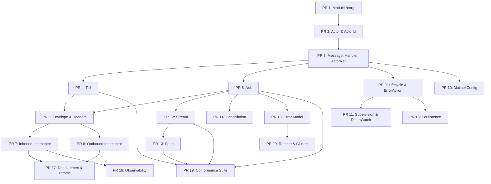

# dactor v0.2 — Development & Test Plan

> Test-driven implementation plan. Each PR is scoped, independently testable,
> and develops adapters alongside core to enable integration tests.
>
> **Approach:** TDD — write conformance tests first, then implement core traits,
> then implement adapters to pass the tests.

---

## PR Overview (~20 PRs)

| PR | Title | Scope | Tests |
|----|-------|-------|-------|
| 1 | Module reorganization & cleanup | Structure | Existing tests pass |
| 2 | Actor trait & ActorId | Core type | Unit + adapter |
| 3 | Message, Handler, ActorRef<A> | Core API | Unit + adapter |
| 4 | Tell (fire-and-forget) | Communication | Unit + adapter + conformance |
| 5 | Ask (request-reply) | Communication | Unit + adapter + conformance |
| 6 | Envelope, Headers, RuntimeHeaders | Messaging | Unit |
| 7 | Interceptor pipeline (Inbound) | Cross-cutting | Unit + adapter |
| 8 | Interceptor pipeline (Outbound) | Cross-cutting | Unit + adapter |
| 9 | Lifecycle hooks & ErrorAction | Lifecycle | Unit + adapter |
| 10 | MailboxConfig & OverflowStrategy | Mailbox | Unit + adapter |
| 11 | Supervision & DeathWatch | Lifecycle | Unit + adapter |
| 12 | Stream (server-streaming) | Communication | Unit + adapter + conformance |
| 13 | Feed (client-streaming) | Communication | Unit + adapter + conformance |
| 14 | Cancellation (CancellationToken) | Communication | Unit + adapter |
| 15 | Error model (ActorError, ErrorCodec) | Errors | Unit |
| 16 | Persistence (EventSourced + DurableState) | Lifecycle | Unit + adapter |
| 17 | Dead letters, Disposition::Delay, throttle | Mailbox | Unit + adapter |
| 18 | Observability (MetricsInterceptor) | Cross-cutting | Unit + integration |
| 19 | Testing infrastructure (conformance suite, MockCluster) | Testing | Meta-tests |
| 20 | Remote actors & cluster stubs | Remote | Unit + integration |

---

## PR Details

### PR 1: Module Reorganization & Cleanup

**Goal:** Restructure from v0.1 flat layout to v0.2 module layout. No behavior changes.

**Changes:**
- Reorganize `dactor/src/` into per-concept files: `actor.rs`, `message.rs`, `errors.rs`, `cluster.rs`, `timer.rs`, `clock.rs`, `mailbox.rs`
- Feature-gate `test_support/` behind `#[cfg(feature = "test-support")]`
- Move `TestClock` out of `traits/clock.rs` into `test_support/`
- Update `lib.rs` with `pub mod` and re-exports via `prelude`
- Make `serde` optional via feature flag
- Update `Cargo.toml` dependencies per §15.6
- Update adapter crates to compile against new module paths
- `NodeId(String)` instead of `NodeId(u64)`

**Tests:**
- All existing 44 tests + 2 doc-tests still pass (green-to-green refactor)
- Add compile test: `test-support` feature enables `TestClock` and `TestRuntime`

**Adapters:** Update imports in dactor-ractor and dactor-kameo (no behavior change)

---

### PR 2: Actor Trait & ActorId

**Goal:** Define the new `Actor` trait with `Args`, `Deps`, lifecycle hooks, and `ActorId`.

**Changes:**
- `actor.rs`: `Actor` trait with `type Args`, `type Deps`, `on_start()`, `on_stop()`
- `actor.rs`: `ActorId` struct with `name`, `node` fields
- `actor.rs`: `SpawnConfig` struct (mailbox config placeholder, target_node)
- Remove old GAT-based `ActorRef<M>` trait

**Tests:**
- Unit: Define a `Counter` actor, verify `Actor` trait bounds compile
- Unit: `ActorId` equality, display, clone, serialize
- Adapter: ractor adapter wraps into `ractor::Actor`, spawns, returns `ActorId`
- Adapter: kameo adapter wraps into `kameo::Actor`, spawns, returns `ActorId`

---

### PR 3: Message, Handler, ActorRef<A>

**Goal:** Define `Message` trait, `Handler<M>` trait, and actor-typed `ActorRef<A>`.

**Changes:**
- `message.rs`: `Message` trait with `type Reply`
- `actor.rs`: `Handler<M>` async trait
- `actor.rs`: `ActorRef<A>` trait (actor-typed, not message-typed)
- `actor.rs`: `ActorRef::id()`, `ActorRef::is_alive()`, `ActorRef::name()`
- `actor.rs`: `ActorRuntime::spawn()` returns `ActorRef<A>`

**Tests:**
- Unit: Define `Increment` message with `Reply = ()`, `GetCount` with `Reply = u64`
- Unit: Implement `Handler<Increment>` and `Handler<GetCount>` for Counter
- Adapter (ractor): Spawn Counter, verify `ActorRef<Counter>` type, call `id()`
- Adapter (kameo): Same tests
- Conformance: `ActorRef::is_alive()` returns true after spawn, false after stop

---

### PR 4: Tell (Fire-and-Forget)

**Goal:** Implement `tell()` on `ActorRef<A>`.

**Changes:**
- `ActorRef::tell()` method
- Adapter ractor: `tell()` → `ractor::cast()` via type-erased dispatch
- Adapter kameo: `tell()` → `kameo::tell().try_send()`

**Tests:**
- Unit: `tell(Increment(5))` increments counter
- Unit: `tell()` to stopped actor returns `Err(ActorSendError)`
- Adapter: Send 100 messages, verify all received in order
- Conformance: `tell()` is fire-and-forget — does not block caller
- Conformance: Multiple `tell()` to same actor, messages processed sequentially

---

### PR 5: Ask (Request-Reply)

**Goal:** Implement `ask()` on `ActorRef<A>` with timeout and `CancellationToken`.

**Changes:**
- `ActorRef::ask()` method returning `Result<M::Reply, RuntimeError>`
- `Option<CancellationToken>` parameter
- Adapter ractor: `ask()` → `ractor::call()` with oneshot channel
- Adapter kameo: `ask()` → `kameo::ask()`

**Tests:**
- Unit: `ask(GetCount)` returns `u64` value
- Unit: `ask()` with timeout, verify `Err(Timeout)` on slow handler
- Unit: `ask()` to stopped actor returns `Err(ActorNotFound)`
- Adapter: ask + tell interleaved, verify reply correctness
- Conformance: `ask()` blocks caller until reply received
- Conformance: Two concurrent `ask()` calls, both get correct replies

---

### PR 6: Envelope, Headers, RuntimeHeaders

**Goal:** Internal message wrapping with headers.

**Changes:**
- `message.rs`: `Envelope<M>` struct (body + headers)
- `message.rs`: `Headers` with `insert()`, `get()`, `remove()`
- `message.rs`: `HeaderValue` trait
- `message.rs`: `RuntimeHeaders` (read-only: `MessageId`, `timestamp`)
- `message.rs`: `Priority` header struct with constants
- Runtime stamps `RuntimeHeaders` on every message

**Tests:**
- Unit: `Headers` insert/get/remove for `Priority`, custom types
- Unit: `RuntimeHeaders` MessageId uniqueness (generate 1000, all distinct)
- Unit: `Envelope` construction and header access
- Unit: `HeaderValue` to_bytes/from_bytes round-trip
- Adapter: Verify RuntimeHeaders are populated when handler receives message

---

### PR 7: Inbound Interceptor Pipeline

**Goal:** Implement `InboundInterceptor` trait and runtime pipeline.

**Changes:**
- `interceptor.rs`: `InboundInterceptor` trait (`on_receive`, `on_complete`)
- `interceptor.rs`: `InboundContext` struct
- `interceptor.rs`: `Disposition` enum (Continue, Delay, Drop, Reject)
- `interceptor.rs`: `Outcome` enum
- `interceptor.rs`: `SendMode` enum (Tell, Ask, Stream, Feed)
- `SpawnConfig.inbound_interceptors` field
- `ActorRuntime::add_inbound_interceptor()` for global interceptors
- Runtime executes interceptor chain before handler dispatch

**Tests:**
- Unit: Interceptor that logs message type — verify called
- Unit: `Disposition::Drop` — message never reaches handler
- Unit: `Disposition::Reject` — `ask()` returns `Err(Rejected)`
- Unit: `Disposition::Delay` — message delivered after delay
- Unit: Multiple interceptors execute in order
- Unit: `on_complete` called after handler finishes
- Adapter (ractor): Global + per-actor interceptors work
- Adapter (kameo): Same tests

---

### PR 8: Outbound Interceptor Pipeline

**Goal:** Implement `OutboundInterceptor` trait on the sender side.

**Changes:**
- `interceptor.rs`: `OutboundInterceptor` trait (`on_send`, `on_reply`, `on_stream_item`)
- `interceptor.rs`: `OutboundContext` struct
- `ActorRuntime::add_outbound_interceptor()`
- Runtime executes outbound chain before tell/ask/stream/feed

**Tests:**
- Unit: Outbound interceptor stamps custom header, inbound interceptor reads it
- Unit: `Disposition::Reject` on outbound — caller gets `Err(Rejected)`
- Unit: `Disposition::Delay` on outbound — caller blocked for duration
- Unit: `on_reply` called with ask reply value
- Unit: Outbound interceptor can modify headers
- Adapter: Header flows through tell → interceptor → handler → verify

---

### PR 9: Lifecycle Hooks & ErrorAction

**Goal:** Actor lifecycle with error handling strategies.

**Changes:**
- `Actor` trait: `on_start()`, `on_stop()`, `on_error()` with defaults
- `lifecycle.rs`: `ErrorAction` enum (Resume, Restart, Stop, Escalate)
- `ActorContext`: access to `actor_id`, `actor_name`, `send_mode`, `headers`
- Runtime calls hooks at appropriate lifecycle points
- `on_error` returns `ErrorAction` — runtime obeys

**Tests:**
- Unit: `on_start` called after spawn (set flag, verify)
- Unit: `on_stop` called on graceful shutdown
- Unit: `on_error` with `Resume` — actor continues processing
- Unit: `on_error` with `Restart` — actor restarts (on_start called again)
- Unit: `on_error` with `Stop` — actor stops
- Adapter: Full lifecycle flow in ractor (panic → on_error → restart)
- Adapter: Full lifecycle flow in kameo

---

### PR 10: MailboxConfig & OverflowStrategy

**Goal:** Configurable mailbox capacity and overflow behavior.

**Changes:**
- `mailbox.rs`: `MailboxConfig` enum (Unbounded, Bounded(usize))
- `mailbox.rs`: `OverflowStrategy` enum (Block, RejectWithError, DropNewest, DropOldest)
- `SpawnConfig.mailbox` uses `MailboxConfig`
- Adapter ractor: Bounded via wrapper channel
- Adapter kameo: Bounded via `spawn_bounded()`
- `RuntimeCapability::BoundedMailbox` introspection

**Tests:**
- Unit: Unbounded mailbox accepts arbitrary messages
- Unit: Bounded(10) with Block — sender blocks when full
- Unit: Bounded(10) with RejectWithError — returns error when full
- Unit: Bounded(10) with DropNewest — newest silently dropped
- Adapter (ractor): Bounded mailbox via wrapper
- Adapter (kameo): Bounded mailbox via native API
- Conformance: `is_supported(BoundedMailbox)` returns correct value per adapter

---

### PR 11: Supervision & DeathWatch

**Goal:** Supervision strategies and watch/unwatch.

**Changes:**
- `supervision.rs`: `SupervisionStrategy` trait
- `supervision.rs`: Built-in strategies: `OneForOne`, `OneForAll`, `RestForOne`
- `supervision.rs`: `ChildTerminated` message
- `ActorRuntime::watch()`, `unwatch()`
- `Handler<ChildTerminated>` pattern for receiving notifications

**Tests:**
- Unit: `watch()` actor, kill target, watcher receives `ChildTerminated`
- Unit: `unwatch()` stops notifications
- Unit: `OneForOne` — only crashed child restarts
- Unit: `OneForAll` — all children restart when one crashes
- Adapter (ractor): Map to ractor's supervisor model
- Adapter (kameo): Map to kameo's `on_link_died`
- Conformance: DeathWatch notification includes child_id and reason

---

### PR 12: Stream (Server-Streaming)

**Goal:** `stream()` method for request → multiple response items.

**Changes:**
- `stream.rs`: `StreamSender<T>`, `BoxStream<T>`, `StreamSendError`
- `ActorRef::stream()` method
- Adapter: mpsc channel shim (both ractor and kameo)
- Backpressure via bounded channel

**Tests:**
- Unit: `stream(GetLogs)` returns 10 items, verify all received
- Unit: Consumer drops stream early → `StreamSendError::ConsumerDropped`
- Unit: Backpressure — slow consumer, verify sender suspends
- Unit: Empty stream (handler sends nothing, drops tx)
- Adapter (ractor): stream with mpsc shim
- Adapter (kameo): stream with mpsc shim
- Conformance: Stream items arrive in order

---

### PR 13: Feed (Client-Streaming)

**Goal:** `feed()` method for stream-of-items → actor → optional reply.

**Changes:**
- `stream.rs`: `StreamReceiver<T>`, `FeedMessage` trait, `FeedHandler<M>` trait
- `ActorRef::feed()` method
- `BatchConfig` for `stream_batched()` / `feed_batched()`
- Adapter: mpsc channel + drain task (both ractor and kameo)

**Tests:**
- Unit: Feed 100 integers, actor sums them, returns total
- Unit: Feed empty stream, actor returns 0
- Unit: Cancellation mid-feed — actor returns partial result
- Unit: Backpressure — slow actor, verify caller stream throttled
- Unit: `BatchConfig` — verify batching reduces wire messages (mock)
- Adapter (ractor): feed with mpsc shim
- Adapter (kameo): feed with mpsc shim
- Conformance: Feed items arrive in order

---

### PR 14: Cancellation (CancellationToken)

**Goal:** Cooperative cancellation for ask, stream, feed.

**Changes:**
- `CancellationToken` integration (from `tokio_util`)
- `ActorContext::cancelled()` method
- `ErrorCode::Cancelled`
- Cancellation outcomes for ask/stream/feed
- `cancel_after()` helper

**Tests:**
- Unit: Cancel ask before handler starts → `Err(Cancelled)`
- Unit: Cancel ask during handler → handler checks `ctx.cancelled()`
- Unit: Cancel stream → StreamSender returns `ConsumerDropped`
- Unit: Cancel feed → StreamReceiver yields `None`
- Unit: `cancel_after(100ms)` — auto-cancel on timeout
- Unit: No cancel token → runs to completion
- Adapter: Verify cancellation works through adapter layer

---

### PR 15: Error Model (ActorError, ErrorCodec)

**Goal:** Structured, serializable error types.

**Changes:**
- `errors.rs`: `ActorError` struct (ErrorCode, message, details, chain, payload)
- `errors.rs`: `ErrorCode` enum (all gRPC-inspired codes)
- `errors.rs`: `RuntimeError` unified enum
- `errors.rs`: `ErrorCodec<E>` trait, `ErasedErrorCodec`, `TypedErrorCodec`
- `ActorRuntime::register_error_codec()`
- `NotSupportedError` with `RuntimeCapability`

**Tests:**
- Unit: `ActorError` construction, display, serialize/deserialize
- Unit: `ErrorCode` round-trip through bincode
- Unit: `ErrorCodec` encode/decode custom error type
- Unit: `ErasedErrorCodec` via `TypedErrorCodec` wrapper
- Unit: `RuntimeError` variants — each variant constructible
- Unit: Error chain (`with_cause`) traversal
- Integration: ask() returns `ActorError` from handler, verify caller can downcast

---

### PR 16: Persistence (EventSourced + DurableState)

**Goal:** Actor state persistence with recovery.

**Changes:**
- `persistence.rs`: `PersistentActor`, `PersistenceId`, `EventSourced`, `DurableState`
- `persistence.rs`: `JournalStorage`, `SnapshotStorage`, `StateStorage` traits
- `persistence.rs`: `InMemoryStorage` (built-in for testing)
- `persistence.rs`: `SnapshotConfig`, `SaveConfig`
- `persistence.rs`: `RecoveryFailurePolicy`, `PersistFailurePolicy`, `PersistError`
- Lifecycle integration: recovery on spawn before messages delivered
- `RuntimeBuilder::with_storage_provider()`

**Tests:**
- Unit: EventSourced actor — persist 3 events, restart, verify state recovered
- Unit: EventSourced + snapshot — persist 100 events, snapshot at 50, restart from snapshot + 50 events
- Unit: DurableState — save state, restart, verify loaded
- Unit: Recovery failure — corrupt journal → `RecoveryFailurePolicy::Stop` → actor stops
- Unit: `InMemoryStorage` round-trip for journal, snapshot, state
- Unit: `SnapshotConfig` auto-snapshot every N events
- Unit: Messages buffered during recovery, delivered after `post_recovery`
- Adapter: Persistent actor through ractor adapter — full lifecycle

---

### PR 17: Dead Letters, Disposition::Delay, Throttle

**Goal:** Dead letter handling, delay-based throttling.

**Changes:**
- `dead_letter.rs`: `DeadLetterHandler` trait, `DeadLetterEvent`, `DeadLetterReason`
- `dead_letter.rs`: `LoggingDeadLetterHandler` (default)
- `Disposition::Delay(Duration)` — cumulative delays in pipeline
- `dactor-throttle` crate: `ActorRateLimiter`, `PeerPressureThrottle`
- `ActorRuntime::set_dead_letter_handler()`

**Tests:**
- Unit: Send to stopped actor → dead letter handler called
- Unit: Custom dead letter handler captures events
- Unit: `Disposition::Delay(100ms)` — verify message delayed
- Unit: Multiple delays cumulative
- Unit: `ActorRateLimiter` — exceed rate → Delay, then Reject at 2×
- Unit: `PeerPressureThrottle` — mock RTT, verify Delay/Reject thresholds
- Integration: Dead letter + interceptor pipeline interaction

---

### PR 18: Observability (MetricsInterceptor)

**Goal:** Built-in metrics collection via interceptor.

**Changes:**
- `metrics.rs`: `MetricsInterceptor` implementing `InboundInterceptor`
- `metrics.rs`: `MetricsStore` with `ActorMetrics` (message_count, error_count, latencies)
- `metrics.rs`: `RuntimeMetrics` (total actors, messages, uptime)
- `ActorRuntime::runtime_metrics()` method

**Tests:**
- Unit: `MetricsInterceptor` records message count per actor
- Unit: `MetricsInterceptor` records handler latency histogram
- Unit: `MetricsStore` query by actor_id
- Unit: Error handler → error_count incremented
- Integration: Register MetricsInterceptor, send 100 messages, verify counts
- Integration: Multiple actors, verify per-actor isolation

---

### PR 19: Testing Infrastructure (Conformance Suite, MockCluster)

**Goal:** Reusable test harness for adapter conformance.

**Changes:**
- `dactor-mock` crate: `MockCluster`, `MockRuntime`, `MockNetwork`
- `test_support/conformance.rs`: Macro-based conformance test suite
- `LinkConfig` with latency, jitter, drop simulation
- Network fault injection: `partition()`, `heal()`
- Node fault injection: `crash_node()`, `restart_node()`
- Inspection API: `in_flight_count()`, `dropped_count()`

**Tests:**
- Meta-test: Conformance suite passes for `TestRuntime`
- Meta-test: Conformance suite passes for ractor adapter
- Meta-test: Conformance suite passes for kameo adapter
- Unit: `MockCluster` with 3 nodes, cross-node tell works
- Unit: `partition()` blocks messages, `heal()` resumes
- Unit: `crash_node()` triggers DeathWatch notifications

---

### PR 20: Remote Actors & Cluster Stubs

**Goal:** Remote actor foundation (serialization, WireEnvelope, cluster traits).

**Changes:**
- `remote.rs`: `RemoteMessage` marker trait
- `remote.rs`: `MessageSerializer` trait with `BincodeSerializer` default
- `remote.rs`: `WireEnvelope` struct, `WireHeaders`
- `remote.rs`: `MessageVersionHandler` for migration
- `cluster.rs`: `ClusterDiscovery` trait, `AdapterCluster` trait
- `cluster.rs`: `ClusterState` API
- `ActorRuntime::register_remote_actor()`
- SpawnManager, CancelManager, WatchManager system actor stubs

**Tests:**
- Unit: `BincodeSerializer` serialize/deserialize round-trip
- Unit: `WireEnvelope` construction and parsing
- Unit: `MessageVersionHandler` — v1 → v2 migration
- Unit: `ClusterState` API (nodes, is_leader, local_node)
- Integration: MockCluster cross-node tell with serialization
- Integration: Remote spawn via SpawnManager stub

---

## Test Strategy

### Test Pyramid

```
                    ┌──────────────┐
                    │  Integration │  MockCluster, cross-adapter
                    │    (~30)     │
                    ├──────────────┤
                    │  Conformance │  Per-adapter conformance suite
                    │    (~50)     │  (macro-generated)
                    ├──────────────┤
                    │ Adapter Unit │  Per-adapter behavior tests
                    │    (~80)     │  (ractor + kameo)
                    ├──────────────┤
                    │  Core Unit   │  Pure core logic tests
                    │   (~150)     │  (no adapter dependency)
                    └──────────────┘
```

**Estimated total: ~310 tests**

### Naming Convention

```
#[test] fn test_{feature}_{scenario}_{expected}()
// Example:
#[test] fn test_ask_stopped_actor_returns_not_found()
#[test] fn test_interceptor_reject_ask_returns_error()
#[test] fn test_stream_backpressure_suspends_sender()
```

### Conformance Suite (PR 19)

```rust
// Adapters invoke the macro to get full test coverage:
dactor::conformance_tests!(RactorRuntime);
dactor::conformance_tests!(KameoRuntime);
```

Generates tests for: tell, ask, stream, feed, lifecycle, interceptors,
mailbox, supervision, cancellation, dead letters, metrics.

---

## Dependency Graph



---

## Branching Strategy

- Each PR: `impl/pr-{N}-{short-name}` (e.g., `impl/pr-01-module-reorg`)
- Base branch: `main`
- Merge: Squash merge to main
- CI: `cargo test --workspace` must pass on every PR

---

## Versioning

| PRs | Version | Milestone |
|-----|---------|-----------|
| 1-5 | v0.2.0-alpha.1 | Core API compiles |
| 6-10 | v0.2.0-alpha.2 | Messaging & mailbox |
| 11-14 | v0.2.0-beta.1 | Communication complete |
| 15-17 | v0.2.0-beta.2 | Error model & persistence |
| 18-20 | v0.2.0-rc.1 | Observability & remote stubs |
| — | v0.2.0 | Release |
